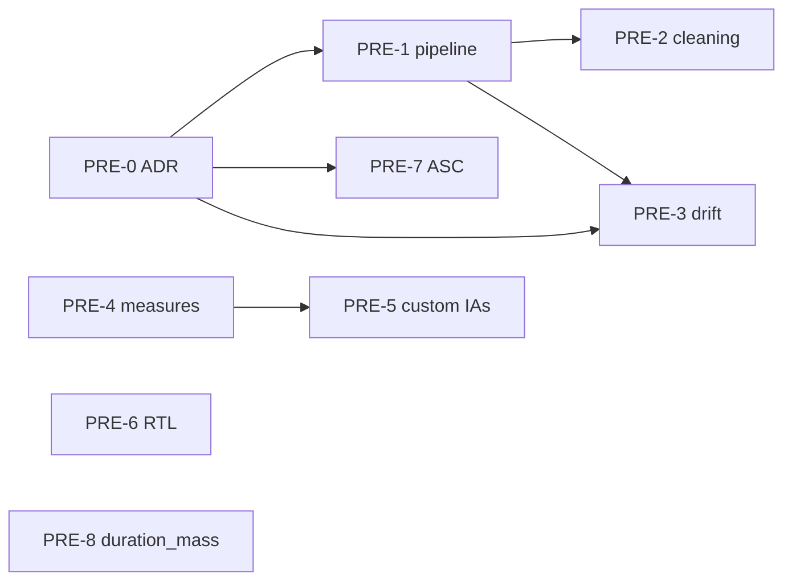

# Scanpath Studio — Improvements & Roadmap

Working tracker for planned features, improvements, and bug fixes. Each item has a
stable **ID** (e.g. `UX-1`) you can cite in chat ("let's do `CMP-3`"), a
**Status**, and a short description with the relevant code anchors.

## How to use this file

- **Status:** `Backlog` (captured, not scheduled) · `Planned` (next-ish, scoped)
  · `In progress` · `Blocked` · `Pending approval` (implemented, awaiting the
  user's final sign-off) · `Done` (signed off — moved to the archive) ·
  `Skipped` (closed without implementing — stays here for the rationale, **not**
  archived).
- **Approval gate.** When an item's implementation is finished, mark it
  `Pending approval` — **never** jump straight to `Done`. Only after the user
  gives the final confirmation does it become `Done` **and move to**
  [`IMPROVEMENTS_ARCHIVE.md`](IMPROVEMENTS_ARCHIVE.md), so this file stays scoped
  to open and recently-finished work. `Skipped` items are **not** archived.
- **IDs are stable.** Don't renumber when an item is finished. New items get the
  next free number in their group; archived items keep their ID over there.
- **Composite asks are split** into sub-items so they can land independently.
- When implementing an item, ask for clarification as needed before starting.

### Currently in progress
- **PERF-1** — Plotly → matplotlib migration ([PR #83](https://github.com/lacclab/scanpath-studio/pull/83), `matplotlib-migration` branch).
- **DATA-1** — Broaden dataset support (ongoing epic).

### Awaiting your approval
Implemented, not yet signed off (→ `Done` + archive on your confirmation):
**AN-1 … AN-28** (the whole *Analysis & corpus views* epic — the four
question-oriented Corpus Analysis sections + the cross-cutting controls);
**DATA-3** (OneStop public dataset); **DATA-4 … DATA-7** (the data-source UI
overhaul — searchable public-datasets picker, no per-source filtering, expected
files, Download button).

### Terminology
Canonical measures (per `AGENTS.md`): **FFD** (`first_fixation_ms`), **FPRT**
(`first_pass_gaze_duration_ms`), **RPD / go-past** (`regression_path_duration_ms`),
**TFD** (`total_fixation_duration_ms`), plus `n_fixations`, `skip_flag`,
`regression_in/out_flag`. Canonical keys: `participant_id`, `trial_id`,
`paragraph_id`, `word_id`, `line_idx`.

### Groups
[UX & Interaction](#ux--interaction) ·
[Compare mode](#compare-mode) ·
[Visualization & display](#visualization--display) ·
[Datasets & ingestion](#datasets--ingestion) ·
[Performance](#performance) ·
[Analysis & corpus views](#analysis--corpus-views) ·
[Preprocessing — eyekit parity](#preprocessing--eyekit-parity) ·
[Validation](#validation) ·
[Bugs](#bugs) ·
[Engineering](#engineering)

---

## UX & Interaction

_UX-1 · UX-1a · UX-2 · UX-2a · UX-3 signed off & archived — see
[`IMPROVEMENTS_ARCHIVE.md`](IMPROVEMENTS_ARCHIVE.md)._

**UX-4 · Replace the same-text ★ marker in trial selectors with a text-like icon** — `Status: Backlog`

In the trial / participant pickers (and the compare-trial selector) the **★**
marker actually means "same stimulus **text** as the primary trial" and **👤**
means "same **participant**" (`SAME_TEXT_MARKER` / `SAME_PARTICIPANT_MARKER`,
[`utils.py`](scanpath_studio/utils.py:503)). The ★ reads like "favorite", which is
misleading. Swap the same-text ★ for a clearly text-related icon (e.g. 📄 / 📝 /
"T") so its meaning is obvious — and so the star can be freed for favorites (see
**UX-6**). Keep (or revisit) 👤 for same-participant. Update any marker
legend/help text. Code anchors: `SAME_TEXT_MARKER` / `SAME_PARTICIPANT_MARKER` +
the option-label builder and sort in
[`utils.py`](scanpath_studio/utils.py:503). Related: **UX-6**, **UX-5**.

**UX-5 · Keep the main Filter-by + trial selectors stable; move extra filter columns under "More"** — `Status: Backlog`

The top **Filter by** row and the **Composite trial id** selectors should be the
**same regardless of which filter-by columns the loaded dataset has**. Today the
main row + the composite trial selector vary with the dataset's columns (e.g.
`repeated_reading_trial` shows up as a third composite selector for OneStop). Pin
the main visible Filter-by controls and the composite trial selectors to a fixed,
canonical set; any **additional** dataset-specific filter columns belong in the
**More** popover (alongside Difficulty / Answer / Selected Answer / annotations),
not in the always-visible row or the composite trial id. Code anchors:
`controls.sidebar_trial_filters` + the trial-filter panel
([`controls.py`](scanpath_studio/controls.py)), the composite trial selector in
[`utils.py`](scanpath_studio/utils.py) (`build_combo_options` / trial-selection
UI), and the dispatch in [`app.py`](scanpath_studio/app.py). Related: **UX-4**.

**UX-6 · Mark annotation state (favorites ★ / tags / notes) in the trial selector** — `Status: Backlog`

New feature: surface each trial's annotation state directly in the trial /
compare selectors. Mark **favorite** trials with a ★ star; also show **tags**
(e.g. a 🏷️ chip or the tag name/count) and **notes** (e.g. a 📝 marker). These
markers are independent of the same-text/same-participant icons (**UX-4**) **and
of each other**: a trial can carry **zero, one, two, or all three** of favorite /
tagged / noted, in any combination, so the markers must **compose (stack)**, not
be mutually exclusive. Decide ordering/spacing relative to the
same-text/same-participant icons. Annotation state lives in
[`annotations.py`](scanpath_studio/annotations.py) (per
`(participant_id, trial_id)` favorites / tags / notes); the option-label builder
is `build_combo_options` + the marker assembly in
[`utils.py`](scanpath_studio/utils.py:574). Ties into the annotation filters
already in the **More** popover. Related: **UX-4**, **UX-5**.

_Next item: `UX-7`._

---

## Compare mode

The "Compare with trial" flow (`single_compare_toggle`) and its per-scanpath
styling live in [`controls.py`](scanpath_studio/controls.py:622)
(`_COMPARE_SCANPATHS`, `_render_compare_fix_styles`,
`_render_compare_saccade_styles`, `_collect_compare_styles`); the overlay figure
is built in [`plots.py`](scanpath_studio/plots.py).

**CMP-1 · CMP-2 · CMP-3 · CMP-4** — `Status: Done (signed off 2026-06-23)` →
moved to [`IMPROVEMENTS_ARCHIVE.md`](IMPROVEMENTS_ARCHIVE.md). Selector moved above
the chips and made to mirror the main picker (trial id + ★/👤 markers, `index/N ·
id` slider); config moved into the rail **⚙️ Compare** popover; optional A/B legend
+ figure titles removed; per-scanpath colours fixed (incl. the "fixations turn black"
bug); and **Color fixations by** restored in compare mode.

---

## Visualization & display

**VIZ-1 · Warn that font sizes are px, not pt** — `Status: Planned`

All font-size controls are in **pixels** (e.g. `format="%.1f px"`,
`global_order_font_size`, `global_colorbar_tickfont_size` in
[`controls.py`](scanpath_studio/controls.py:1052)), but stimulus typography is
usually specified in **points**. Add a short note/warning near the font controls
explaining the difference (and that matching the original stimulus requires a
px↔pt conversion via DPI).

**VIZ-2 · Increase font size across the app where possible** — `Status: Planned`

General readability pass on app chrome (labels, captions, table text). Likely
[`styles.py`](scanpath_studio/styles.py) / theme. Keep within Streamlit theming;
don't regress dense layouts.

**VIZ-3 · Alternative heatmap normalization** — `Status: Backlog`

Explore normalization options for the heatmap views (e.g. per-trial vs per-corpus
max, log scaling, per-word-area density). Related but distinct from the new
`duration_mass` heatmap style (**PRE-8**).

**VIZ-4 · Improve image-based stimuli support** — `Status: Backlog`

Better handling/rendering when the stimulus is an image rather than laid-out text
(scaling, alignment to fixation space, AOIs over images). Ties into the
stimulus-image fallback used for unsupported scripts in **PRE-6**.

**VIZ-5 · Export the plot as separable layers** — `Status: Backlog`

Add an export mode that keeps the figure's layers **separable** in the output
file instead of one flattened image — so a *word boxes / fixations / saccades /
heatmap / labels / stimulus image* split can be toggled and restyled in
Illustrator / Inkscape for publication figures. Options to explore: vector
(SVG/PDF) with one named `<g>` group per layer (Plotly traces already map cleanly
to the per-layer helpers in [`plots.py`](scanpath_studio/plots.py) —
`_add_saccade_layer`, `_add_raw_gaze_layer`, the `_add_*_heatmap` family, and the
words/fixations cores), and/or a set of per-layer files dropped into the export
zip. Wire into `export.ExportOptions` / `render_export_options` / `bulk_export`
([`export.py`](scanpath_studio/export.py:47)) alongside the existing
PNG/SVG/PDF/HTML formats, and surface it in the **Export** subtab
(`tabs._render_export_panel`).

**VIZ-6 · Replace the "hollow" fixation marker style with an opacity control** — `Status: Done (signed off 2026-06-23)` →
moved to [`IMPROVEMENTS_ARCHIVE.md`](IMPROVEMENTS_ARCHIVE.md).

**VIZ-7 · Fixation-index range selector on the main scanpath plot** — `Status: Done (signed off 2026-06-23)` →
moved to [`IMPROVEMENTS_ARCHIVE.md`](IMPROVEMENTS_ARCHIVE.md).

**VIZ-8 · Color saccades by saccade type** — `Status: Backlog`

Encode each saccade by its reading type — *forward saccade / skip / refixation /
return sweep / regression* (the classic schematic). Saccades currently draw as one
trace in a single global colour (`global_saccade_color` + style/width,
[`controls.py`](scanpath_studio/controls.py:1188); `plots._add_saccade_layer`
[`plots.py`](scanpath_studio/plots.py:671)). The app computes per-fixation
`is_regression` and word-level `regression_in/out_flag`
([`measures.py`](scanpath_studio/measures.py:161)) but never uses them for saccade
encoding, and the forward/skip/refixation/return-sweep distinction isn't classified
yet. Plan: derive a per-saccade `saccade_type` in `enrich_fixations` from
consecutive fixations' `word_id` + line membership (`measures.cluster_word_lines`
[`measures.py`](scanpath_studio/measures.py:257)) and `is_regression`; add an
"Off / By type" mode + 5-swatch palette to the saccade popover
(`global_saccade_type_*`, seeded in `_VIZ_WIDGET_DEFAULTS`); render one sub-trace
per type in `_add_saccade_layer` with a small legend. Related: **CMP-4**, **VIZ-6**.

**VIZ-9 · "Linear reading" view — saccades as arcs, fixations above the words** — `Status: Backlog`

A stylized reading-diagram mode (cf. the schematic): draw saccades as curved
**arcs/arches** instead of straight connectors, and snap each fixation directly
**above the word** it lands on rather than at its raw gaze point. Straight
connectors come from `plots._saccade_segments` → `_add_saccade_layer`
([`plots.py`](scanpath_studio/plots.py:671)); fixations use raw x/y in the marker
trace; word-box geometry comes from `build_word_boxes` and line membership from
`measures.cluster_word_lines`. Plan: add viz-mode keys (e.g.
`global_saccade_render_mode` = straight|arc, `global_fixation_snap_to_word`) in
`_VIZ_WIDGET_DEFAULTS`, surface a Render-style selectbox + snap checkbox in the
saccade popover, thread them through `_collect_viz_settings` →
`make_scanpath_figure`, add a `_curved_saccade_segments` Bézier variant, and
reposition fixation y to each word's top-center (reuse `assign_fixations_to_words`).
Must stay on the true-scale path (`tabs._render_true_scale_chart`) and include the
mode in the figure cache key. Related: **PRE-3** (`snap_to_lines`), **VIZ-5**.

**VIZ-10 · Animate: autoplay on by default + a start/stop autoplay control** — `Status: Backlog`

Make the animated scanpath **autoplay on load** by default, and add a user option
to turn autoplay on/off (start/stop). Today the true-scale embed forces the
animation to start paused — `tabs._render_true_scale_chart` passes `auto_play=False`
to `fig.to_html` ([`tabs.py`](scanpath_studio/tabs.py:178)) so the figure only plays
at the configured speed when the user presses ▶ Play (`plots._animation_play_buttons`
[`plots.py`](scanpath_studio/plots.py:1827)). Note the original reason for
`auto_play=False`: Plotly's default autoplay ignores the configured playback speed
and runs at its own default frame duration — so flipping the default isn't a
one-liner; autoplay needs to honor `frame_duration`/playback speed (likely by
emitting a small client-side `Plotly.animate(...)` kickoff after mount using the
computed `avg_frame_duration`, rather than relying on `to_html(auto_play=True)`).
Plan: add an `global_anim_autoplay` viz key (default **on**) to `_VIZ_WIDGET_DEFAULTS`
+ a toggle in the Animate ⚙ popover (`controls.py` / the Animate view-mode controls
in `tabs.render_single_trial_tab`), thread it through `_collect_viz_settings` into
the animation render so the embed kicks off (or skips) playback at the right speed.
Expose on **every surface** per *AGENTS.md → Exposing a feature on every surface*:
the deep link / Share contract in `url_state.py` (`_URL_PRESETS` / `_build_share_query`),
a `--no-autoplay` (or `--autoplay`) flag on `cli.py render --animate`, and an
`autoplay` parameter on `api.animate_scanpath` + `CANONICAL_FIGURE_DEFAULTS`.
Related: **VIZ-9**, **CMP-4**.

**VIZ-11 · Animate slider: uniform time grid + "elapsed / total seconds" readout** — `Status: Backlog`

Improve the animation time slider so its readout and stepping are **time-based**
rather than fixation-onset-based, and the readout shows elapsed **out of total**
seconds — e.g. **"1.2 / 30.0s"** instead of the current bare **"Elapsed: X.Xs"**.

**Why not fixation index:** the obvious "Fixation N / TOTAL" readout breaks for a
**comparison** animation (two overlaid scanpaths). In Plotly the slider's stops
*are* the frames, and frames are currently emitted at every distinct fixation
*onset across all scanpaths* (`_anim_timeline`
[`plots.py`](scanpath_studio/plots.py:1745)), so with two readers the steps are
the *union* of both onset sets — no single fixation index is meaningful, and the
slider steps bunch wherever fixations cluster instead of scrubbing linearly.

**Plan — switch the frame grid from onsets to uniform time.** Generate one frame
every fixed interval (≈100 ms) instead of one per onset; the per-frame *content*
logic already works unchanged (`searchsorted(onsets, t)` shows every fixation
whose onset ≤ t — `make_scanpath_animation` [`plots.py`](scanpath_studio/plots.py:2283)).
This makes the slider a linear time scrubber, makes the readout naturally
time-based for **any** number of scanpaths (the two-scanpath problem disappears),
and simplifies playback (uniform per-frame duration — the variable-duration
bookkeeping in `_anim_timeline` mostly goes away). In `_animation_time_slider`
([`plots.py`](scanpath_studio/plots.py:1896)) drop the `prefix="Elapsed: "` and
set each step `label` to `f"{t / 1000:.1f} / {total / 1000:.1f}s"`.
- **Bound the frame count:** an adaptive grid `step = max(100ms, span / MAX_FRAMES)`
  (cap ~300–400 frames) so a long reading gets a coarser grid instead of thousands
  of frames — otherwise the GIF/MP4 export (`animation_export.export_animation`)
  balloons. Quantization is ≤ one grid-step (a 0.13 s onset shows at the 0.2 s
  frame); negligible at 100 ms.
- **Single-scanpath bonus:** when exactly one scanpath is animated the fixation
  index *is* unambiguous, so optionally append it there only —
  `Fixation 5 / 42 · 1.2 / 30.0s` — and omit it in comparison mode.

Display-only; no deep-link/CLI/API surface needed. Related: **VIZ-10**, **CMP-4**.

**VIZ-12 · Quick views: show which preset is active (Scanpath selected by default)** — `Status: Backlog`

The **Quick views** row (👁️ Scanpath · 🔥 Heatmap) gives no visual cue that
**Scanpath** is the default/active view — both render as identical, unselected
buttons. Surface the active preset so the user can see the current quick view at
a glance, with Scanpath shown as selected on first load. The two presets are
plain stateless `st.button`s side-by-side in `controls.sidebar_controls`
([`controls.py`](scanpath_studio/controls.py:1178)), wired to `_apply_view_preset`
([`controls.py`](scanpath_studio/controls.py:249)) which sets the `_VIEW_PRESETS`
layer toggles ([`controls.py`](scanpath_studio/controls.py:201)).
Plan: track the active preset in session state (e.g. `global_quick_view`, default
`"scanpath"`, seeded in `_seed_viz_state`), set it in `_apply_view_preset`, and
render the active one as selected — either swap the two buttons for an
`st.segmented_control` (single-select, like the heatmap-style / saccade-style
controls already use) or give the active button `type="primary"`.
- **Caveat — drift:** a preset only sets *layer* toggles; the user can then toggle
  an individual layer and no longer exactly match the preset. Decide whether the
  highlight is "last preset clicked" (simple, can be stale) or derived from
  whether the current toggles still match a preset's layer set (clears the
  highlight once the user customizes — arguably clearer). Recommend the latter:
  show a preset as selected only while the live toggle state equals its
  `_VIEW_PRESETS` set, else show none selected.
Display-only; no deep-link/CLI/API surface needed. Related: **VIZ-6**.

---

## Datasets & ingestion

**DATA-1 · Broaden dataset support (epic)** — `Status: In progress`

Ongoing work to load more corpora beyond the bundled sample / OneStop. Track
per-dataset adapters in [`datasets.py`](scanpath_studio/datasets.py) /
[`data.py`](scanpath_studio/data.py). Related: MultiplEYE support, EyeLink `.asc`
import (**PRE-7**), RTL/multilingual rendering (**PRE-6**), non-English validation
(**VAL-3**).

**DATA-2 · Integrate experimental-setup parameters into display/data settings** — `Status: Backlog`

Fold experimental-setup values (screen resolution, viewing distance, DPI, stimulus
font pt, etc.) into the display/data settings so true-to-scale rendering and the
px↔pt note (**VIZ-1**) can use them directly instead of being implicit.

**DATA-3 · Expose OneStop as a public dataset (OSF download)** — `Status: Pending approval`

OneStop now appears in the **Public datasets** picker alongside PoTeC / MultiplEYE,
downloading the paragraph-level interest-area + fixation reports from
[OSF](https://osf.io/2prdq/) on demand (regime-selectable: ordinary / information
seeking / repeated / information-seeking-repeated). Loader
`datasets.onestop_raw_frames` / `download_onestop` (reads via `data.read_table` to
skip the OSF zips' `__MACOSX` cruft); sidebar source `_load_onestop_public_source`
+ registry entry in [`app.py`](scanpath_studio/app.py). Docs: [`onestop.md`](docs/onestop.md).
Distinct from the env-var `$ONESTOP_DATA_DIR` "OneStop server bundle" source, which
stays for local `lacclab` exports + per-pid shards.

### Data-source UI overhaul (DATA-4 … DATA-7)

Cross-cutting goal: make the **data-source picker** clear and pretty as the public
corpus list grows toward ~40, while keeping **load a local private dataset** the
primary, most prominent path. All four touch the sidebar source UI
(`app.render_sidebar_data_source` [`app.py`](scanpath_studio/app.py:995), the
`PUBLIC_DATASET_REGISTRY` + `_load_public_dataset`
[`app.py`](scanpath_studio/app.py:513), and the per-corpus loaders
`_load_potec_source` / `_load_multipleye_source` / `_load_onestop_public_source`).

**DATA-4 · Public-datasets browser that scales to ~40 corpora** — `Status: Pending approval`

**Implemented (2026-06-24).** The flat dataset radio is now a **searchable
`st.selectbox`** (`_load_public_dataset` [`app.py`](scanpath_studio/app.py)) that
displays each corpus' **short name** + a compact *language · size* caption,
one-line description, and **Dataset home ↗** link. `PUBLIC_DATASET_REGISTRY` was
promoted from `{label: {loader, monitor}}` to a structured entry (adds `short` /
`language` / `size` / `description` / `link`; `loader` + `monitor` preserved so
`_public_dataset_monitor` and the canvas-snap tests keep working). The picker
scales as the catalogue grows; **local/private upload stays the primary path**
(top of `render_sidebar_data_source`, ➕ Add data). Selection still rides
`public_dataset_choice` (the full label, so deep-link/session round-trips).
Feature flag `public_datasets_enabled()` unchanged. Related: **DATA-1**.

**DATA-5 · Drop the per-source participant/text filtering from the loaders** — `Status: Pending approval`

**Implemented (2026-06-24).** Removed PoTeC's **Texts** + **Readers** controls and
MultiplEYE's **Sessions** + **Stimuli** multiselects; each loader now reads the
**whole corpus** (`potec_raw_frames(root)` / `multipleye_raw_frames(root, …)` —
per the user's "default = all the data") and the global **Narrow by** trial
filters scope it. The app-side cached wrappers (`_cached_potec_raw_frames` /
`_cached_multipleye_raw_frames` / `_cached_onestop_raw_frames`) lost their
`readers`/`texts`/`sessions`/`stimuli`/`download` args; the headless
`load_potec`/`load_multipleye` keep theirs. MultiplEYE's **Fixation source**
radio stays (a load variant, not filtering). Demo-fallback paths still behave.

**DATA-6 · Surface the expected file names / directory structure per corpus** — `Status: Pending approval`

**Implemented (2026-06-24).** Each loader shows an **"Expected files"** expander
(shared `_dataset_dir_input`) next to its *Data directory* input, listing the
file-name patterns + sub-directory tree it looks for (`_POTEC_STRUCTURE_MD` /
`_MULTIPLEYE_STRUCTURE_MD` / `_onestop_structure_md(regime)`) — so a user who
*already has* the data knows exactly what to drop where. Pairs with **DATA-7**.

**DATA-7 · Rework the download + mapping flow (button, not a checkbox)** — `Status: Pending approval`

**Implemented (2026-06-24).** The always-on *Download if missing* checkbox is
replaced by a shared **found-vs-Download** status (`_dataset_access_status`): it
detects the corpus on disk (`datasets.potec_present` / `onestop_present` /
`multipleye_inventory`) and either shows **"Found in `<dir>`"** (loads with **no
network**) or a one-click **⬇ Download** button (PoTeC / OneStop;
`download_potec` / `download_onestop` behind a spinner, then rerun → load).
MultiplEYE (no public URL) shows a missing-data note. The two use cases —
*already downloaded* vs *need to download* — are now first-class; public-corpus
frames still flow through the generic auto-detect → **Column-mapping** panels
unchanged. Tests: `potec_present` / `onestop_present` in
[`tests/test_dataset_support.py`](tests/test_dataset_support.py); the picker +
per-loader access UI in [`tests/test_apptest.py`](tests/test_apptest.py)
(`test_potec_source_renders`, `test_each_public_dataset_loader_ui_renders`).
Pairs with **DATA-6**.

**DATA-8 · Show the column-mapping override for the Bundled Demo too** — `Status: Backlog`

The **Column mapping — Words/IA** and **Column mapping — Fixations** override
panels are surfaced for uploaded / public datasets but not for the **Bundled
Demo**, so a first-time user never sees that re-mapping columns is even possible.
Show the column-mapping expanders for the bundled demo as well (read-only or
pre-filled with the demo's inferred mapping is fine) **so all capabilities are
discoverable**. Code anchors: the column-mapping override UI in
[`controls.py`](scanpath_studio/controls.py) and the gating in
`app.render_sidebar_data_source` ([`app.py`](scanpath_studio/app.py)). Related:
**DATA-9**.

**DATA-9 · Reorganize the Data sidebar to be intuitive (merge source + selection, nest setup/mapping)** — `Status: Backlog`

The **Data** sidebar has grown organically and is now confusing. Redesign it for
clarity (layout at the implementer's discretion). Concrete pointers from the user:
- **Merge "Data source" and the dataset selection** — today there's duplication
  between the radio (Bundled Demo / OneStop / Public datasets) and the separate
  **Dataset** picker (e.g. PoTeC). Combine into one selection, tagging each entry
  with its kind (**demo / private / public**).
- **Nest "Experimental Setup" and the two "Column mapping" panels under the active
  `<dataset>` options** (e.g. under "PoTeC options") instead of as sibling
  top-level expanders, so per-dataset config lives with its dataset.

Code anchors: `app.render_sidebar_data_source`
([`app.py`](scanpath_studio/app.py:995)), the `PUBLIC_DATASET_REGISTRY` /
`_load_public_dataset` picker, the per-corpus loaders
(`_load_potec_source` / `_load_multipleye_source` / `_load_onestop_public_source`),
the Experimental Setup + column-mapping sections in
[`controls.py`](scanpath_studio/controls.py). Keep `public_dataset_choice` /
deep-link round-tripping intact. Related: **DATA-4** (picker overhaul), **DATA-8**.

_Next item: `DATA-10`._

---

## Performance

**PERF-1 · Replace Plotly with matplotlib (or lighter renderer) for speed** — `Status: In progress`

Interactivity isn't essential for the core spatial plot; a static renderer should
be much faster. Tracked in [PR #83](https://github.com/lacclab/scanpath-studio/pull/83)
(`matplotlib-migration` branch). Keep the spatial plot on the true-scale path.

**PERF-2 · Investigate (and warn about) slowdowns from keeping many fields** — `Status: Backlog`

Hypothesis: selecting many columns/measures/metadata fields slows the app.
**First verify** whether it's actually true (profile a wide vs narrow frame); if
so, add a note/warning. If not, close this item.

---

## Analysis & corpus views

**Goal:** replace the single *Corpus Analysis → Aggregated Views* subtab with a
set of analysis sections, each answering one question — *what does a text look
like? a reader? a group? two groups against each other?* All sections obey the
active trial filters and the metric picker.

**Implementation convention:** keep aggregation logic **pure** in
[`aggregation.py`](scanpath_studio/aggregation.py) (one helper per view → tidy
DataFrame), build figures in [`plots.py`](scanpath_studio/plots.py) via the
`make_*_figure` pattern, wire into [`tabs.py`](scanpath_studio/tabs.py). Add a
smoke test per figure against the bundled sample (3 pid × 2 articles).

**Status (`Pending approval`):** the whole epic is implemented. *Aggregated Views*
is replaced by four question-oriented subtabs — **Per text · Per reader · Per
group · Group comparison** (`render_per_text_tab` / `render_per_reader_tab` /
`render_per_group_tab` / `render_group_comparison_tab`) — alongside *Generations
(WIP)*. Pure helpers + a `Measure` registry live in `aggregation.py`, builders in
`plots.py`, cross-cutting controls + cached wrappers in `tabs.py`; groups are
defined by splitting a field **or** by two independent filter sets. Tests in
[`tests/test_analysis_views.py`](tests/test_analysis_views.py) (unit per helper +
smoke per figure on the bundled sample); `scipy` added for AN-21. Docs synced
(CHANGELOG / AGENTS / `scanpath_studio/CLAUDE.md` / `docs/`).

### Per text — one `paragraph_id`/`trial_id`, many readers

**AN-1 · Stacked per-reader word profiles (small multiples)** — `Status: Pending approval` *(primary request)*

X = `word_id` (reading order), Y = chosen measure (TFD default; switch FFD/FPRT/
RPD/`n_fixations`). One panel per `participant_id`, stacked with shared X
(`make_subplots`, `shared_xaxes`). Optional faint cohort-mean overlay per panel.

**AN-2 · Word × reader heatmap** — `Status: Pending approval`

Same data collapsed to one heatmap: rows = participants, cols = `word_id`, color =
measure. Bright columns = universally hard words; bright rows = uniformly slow
reader. Reuses word-level heatmap machinery.

**AN-3 · Cohort word profile with spread band** — `Status: Pending approval`

Mean measure per word + shaded IQR/±1 SD band across readers — the "average
reader of this text" with uncertainty.

**AN-4 · Word difficulty annotated on the stimulus** — `Status: Pending approval`

The text laid out (true-to-scale renderer), each word tinted by aggregate measure
or `skip_rate` / `regression_in_rate` — corpus-level scanpath, no fixations drawn.

**AN-5 · Measure vs. linguistic feature scatter** — `Status: Pending approval`

Per-word mean measure vs. a bundled feature (`gpt2_surprisal`,
`wordfreq_frequency`, `word_length`, `universal_pos`) with a trend line. OneStop
sample ships these columns.

**AN-6 · Skip / regression rate per word** — `Status: Pending approval`

Bar/lollipop of `skip_flag` and `regression_in_flag` rates by `word_id`.

### Per participant — one `participant_id`, many trials

**AN-7 · Measure distributions vs. cohort** — `Status: Pending approval`

Histogram/violin/box of fixation `duration_ms`, `saccade_amplitude`, per-word
TFD/FFD for the selected reader, with the cohort distribution behind. Optional KDE.

**AN-8 · Reading speed & summary card** — `Status: Pending approval`

WPM, mean fixation duration, fixation count, regression rate, skip rate, mean
saccade amplitude — compact stat strip + cohort percentiles.

**AN-9 · Fixation duration over time** — `Status: Pending approval`

X = `timestamp_ms` (or `order_in_trial`), Y = `duration_ms` — within-trial
fatigue/settling. Faceted by trial or averaged.

**AN-10 · Saccade amplitude vs. fixation duration** — `Status: Pending approval`

2D density / hexbin — the classic oculomotor scatter (careful vs. skimming).

**AN-11 · Progressive vs. regressive saccades** — `Status: Pending approval`

Counts/share of `is_regression` / `regression_out_flag` per trial.

**AN-12 · Launch-site / landing-position curves** — `Status: Pending approval`

Histogram of landing position within words (needs `first_fix_x` relative to word
box) — the preferred-viewing-location curve. Overlaps **PRE-4**'s
`initial_landing_position`.

**AN-13 · Per-trial trend for this reader** — `Status: Pending approval`

The existing Trends line filtered to one participant — does this person slow down
across the session?

### Per group — a cohort defined by the active filter

**AN-14 · Group distribution summaries** — `Status: Pending approval`

Per-participant distributions pooled across the group (violin/box of fixation
duration, saccade amplitude, TFD, reading speed).

**AN-15 · Group word profile** — `Status: Pending approval`

Cohort word profile (mean + band) computed within the group, for a selected text.

**AN-16 · Per-reader summary table for the group** — `Status: Pending approval`

Sortable table, one row per participant, columns = summary stats — spot outliers.

**AN-17 · Group trend** — `Status: Pending approval`

Trends line averaged within the group (optionally per-participant faint behind).

### Group comparison — two groups side by side

**AN-18 · Overlaid distributions** — `Status: Pending approval`

Two groups' fixation-duration / saccade-amplitude / TFD distributions on shared
axes (violin halves or overlaid KDE).

**AN-19 · Difference word profile** — `Status: Pending approval`

Per-word measure A − B along the text with a zero reference line and diverging
colormap — *where* the groups diverge (Adv vs. Ele, L1 vs. L2).

**AN-20 · Paired summary bars** — `Status: Pending approval`

Side-by-side group-mean bars per measure with error bars (SD / SEM / bootstrap CI).

**AN-21 · Effect size + simple test** — `Status: Pending approval`

Per measure: mean difference, Cohen's *d*, Mann–Whitney / t-test p-value, with a
clear "exploratory, not pre-registered" caveat.

**AN-22 · Two-group word heatmap, stacked** — `Status: Pending approval`

Group A heatmap above group B (shared word axis) for direct visual comparison.

### Cross-cutting controls for the analysis sections

**AN-23 · Shared measure picker** — `Status: Pending approval`

One measure picker (TFD/FFD/FPRT/RPD/`n_fixations`/skip/regression) every section
reads from.

**AN-24 · Aggregation & spread choice** — `Status: Pending approval`

Mean/median/sum aggregation and SD/IQR/SEM/bootstrap-CI spread where a band or
error bar is drawn.

**AN-25 · Normalization toggle (raw vs. z-scored within reader)** — `Status: Pending approval`

So slow and fast readers compare on shape, not absolute level.

**AN-26 · Min-readers / min-trials guard** — `Status: Pending approval`

Gray out / warn when a per-word cell is backed by too few observations.

**AN-27 · Download the underlying tidy table per view** — `Status: Pending approval`

Reuse the export plumbing so users can re-plot elsewhere.

**AN-28 · Persist the active filter & visualization controls into Corpus Analysis** — `Status: Pending approval`

The Aggregated Views subtab (`tabs.render_aggregated_views_tab`
[`tabs.py`](scanpath_studio/tabs.py:2528)) already receives
`words_filtered`/`fixations_filtered`, so the **trial filters** (participants, text,
metadata, favourites/tags via `controls.read_trial_filters`) **do** carry over
(matching the section goal above). But it does **not** receive `viz_settings`, so
its per-text heatmap (the `make_scanpath_figure` call around
[`tabs.py`](scanpath_studio/tabs.py:2647)) **hard-codes** the display options —
heatmap style/metric/colorscale, colorbar orientation/font, marker size, label &
text styling, fixation-flag highlights, stimulus image — instead of reading the
user's `global_*` choices, unlike `render_multiple_comparison_tab`, which threads
`viz_settings` through. Pass `viz_settings` from `render_corpus_analysis_tab` into
`render_aggregated_views_tab` and replace the hard-coded figure args with reads
from it; audit the trend / distribution figures for the same gap. Related:
**AN-23**, **AN-24**.

---

## Preprocessing — eyekit parity

**Epic.** Scanpath Studio is strong at *visualization* and *corpus aggregation*
but does almost no *data preprocessing* — [eyekit](https://jwcarr.github.io/eyekit/)'s
home turf. These items close the gap.

**Build order:** `PRE-0` → `PRE-1` → (`PRE-2`, `PRE-3`); `PRE-4` → `PRE-5`;
`PRE-6`, `PRE-7`, `PRE-8` independent.

**Milestones:** M1 foundation (`PRE-0`, `PRE-1`) · M2 flagship (`PRE-2`, `PRE-3`)
· M3 analysis (`PRE-4`, `PRE-5`) · M4 reach (`PRE-6`, `PRE-7`, `PRE-8`).

**Cross-cutting acceptance criteria** (every item): new processing is optional &
off by default · visible in the true-scale plot where applicable · reflected in
measures + export · respects `global_*`/`single_*`/`filter_*` session-state
conventions · spatial plot stays on `tabs._render_true_scale_chart` · CHANGELOG
updated.

**PRE-0 · ADR: adopt eyekit as a dependency vs. reimplement** — `Status: Decided 2026-06-23 — reimplement natively` *(blocks PRE-3, PRE-5, PRE-7)*

**Decision: do NOT adopt eyekit; port the algorithms natively.** eyekit is
**GPL-3.0** (copyleft), incompatible with this MIT project distributed on PyPI —
taking it as a runtime dependency would impose GPL on the combined work. The
canonical algorithm code (`jwcarr/drift`, the Carr et al. 2021 companion repo) is
**CC BY 4.0**, so we port with attribution; only `scipy` (BSD-3) is added (the
optimizer + k-means a few algorithms need). Reading measures (**PRE-4**) likewise
stay native. This reverses the earlier "adopt eyekit" recommendation, on the
licence finding above. Full rationale + per-item design (this doc serves as the
ADR): [`plans/pre-3-vertical-drift-correction.md`](plans/pre-3-vertical-drift-correction.md). Deliverable: `scipy` in `pyproject.toml` when PRE-3 lands. **PRE-7**
(`import_asc`) must also be reimplemented or sourced from a non-GPL parser.

**PRE-1 · Preprocessing pipeline stage (foundation)** — `Status: Backlog` *(depends PRE-0)*

Optional stage between `data.normalize_fixations` and
`measures.enrich_fixations`/`compute_per_word_measures`. Fixations gain an
`excluded` flag (soft-exclude, not hard-drop) + a derived-column convention so
corrections keep the original. New **"Preprocessing"** panel, `global_preproc_*`
keys, off by default, with a recompute trigger. Fold preproc settings into the
cache key (don't break the OneStop `frame_fingerprint`/`st.cache_data` fast path).
AC: disabled = byte-identical output to today.

**PRE-2 · Fixation cleaning: discard short / long / out-of-bounds + purge** — `Status: Partly done (visualization-only)`

**Visualization-only version shipped** (per the user's 2026-06-23 reframing): under
the ⚙ Fixation style controls, **short / long / out-of-bounds** each get
Off / **Highlight** (chosen marker + colour) / **Discard** (hide from the plot
only), with editable short/long ms thresholds (defaults 80 / 800). Threaded as a
`fixation_flags` dict through `_collect_viz_settings` → `make_scanpath_figure`
(classify on `ordered`, drop Discards before the marker trace, overlay Highlights);
saccade lines still bridge across discarded fixations. Replaces the old
out-of-text marker toggle (`global_highlight_out_of_text` removed → `fixation_flags`).
Does **not** touch reading measures or exports.

Still **Backlog** (the eyekit preprocessing version): a real `excluded` soft-flag in
the pipeline (depends PRE-1), an "N excluded" count, and `purge` (hard-drop +
reindex) that propagates to measures + export.

**PRE-3 · Vertical drift correction (`snap_to_lines`) + before/after viz** — `Status: Backlog` *(depends PRE-1, PRE-0)*

The headline gap (today only a 50px nearest-word fallback exists in
[`measures.py`](scanpath_studio/measures.py)). **This is the "support fixation
alignment algorithms" request.** Wrap eyekit `FixationSequence.snap_to_lines`
(Carr et al. 2022): `chain / cluster / merge / regress / segment / slice / split /
stretch / warp`. Adapter: word boxes → line y-centers (reuse
`measures.cluster_word_lines`); write corrected y to a derived column. Algorithm
picker + per-algorithm params in the Preprocessing panel. Before/after toggle on
the true-scale plot (ghost originals, arrows to corrected, optional color-by line).

▶ **Detailed plan:** [`plans/pre-3-vertical-drift-correction.md`](plans/pre-3-vertical-drift-correction.md) *(approved 2026-06-23; implementation deferred)*. Revises the approach above per the **PRE-0** decision (**port natively, not eyekit**): a new `alignment.py`, a comparison-grid subtab, and an in-place main-plot correction. The set is the Carr et al. (2021) **10** — `attach / chain / cluster / compare / merge / regress / segment / split / stretch / warp` — which adds `attach`/`compare` and **drops `slice`** (a post-2021 eyekit addition) versus the list above.

**PRE-4 · Reading-measure parity** — `Status: Backlog`

Extend `measures.compute_per_word_measures`: `initial_landing_position` and
`initial_landing_distance`; `number_of_regressions_in` as an integer count (app
has only the boolean flag); `second_pass_duration`; `single_fixation_duration`
(FFD when exactly one first-pass fixation). Audit that the app's
`regression_path_duration` == eyekit `go_past_duration`. Surface in per-word
export, color-by options, corpus aggregation; keep IA_* pre-aggregated precedence.

**PRE-5 · Custom interest areas + IA-level reports** — `Status: Backlog` *(depends PRE-4)*

Today AOIs == precomputed per-word boxes only. Define IAs per text by word range,
regex over word text, or eyekit-style `[bracket]{id}` markup (union of member word
boxes). Render as distinct highlighted regions in
[`plots.py`](scanpath_studio/plots.py). IA-level measures (reuse PRE-4) →
`interest_area_report`-style table for Corpus Analysis + export. Persist
definitions per `text_id` via the Save & restore JSON.

**PRE-6 · RTL & multilingual text rendering** — `Status: Backlog`

Lab is Technion (Hebrew); MultiplEYE anticipates an RTL sample. Today the
true-scale renderer assumes LTR monospace. Add a `right_to_left` flag (per
dataset/trial, auto-detect from script) that flips word/line order + label
anchoring; Arabic shaping/bidi; a CJK-capable font option. Ensure reading-order
inference, line clustering, landing-position direction (**PRE-4**), and order
numbers respect direction. Keep stimulus-image background as fallback (**VIZ-4**).

**PRE-7 · EyeLink `.asc` import** — `Status: Backlog` *(depends PRE-0)*

App requires pre-extracted fixations today. Wrap `eyekit.io.import_asc` (EFIX
fixations; optional messages/variables) → normalized fixation schema; derive
participant/trial from filename (like the MultiplEYE path). New "Dataset format"
in the upload wizard; optional raw-sample surfacing; message-based trial
segmentation. Word boxes/AOIs still come from a separate stimulus file. Feeds
**DATA-1**.

**PRE-8 · `duration_mass` probabilistic heatmap** — `Status: Backlog`

Add eyekit `measure.duration_mass` as a 4th heatmap style (alongside
word/density/interpolated): spread each fixation's duration across nearby
characters via a Gaussian (sigma in chars) instead of hard word assignment. New
style + sigma param in the existing heatmap control; render through the existing
heatmap path in [`plots.py`](scanpath_studio/plots.py). Related to **VIZ-3**.

---

## Validation

**VAL-1 · Validate against the EyeLink-rendered image** — `Status: Backlog`

Confirm the true-to-scale rendering matches what EyeLink produced for the same
trial (word boxes / fixation positions overlay correctly).

**VAL-2 · Validate OneStop text-spacing v1 (1px difference)** — `Status: Backlog`

Verify the 1-pixel text-spacing difference in OneStop spacing version 1 shows up
correctly in the layout.

**VAL-3 · Check additional datasets, especially non-English** — `Status: Backlog`

Smoke-test loading/rendering on non-English corpora. Surfaces RTL needs (**PRE-6**)
and feeds **DATA-1**.

---

## Bugs

_BUG-1, BUG-2 signed off & archived — see
[`IMPROVEMENTS_ARCHIVE.md`](IMPROVEMENTS_ARCHIVE.md)._

**BUG-3 · MultiplEYE: stimulus text renders misaligned (fixations + image are fine)** — `Status: Pending approval`

**Implemented (2026-06-24).** Both fixes landed and are verified (headless render
shows the word boxes framing the printed stimulus text exactly; 580 tests pass).
(a) The loader reads `FONT_SIZE` + `FONT` from the stimulus config and stamps
`stimulus_font_px` / `stimulus_font_family` (a CSS stack, NotoSansMonoCJKsc →
`'Noto Sans Mono CJK SC', …`) onto the frames (`datasets._multipleye_font_config`
/ `_multipleye_font_css` / `_multipleye_stamp_font`; registered as meta
passthrough fields in `data.py` so they survive normalization); the app snaps its
font controls to them (exact 28 px + CJK family, scale-to-boxes off) on a source
switch (`app._dataset_font` + the font snap in `render_sidebar_canvas_controls`,
mirroring the canvas snap). (b) `scale_text_to_boxes` now budgets from the line
**pitch** (`plots._line_pitch`) instead of the glyph-tight box height, and the
width cap is script-aware (`_latin_advance` / `_is_fullwidth`, per-word em sum),
so CJK + mixed CJK/Latin lines size sensibly; OneStop is byte-identical. Tests in
`tests/test_plots.py` (TestLinePitchAndScript), `tests/test_dataset_support.py`
(font config + stamping), `tests/test_app.py` (TestDatasetFont). Docs synced
(CHANGELOG / `scanpath_studio/CLAUDE.md` / `docs/multipleye.md`).

On a MultiplEYE trial the fixations and the stimulus **image** background line up
correctly, but the **true-to-scale word text** (the word labels drawn from the
word boxes) does **not** sit where it should. So the box/fixation geometry is
right (image origin shift via `_MULTIPLEYE_IMAGE_ORIGIN` and the offset word
boxes from `_multipleye_word_boxes_from_frame`
[`datasets.py`](scanpath_studio/datasets.py:422) agree with the page image), but
the *rendered text layer* is off — likely a label-positioning / font-sizing
mismatch in the true-to-scale text path, not a coordinate-offset problem.

**Root cause (diagnosed 2026-06-23).** Two independent issues, both in the
true-to-scale text path (`_word_label_font_px` [`plots.py`](scanpath_studio/plots.py:339)),
**not** the coordinates (image-origin shift + offset boxes are correct):

1. **Size under-budgeted ~3×.** `scale_text_to_boxes` sets font =
   `box_height / line_spacing`. MultiplEYE AOI char boxes are **tight around the
   glyph** (height 34 px), not line-pitch-tall like OneStop (where box height ==
   line pitch, so `/3` leaves a blank line above+below). MultiplEYE's actual line
   pitch is 98.6 px and the real font is **`FONT_SIZE = 28`** (from
   `…/stimuli_…/config/config_zh_ch_Zurich_1_2025.py`). So `34/3 ≈ 11 px` is ~3×
   too small → the user disables the toggle. Manual font **28** works because it's
   literally the config's `FONT_SIZE` (image is drawn 1 img-px = 1 screen-px = 1
   data-px: 1310×991 centered on 1920×1080), and the manual path still ×`scale`,
   staying true-to-scale. Also `_width_fit_font`'s `_MONO_ASPECT = 0.6` is a
   **Latin** assumption; the stimulus font is `NotoSansMonoCJKsc` (**full-width,
   aspect ≈ 1.0**), so the width cap is wrong for CJK too.
2. **"Almost" but not exact, even at 28.** (a) Font-family mismatch — labels
   render in generic `"monospace"` ([`constants.py`](scanpath_studio/constants.py:10)),
   not `NotoSansMonoCJKsc`, so a fallback CJK font's advance widths/cap-height
   differ → horizontal drift along a line + small vertical offset. (b)
   Nominal-vs-inked size + anchor: PIL drew glyphs top-left in a 34 px cell for a
   28 px font; Plotly centers the label in the box and rasterizes "28" differently,
   distributing the ~6 px slack differently.

**Fix direction.** Stop *inferring* typography from box geometry for image-backed
corpora; thread the real values through. (a) MultiplEYE loader reads `FONT_SIZE`
(+ ideally the font file / a CJK-capable family) from the stimulus config and
stamps it onto the dataset → feed as the true-to-scale font size + `font_family`.
(b) Make `scale_text_to_boxes` budget from the **line pitch** (line-to-line
distance) rather than the tight box height, and make the width-fit aspect
**script-aware** (CJK full-width ≈ 1.0). OneStop is unaffected (box height ==
pitch there).

Acceptance: with the stimulus image off, the rendered MultiplEYE word text falls
within its word boxes and matches the page layout *without* manual font tweaks;
with the image on, the labels sit on top of the corresponding image words.
Related: **VIZ-4** (image-based stimuli support), **VIZ-1**/**DATA-2** (px↔pt /
experimental-setup params), **PRE-6** (RTL/multilingual rendering — MultiplEYE
adds non-English scripts), **DATA-1**.

**BUG-4 · MultiplEYE: residual small text-vs-image mismatch** — `Status: Backlog`

Follow-up to **BUG-3** (now `Pending approval`). After the BUG-3 fixes (real
`FONT_SIZE`/`FONT` threaded through, line-pitch-based `scale_text_to_boxes`,
script-aware width cap) the MultiplEYE true-to-scale word text lines up *much*
better, but a **small** residual offset between the rendered text layer and the
stimulus image remains — the labels are close but not pixel-exact on top of the
image words. Likely the leftover slack noted in BUG-3's root cause (2): the
nominal-vs-inked glyph size + anchor difference between how PIL drew the image
glyphs (top-left in a glyph-tight cell) and how Plotly centers/rasterizes the
label in the box, and/or remaining font-metric differences between the CJK
fallback font and the exact stimulus font. Quantify the residual (by how much,
and whether it's a constant shift vs. per-line/per-word drift) before fixing.
Code anchors: `_word_label_font_px` / `scale_text_to_boxes` / `_line_pitch`
([`plots.py`](scanpath_studio/plots.py:339)), MultiplEYE font stamping
(`datasets._multipleye_font_config` / `_multipleye_font_css`), and the font snap
in `app.render_sidebar_canvas_controls`. Related: **BUG-3**, **VIZ-4**, **PRE-6**.

**BUG-5 · Upload crashes on Streamlit Community Cloud (works locally)** — `Status: Backlog`

Uploading a dataset through the Upload / Add-dataset wizard works on a local
`streamlit run` but **crashes on the deployed Streamlit Community Cloud app**.
Repro + capture the actual traceback from the Cloud logs first — the local-vs-deployed
split points at an environment difference rather than wizard logic: likely the
Cloud upload-size limit (`server.maxUploadSize`), a memory cap on large
CSV/Parquet, a missing/locked writable temp dir, or a dependency/version skew
between local and the Cloud image. Code anchors: the wizard flow in
[`wizard.py`](scanpath_studio/wizard.py) and the upload source handling in
`app.render_sidebar_data_source` ([`app.py`](scanpath_studio/app.py)); deployment
config in `streamlit_app.py` / any `.streamlit/config.toml`. Confirm whether it's
size-, memory-, or import-related before fixing.

_Next item: `BUG-6`._

---

## Engineering

Lower priority than features, but tracked.

### Tests

**ENG-1 · Tests for each `aggregation.py` helper + smoke test per new figure** — `Status: Backlog`

Pure functions → feed a tiny tidy frame, assert grouped output.

**ENG-2 · Cover the OneStop per-pid shard fast-path** — `Status: Backlog`

Gated on `$ONESTOP_DATA_DIR`.

**ENG-3 · Cover MultiplEYE side-data enrichment** — `Status: Backlog`

Questions / reader meta / measures / images.

**ENG-4 · Extend `AppTest` coverage** — `Status: Backlog`

Column-mapping UI, trial filters, bulk-export zip.

### Code quality

_ENG-5 (decompose `app.py`) · ENG-7 (`watchdog`) signed off & archived — see
[`IMPROVEMENTS_ARCHIVE.md`](IMPROVEMENTS_ARCHIVE.md)._

**ENG-6 · Centralize `st.session_state` keys** — `Status: Skipped`

Skipped at the user's request (2026-06-23): the app has hundreds of keys and
deep-links seed many pre-widget, so a full typed migration is high-risk for low
payoff right now.

**ENG-8 · Resolve / promote the "Generations (WIP)" tab** — `Status: Backlog`

Finish it or hide it (`model_scanpaths.py` / `similarity.py` / `synthetic.py`).

### UX / robustness

_ENG-9 (surface auto-detected columns) · ENG-10 (animation-export errors when
Chrome is missing) signed off & archived — see
[`IMPROVEMENTS_ARCHIVE.md`](IMPROVEMENTS_ARCHIVE.md)._

**ENG-11 · Version saved plot-config JSON + migration path** — `Status: Backlog`

So old saved configs keep loading as the schema evolves.

### Docs

**ENG-12 · Document the true-to-scale text rendering model** — `Status: Backlog`

Data-space word size → screen px; currently only in code comments. (Relates to
VIZ-1 px↔pt and DATA-2.)

**ENG-13 · Document the new analysis sections once built** — `Status: Backlog`

Add to `docs/` after AN-* land.

**ENG-14 · Replace the provisional/TBD author list with the real co-authors** — `Status: Backlog`

The author/citation metadata is still provisional. Add the confirmed co-authors
in place of the `TBD` / "and others" placeholders:
- **Ella Lion** — LACC Lab, Technion (our lab).
- **Deborah Jacobi**, **David Reiche**, **Lena Jäger** — DiLi Lab (Lena Jäger's
  Digital Linguistics group).

Update every surface that carries the author list (keep them in sync):
- [`CITATION.cff`](CITATION.cff:10) — the `authors:` block (currently Shubi /
  Gruteke Klein / Berzak with a "provisional" note at line 20); add the new
  `given-names` / `family-names` / `affiliation` entries and drop the note once
  final.
- [`README.md`](README.md:19) — "Omer Shubi, Keren Gruteke Klein, and others
  (TBD) — LACC Lab, Technion."
- [`scanpath_studio/constants.py`](scanpath_studio/constants.py:106) —
  `CITATION["authors"]` (`"Omer Shubi, LACC Lab (Technion)"`), surfaced in-app.
- [`scanpath_studio/app.py`](scanpath_studio/app.py:263) — the "… and TBD at the
  LaCC Lab" About text.

**The paper and app author lists must match** — keep the in-prep paper's authors
(the "citation TBD" note at [`README.md`](README.md:145)) and the software author
list above as the same set, in the same order.

Confirm exact name spelling/diacritics (Jäger), affiliation wording, and author
order with the user before editing.

---

> When any view, measure, severity, or path here lands, update `AGENTS.md`,
> `scanpath_studio/CLAUDE.md`, `CHANGELOG.md`, and the `docs/` site in the same
> change (project convention: keep docs in sync with code).
