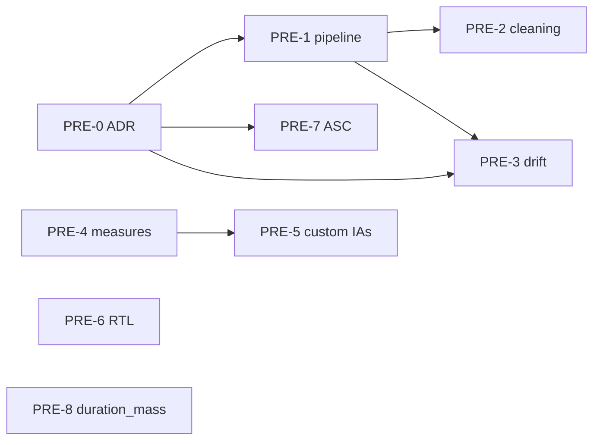

# Scanpath Studio — Improvements & Roadmap

Working tracker for planned features, improvements, and bug fixes. Each item has a
stable **ID** (e.g. `UX-1`) you can cite in chat ("let's do `CMP-3`"), a
**Status**, and a short description with the relevant code anchors.

## How to use this file

- **Status:** `Backlog` (captured, not scheduled) · `Planned` (next-ish, scoped)
  · `In progress` · `Blocked` · `Done`.
- **IDs are stable.** Don't renumber when an item is finished; mark it `Done` (or
  cut it once it has shipped and is in `CHANGELOG.md`). New items get the next
  free number in their group.
- **Composite asks are split** into sub-items so they can land independently.
- When implementing an item, ask for clarification as needed before starting.

### Currently in progress
- **PERF-1** — Plotly → matplotlib migration ([PR #83](https://github.com/lacclab/scanpath-studio/pull/83), `matplotlib-migration` branch).
- **DATA-1** — Broaden dataset support (ongoing epic).

### Terminology
Canonical measures (per `AGENTS.md`): **FFD** (`first_fixation_ms`), **FPRT**
(`first_pass_gaze_duration_ms`), **RPD / go-past** (`regression_path_duration_ms`),
**TFD** (`total_fixation_duration_ms`), plus `n_fixations`, `skip_flag`,
`regression_in/out_flag`. Canonical keys: `participant_id`, `trial_id`,
`paragraph_id`, `word_id`, `line_idx`.

### Groups
[UX & Interaction](#ux--interaction) ·
[Compare mode](#compare-mode) ·
[Visualization & display](#visualization--display) ·
[Datasets & ingestion](#datasets--ingestion) ·
[Performance](#performance) ·
[Analysis & corpus views](#analysis--corpus-views) ·
[Preprocessing — eyekit parity](#preprocessing--eyekit-parity) ·
[Validation](#validation) ·
[Bugs](#bugs) ·
[Engineering](#engineering)

---

## UX & Interaction

**UX-1 · Move the trial-chip field picker into the main plot chip row** — `Status: Done`

Done: the sidebar `🏷️ Trial chips` picker is gone; an inline **✏️ Edit chips**
`st.popover` now sits at the right end of the chip row
(`tabs.render_single_trial_tab`), hosting `controls.render_trial_chip_picker`.

- **UX-1a · Reorder chips in place** — `Status: Done`. Built with
  `streamlit-sortables` (`sort_items`, new dependency): a two-bucket drag UI
  (*Shown · drag to reorder* / *Available*) handles membership **and** order in one
  widget, written back to `trial_chip_fields`.

**UX-2 · Welcome tour covers all major components, in reading order** — `Status: Done`

Done: `tour._SPOTLIGHT_STEPS` is a 9-step reading-order walk (plot → trial
selection → chips → rail view-modes/controls → bottom subtabs → sidebar data +
save/restore), targeting new keyed wrappers (`tour_grp_plot` / `_trial_select` /
`_chips` / `_subtabs`) added in `tabs.py`.

- **UX-2a · Drop the separate Exit button** — `Status: Done`. The card footer is
  now Back / Next (or Done); the ✕ (`tour_sp_close`) is the only close affordance.

**UX-3 · Green/red check & cross in Stimulus & questions** — `Status: Done`

Done: the correctness line in `tabs._render_paragraph_panel` uses Streamlit
colour markdown — `:green[✓ correct]` / `:red[✗ incorrect]` (and `✓ yes`/`✗ no`).

---

## Compare mode

The "Compare with trial" flow (`single_compare_toggle`) and its per-scanpath
styling live in [`controls.py`](scanpath_studio/controls.py:622)
(`_COMPARE_SCANPATHS`, `_render_compare_fix_styles`,
`_render_compare_saccade_styles`, `_collect_compare_styles`); the overlay figure
is built in [`plots.py`](scanpath_studio/plots.py).

**CMP-1 · Move the trial comparison selector into the main plot area** — `Status: Done`

Done: the **Compare** toggle stays in the rail's View modes, but the second-trial
selector (`tabs._render_compare_selector`) now renders above the chips, mirroring
the main picker (selectbox + scrubbing slider + ◀ ▶) with an **A/B** colour-swatch
label line.

**CMP-2 · Optionally hide the compared-trial legend, hidden by default** — `Status: Done`

Done: `global_show_compare_legend` (default off) threads `show_legend` into
`make_comparison_figure` / the split figure **and** the animated dual overlay
(`make_scanpath_animation`); the static overlay reclaims the top reserve when
hidden. Toggle lives in the compare selector's ⚙ popover.

**CMP-3 · Fix compare default colors not matching the actual rendered values** — `Status: Done`

Done: a single `constants.compare_palette_color(idx)` is now the one source of
truth for both the per-scanpath style seeding/collection and
`plots._comparison_scanpath_style`, so the swatches can't drift from the figure —
and CMP-1's A/B labels read those same resolved colours.

**CMP-4 · Remove redundant saccade-color control in compare mode** — `Status: Done`

Done: in compare mode the global Saccade colour/style/width **and** the global
fixation colour-by/size/hollow/colorscale/range controls are hidden (they're dead
for the overlay); only the per-scanpath controls + shared toggles (Direction
arrows, Fixation index) show.

---

## Visualization & display

**VIZ-1 · Warn that font sizes are px, not pt** — `Status: Planned`

All font-size controls are in **pixels** (e.g. `format="%.1f px"`,
`global_order_font_size`, `global_colorbar_tickfont_size` in
[`controls.py`](scanpath_studio/controls.py:1052)), but stimulus typography is
usually specified in **points**. Add a short note/warning near the font controls
explaining the difference (and that matching the original stimulus requires a
px↔pt conversion via DPI).

**VIZ-2 · Increase font size across the app where possible** — `Status: Planned`

General readability pass on app chrome (labels, captions, table text). Likely
[`styles.py`](scanpath_studio/styles.py) / theme. Keep within Streamlit theming;
don't regress dense layouts.

**VIZ-3 · Alternative heatmap normalization** — `Status: Backlog`

Explore normalization options for the heatmap views (e.g. per-trial vs per-corpus
max, log scaling, per-word-area density). Related but distinct from the new
`duration_mass` heatmap style (**PRE-8**).

**VIZ-4 · Improve image-based stimuli support** — `Status: Backlog`

Better handling/rendering when the stimulus is an image rather than laid-out text
(scaling, alignment to fixation space, AOIs over images). Ties into the
stimulus-image fallback used for unsupported scripts in **PRE-6**.

---

## Datasets & ingestion

**DATA-1 · Broaden dataset support (epic)** — `Status: In progress`

Ongoing work to load more corpora beyond the bundled sample / OneStop. Track
per-dataset adapters in [`datasets.py`](scanpath_studio/datasets.py) /
[`data.py`](scanpath_studio/data.py). Related: MultiplEYE support, EyeLink `.asc`
import (**PRE-7**), RTL/multilingual rendering (**PRE-6**), non-English validation
(**VAL-3**).

**DATA-2 · Integrate experimental-setup parameters into display/data settings** — `Status: Backlog`

Fold experimental-setup values (screen resolution, viewing distance, DPI, stimulus
font pt, etc.) into the display/data settings so true-to-scale rendering and the
px↔pt note (**VIZ-1**) can use them directly instead of being implicit.

---

## Performance

**PERF-1 · Replace Plotly with matplotlib (or lighter renderer) for speed** — `Status: In progress`

Interactivity isn't essential for the core spatial plot; a static renderer should
be much faster. Tracked in [PR #83](https://github.com/lacclab/scanpath-studio/pull/83)
(`matplotlib-migration` branch). Keep the spatial plot on the true-scale path.

**PERF-2 · Investigate (and warn about) slowdowns from keeping many fields** — `Status: Backlog`

Hypothesis: selecting many columns/measures/metadata fields slows the app.
**First verify** whether it's actually true (profile a wide vs narrow frame); if
so, add a note/warning. If not, close this item.

---

## Analysis & corpus views

**Goal:** replace the single *Corpus Analysis → Aggregated Views* subtab with a
set of analysis sections, each answering one question — *what does a text look
like? a reader? a group? two groups against each other?* All sections obey the
active trial filters and the metric picker.

**Implementation convention:** keep aggregation logic **pure** in
[`aggregation.py`](scanpath_studio/aggregation.py) (one helper per view → tidy
DataFrame), build figures in [`plots.py`](scanpath_studio/plots.py) via the
`make_*_figure` pattern, wire into [`tabs.py`](scanpath_studio/tabs.py). Add a
smoke test per figure against the bundled sample (3 pid × 2 articles).

### Per text — one `paragraph_id`/`trial_id`, many readers

**AN-1 · Stacked per-reader word profiles (small multiples)** — `Status: Planned` *(primary request)*

X = `word_id` (reading order), Y = chosen measure (TFD default; switch FFD/FPRT/
RPD/`n_fixations`). One panel per `participant_id`, stacked with shared X
(`make_subplots`, `shared_xaxes`). Optional faint cohort-mean overlay per panel.

**AN-2 · Word × reader heatmap** — `Status: Backlog`

Same data collapsed to one heatmap: rows = participants, cols = `word_id`, color =
measure. Bright columns = universally hard words; bright rows = uniformly slow
reader. Reuses word-level heatmap machinery.

**AN-3 · Cohort word profile with spread band** — `Status: Backlog`

Mean measure per word + shaded IQR/±1 SD band across readers — the "average
reader of this text" with uncertainty.

**AN-4 · Word difficulty annotated on the stimulus** — `Status: Backlog`

The text laid out (true-to-scale renderer), each word tinted by aggregate measure
or `skip_rate` / `regression_in_rate` — corpus-level scanpath, no fixations drawn.

**AN-5 · Measure vs. linguistic feature scatter** — `Status: Backlog`

Per-word mean measure vs. a bundled feature (`gpt2_surprisal`,
`wordfreq_frequency`, `word_length`, `universal_pos`) with a trend line. OneStop
sample ships these columns.

**AN-6 · Skip / regression rate per word** — `Status: Backlog`

Bar/lollipop of `skip_flag` and `regression_in_flag` rates by `word_id`.

### Per participant — one `participant_id`, many trials

**AN-7 · Measure distributions vs. cohort** — `Status: Backlog`

Histogram/violin/box of fixation `duration_ms`, `saccade_amplitude`, per-word
TFD/FFD for the selected reader, with the cohort distribution behind. Optional KDE.

**AN-8 · Reading speed & summary card** — `Status: Backlog`

WPM, mean fixation duration, fixation count, regression rate, skip rate, mean
saccade amplitude — compact stat strip + cohort percentiles.

**AN-9 · Fixation duration over time** — `Status: Backlog`

X = `timestamp_ms` (or `order_in_trial`), Y = `duration_ms` — within-trial
fatigue/settling. Faceted by trial or averaged.

**AN-10 · Saccade amplitude vs. fixation duration** — `Status: Backlog`

2D density / hexbin — the classic oculomotor scatter (careful vs. skimming).

**AN-11 · Progressive vs. regressive saccades** — `Status: Backlog`

Counts/share of `is_regression` / `regression_out_flag` per trial.

**AN-12 · Launch-site / landing-position curves** — `Status: Backlog`

Histogram of landing position within words (needs `first_fix_x` relative to word
box) — the preferred-viewing-location curve. Overlaps **PRE-4**'s
`initial_landing_position`.

**AN-13 · Per-trial trend for this reader** — `Status: Backlog`

The existing Trends line filtered to one participant — does this person slow down
across the session?

### Per group — a cohort defined by the active filter

**AN-14 · Group distribution summaries** — `Status: Backlog`

Per-participant distributions pooled across the group (violin/box of fixation
duration, saccade amplitude, TFD, reading speed).

**AN-15 · Group word profile** — `Status: Backlog`

Cohort word profile (mean + band) computed within the group, for a selected text.

**AN-16 · Per-reader summary table for the group** — `Status: Backlog`

Sortable table, one row per participant, columns = summary stats — spot outliers.

**AN-17 · Group trend** — `Status: Backlog`

Trends line averaged within the group (optionally per-participant faint behind).

### Group comparison — two groups side by side

**AN-18 · Overlaid distributions** — `Status: Backlog`

Two groups' fixation-duration / saccade-amplitude / TFD distributions on shared
axes (violin halves or overlaid KDE).

**AN-19 · Difference word profile** — `Status: Backlog`

Per-word measure A − B along the text with a zero reference line and diverging
colormap — *where* the groups diverge (Adv vs. Ele, L1 vs. L2).

**AN-20 · Paired summary bars** — `Status: Backlog`

Side-by-side group-mean bars per measure with error bars (SD / SEM / bootstrap CI).

**AN-21 · Effect size + simple test** — `Status: Backlog`

Per measure: mean difference, Cohen's *d*, Mann–Whitney / t-test p-value, with a
clear "exploratory, not pre-registered" caveat.

**AN-22 · Two-group word heatmap, stacked** — `Status: Backlog`

Group A heatmap above group B (shared word axis) for direct visual comparison.

### Cross-cutting controls for the analysis sections

**AN-23 · Shared measure picker** — `Status: Backlog`

One measure picker (TFD/FFD/FPRT/RPD/`n_fixations`/skip/regression) every section
reads from.

**AN-24 · Aggregation & spread choice** — `Status: Backlog`

Mean/median/sum aggregation and SD/IQR/SEM/bootstrap-CI spread where a band or
error bar is drawn.

**AN-25 · Normalization toggle (raw vs. z-scored within reader)** — `Status: Backlog`

So slow and fast readers compare on shape, not absolute level.

**AN-26 · Min-readers / min-trials guard** — `Status: Backlog`

Gray out / warn when a per-word cell is backed by too few observations.

**AN-27 · Download the underlying tidy table per view** — `Status: Backlog`

Reuse the export plumbing so users can re-plot elsewhere.

---

## Preprocessing — eyekit parity

**Epic.** Scanpath Studio is strong at *visualization* and *corpus aggregation*
but does almost no *data preprocessing* — [eyekit](https://jwcarr.github.io/eyekit/)'s
home turf. These items close the gap.

**Build order:** `PRE-0` → `PRE-1` → (`PRE-2`, `PRE-3`); `PRE-4` → `PRE-5`;
`PRE-6`, `PRE-7`, `PRE-8` independent.

**Milestones:** M1 foundation (`PRE-0`, `PRE-1`) · M2 flagship (`PRE-2`, `PRE-3`)
· M3 analysis (`PRE-4`, `PRE-5`) · M4 reach (`PRE-6`, `PRE-7`, `PRE-8`).

**Cross-cutting acceptance criteria** (every item): new processing is optional &
off by default · visible in the true-scale plot where applicable · reflected in
measures + export · respects `global_*`/`single_*`/`filter_*` session-state
conventions · spatial plot stays on `tabs._render_true_scale_chart` · CHANGELOG
updated.

**PRE-0 · ADR: adopt eyekit as a dependency vs. reimplement** — `Status: Decided 2026-06-23 — reimplement natively` *(blocks PRE-3, PRE-5, PRE-7)*

**Decision: do NOT adopt eyekit; port the algorithms natively.** eyekit is
**GPL-3.0** (copyleft), incompatible with this MIT project distributed on PyPI —
taking it as a runtime dependency would impose GPL on the combined work. The
canonical algorithm code (`jwcarr/drift`, the Carr et al. 2021 companion repo) is
**CC BY 4.0**, so we port with attribution; only `scipy` (BSD-3) is added (the
optimizer + k-means a few algorithms need). Reading measures (**PRE-4**) likewise
stay native. This reverses the earlier "adopt eyekit" recommendation, on the
licence finding above. Full rationale + per-item design (this doc serves as the
ADR): [`plans/pre-3-vertical-drift-correction.md`](plans/pre-3-vertical-drift-correction.md). Deliverable: `scipy` in `pyproject.toml` when PRE-3 lands. **PRE-7**
(`import_asc`) must also be reimplemented or sourced from a non-GPL parser.

**PRE-1 · Preprocessing pipeline stage (foundation)** — `Status: Backlog` *(depends PRE-0)*

Optional stage between `data.normalize_fixations` and
`measures.enrich_fixations`/`compute_per_word_measures`. Fixations gain an
`excluded` flag (soft-exclude, not hard-drop) + a derived-column convention so
corrections keep the original. New **"Preprocessing"** panel, `global_preproc_*`
keys, off by default, with a recompute trigger. Fold preproc settings into the
cache key (don't break the OneStop `frame_fingerprint`/`st.cache_data` fast path).
AC: disabled = byte-identical output to today.

**PRE-2 · Fixation cleaning: discard short / long / out-of-bounds + purge** — `Status: Partly done (visualization-only)`

**Visualization-only version shipped** (per the user's 2026-06-23 reframing): under
the ⚙ Fixation style controls, **short / long / out-of-bounds** each get
Off / **Highlight** (chosen marker + colour) / **Discard** (hide from the plot
only), with editable short/long ms thresholds (defaults 80 / 800). Threaded as a
`fixation_flags` dict through `_collect_viz_settings` → `make_scanpath_figure`
(classify on `ordered`, drop Discards before the marker trace, overlay Highlights);
saccade lines still bridge across discarded fixations. Replaces the old
out-of-text marker toggle (`global_highlight_out_of_text` removed → `fixation_flags`).
Does **not** touch reading measures or exports.

Still **Backlog** (the eyekit preprocessing version): a real `excluded` soft-flag in
the pipeline (depends PRE-1), an "N excluded" count, and `purge` (hard-drop +
reindex) that propagates to measures + export.

**PRE-3 · Vertical drift correction (`snap_to_lines`) + before/after viz** — `Status: Backlog` *(depends PRE-1, PRE-0)*

The headline gap (today only a 50px nearest-word fallback exists in
[`measures.py`](scanpath_studio/measures.py)). **This is the "support fixation
alignment algorithms" request.** Wrap eyekit `FixationSequence.snap_to_lines`
(Carr et al. 2022): `chain / cluster / merge / regress / segment / slice / split /
stretch / warp`. Adapter: word boxes → line y-centers (reuse
`measures.cluster_word_lines`); write corrected y to a derived column. Algorithm
picker + per-algorithm params in the Preprocessing panel. Before/after toggle on
the true-scale plot (ghost originals, arrows to corrected, optional color-by line).

▶ **Detailed plan:** [`plans/pre-3-vertical-drift-correction.md`](plans/pre-3-vertical-drift-correction.md) *(approved 2026-06-23; implementation deferred)*. Revises the approach above per the **PRE-0** decision (**port natively, not eyekit**): a new `alignment.py`, a comparison-grid subtab, and an in-place main-plot correction. The set is the Carr et al. (2021) **10** — `attach / chain / cluster / compare / merge / regress / segment / split / stretch / warp` — which adds `attach`/`compare` and **drops `slice`** (a post-2021 eyekit addition) versus the list above.

**PRE-4 · Reading-measure parity** — `Status: Backlog`

Extend `measures.compute_per_word_measures`: `initial_landing_position` and
`initial_landing_distance`; `number_of_regressions_in` as an integer count (app
has only the boolean flag); `second_pass_duration`; `single_fixation_duration`
(FFD when exactly one first-pass fixation). Audit that the app's
`regression_path_duration` == eyekit `go_past_duration`. Surface in per-word
export, color-by options, corpus aggregation; keep IA_* pre-aggregated precedence.

**PRE-5 · Custom interest areas + IA-level reports** — `Status: Backlog` *(depends PRE-4)*

Today AOIs == precomputed per-word boxes only. Define IAs per text by word range,
regex over word text, or eyekit-style `[bracket]{id}` markup (union of member word
boxes). Render as distinct highlighted regions in
[`plots.py`](scanpath_studio/plots.py). IA-level measures (reuse PRE-4) →
`interest_area_report`-style table for Corpus Analysis + export. Persist
definitions per `text_id` via the Save & restore JSON.

**PRE-6 · RTL & multilingual text rendering** — `Status: Backlog`

Lab is Technion (Hebrew); MultiplEYE anticipates an RTL sample. Today the
true-scale renderer assumes LTR monospace. Add a `right_to_left` flag (per
dataset/trial, auto-detect from script) that flips word/line order + label
anchoring; Arabic shaping/bidi; a CJK-capable font option. Ensure reading-order
inference, line clustering, landing-position direction (**PRE-4**), and order
numbers respect direction. Keep stimulus-image background as fallback (**VIZ-4**).

**PRE-7 · EyeLink `.asc` import** — `Status: Backlog` *(depends PRE-0)*

App requires pre-extracted fixations today. Wrap `eyekit.io.import_asc` (EFIX
fixations; optional messages/variables) → normalized fixation schema; derive
participant/trial from filename (like the MultiplEYE path). New "Dataset format"
in the upload wizard; optional raw-sample surfacing; message-based trial
segmentation. Word boxes/AOIs still come from a separate stimulus file. Feeds
**DATA-1**.

**PRE-8 · `duration_mass` probabilistic heatmap** — `Status: Backlog`

Add eyekit `measure.duration_mass` as a 4th heatmap style (alongside
word/density/interpolated): spread each fixation's duration across nearby
characters via a Gaussian (sigma in chars) instead of hard word assignment. New
style + sigma param in the existing heatmap control; render through the existing
heatmap path in [`plots.py`](scanpath_studio/plots.py). Related to **VIZ-3**.

---

## Validation

**VAL-1 · Validate against the EyeLink-rendered image** — `Status: Backlog`

Confirm the true-to-scale rendering matches what EyeLink produced for the same
trial (word boxes / fixation positions overlay correctly).

**VAL-2 · Validate OneStop text-spacing v1 (1px difference)** — `Status: Backlog`

Verify the 1-pixel text-spacing difference in OneStop spacing version 1 shows up
correctly in the layout.

**VAL-3 · Check additional datasets, especially non-English** — `Status: Backlog`

Smoke-test loading/rendering on non-English corpora. Surfaces RTL needs (**PRE-6**)
and feeds **DATA-1**.

---

## Bugs

**BUG-1 · Trial filter persists (incorrectly) when switching datasets** — `Status: Done`

Done: `app.main` resets the `filter_*` keys + derived `_trial_filters` on a
data-source change (keyed on `(data_choice, public_dataset_choice)`, matching the
col-map reset), and **stashes/restores** the per-dataset selections so switching
back recovers them.

---

## Engineering

Lower priority than features, but tracked.

### Tests

**ENG-1 · Tests for each `aggregation.py` helper + smoke test per new figure** — `Status: Backlog`

Pure functions → feed a tiny tidy frame, assert grouped output.

**ENG-2 · Cover the OneStop per-pid shard fast-path** — `Status: Backlog`

Gated on `$ONESTOP_DATA_DIR`.

**ENG-3 · Cover MultiplEYE side-data enrichment** — `Status: Backlog`

Questions / reader meta / measures / images.

**ENG-4 · Extend `AppTest` coverage** — `Status: Backlog`

Column-mapping UI, trial filters, bulk-export zip.

### Code quality

**ENG-5 · Decompose `app.py`** — `Status: Done`

Done earlier: `url_state.py` (deep-link/share/config), `wizard.py` (upload wizard),
and `constants.py` (source/view labels) were split out (app.py 4087 → ~1640 lines);
view dispatch is `url_state._active_view` + a 2-branch `if/else` in `main`, and the
data-source strategy is `PUBLIC_DATASET_REGISTRY` + `load_words_and_fixations`.
Column mapping always lived in `controls.py`. Verified 2026-06-23.

**ENG-6 · Centralize `st.session_state` keys** — `Status: Skipped`

Skipped at the user's request (2026-06-23): the app has hundreds of keys and
deep-links seed many pre-widget, so a full typed migration is high-risk for low
payoff right now.

**ENG-7 · Confirm `watchdog` is actually used; drop if not** — `Status: Done`

Done: **keep** — `watchdog` is an optional Streamlit runtime file-watcher (faster
hot reload; not imported by app code). Added a clarifying comment in
`pyproject.toml` + `requirements.txt`.

**ENG-8 · Resolve / promote the "Generations (WIP)" tab** — `Status: Backlog`

Finish it or hide it (`model_scanpaths.py` / `similarity.py` / `synthetic.py`).

### UX / robustness

**ENG-9 · Surface auto-detected columns in the Column Mapping panel** — `Status: Done`

Done: `controls.column_mapping_ui` now shows a `✨ auto-detected \`col\`` caption per
field (flagging overrides); the remap editor labels it `currently mapped` instead
(its proposal is the saved mapping, not a fresh detect).

**ENG-10 · Better animation-export errors when Chrome/Chromium is missing** — `Status: Done`

Done: `animation_export.chrome_available()` + a shared `CHROME_INSTALL_HINT`
(pointing to `kaleido_get_chrome` / the HTML export); a UI pre-flight before a
GIF/MP4 render; a warm→cold `to_image` fallback when the warm Kaleido server won't
start but Chrome exists; and the static PNG/SVG/PDF export reuses the same hint.

**ENG-11 · Version saved plot-config JSON + migration path** — `Status: Backlog`

So old saved configs keep loading as the schema evolves.

### Docs

**ENG-12 · Document the true-to-scale text rendering model** — `Status: Backlog`

Data-space word size → screen px; currently only in code comments. (Relates to
VIZ-1 px↔pt and DATA-2.)

**ENG-13 · Document the new analysis sections once built** — `Status: Backlog`

Add to `docs/` after AN-* land.

---

> When any view, measure, severity, or path here lands, update `AGENTS.md`,
> `scanpath_studio/CLAUDE.md`, `CHANGELOG.md`, and the `docs/` site in the same
> change (project convention: keep docs in sync with code).
