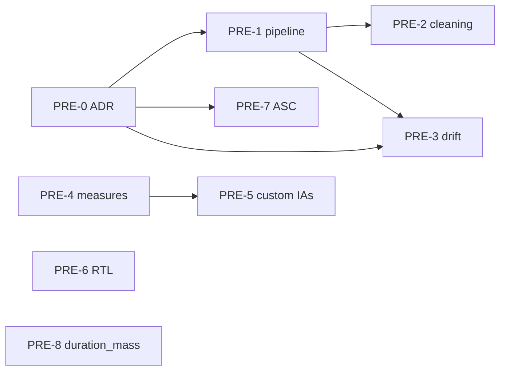

# Scanpath Studio — Improvements & Roadmap

Working tracker for planned features, improvements, and bug fixes. Each item has a
stable **ID** (e.g. `UX-1`) you can cite in chat ("let's do `CMP-3`"), a
**Status**, and a short description with the relevant code anchors.

## How to use this file

- **Status:** `Backlog` (captured, not scheduled) · `Planned` (next-ish, scoped)
  · `In progress` · `Blocked` · `Pending approval` (implemented, awaiting the
  user's final sign-off) · `Done` (signed off — moved to the archive) ·
  `Skipped` (closed without implementing — stays here for the rationale, **not**
  archived).
- **Approval gate.** When an item's implementation is finished, mark it
  `Pending approval` — **never** jump straight to `Done`. Only after the user
  gives the final confirmation does it become `Done` **and move to**
  [`IMPROVEMENTS_ARCHIVE.md`](IMPROVEMENTS_ARCHIVE.md), so this file stays scoped
  to open and recently-finished work. `Skipped` items are **not** archived.
- **IDs are stable.** Don't renumber when an item is finished. New items get the
  next free number in their group; archived items keep their ID over there.
- **Composite asks are split** into sub-items so they can land independently.
- When implementing an item, ask for clarification as needed before starting.

### Currently in progress
- **PERF-1** — Plotly → matplotlib migration ([PR #83](https://github.com/lacclab/scanpath-studio/pull/83), `matplotlib-migration` branch).
- **DATA-1** — Broaden dataset support (ongoing epic).

### Signed off 2026-07-03 (moved to the archive)
Released in **v0.24.0**: **VIZ-1** (px-vs-pt note) · **VIZ-2** (larger small fonts)
· **VIZ-3** (heatmap Linear/Log) · **VIZ-4** (image stimuli: upload override +
align-to-text + generalized) · **VIZ-5** (separable-layer export + empty-data fix)
· **VIZ-8** (saccade-by-type colours + optional legend) · **VIZ-9** ("linear
reading" arcs + snap) · **VIZ-10** (animation autoplay) · **BUG-3** (MultiplEYE
text alignment) · **BUG-5** (upload-size guard) · **BUG-6** (theme from any launch
dir) · **DATA-3** (OneStop public + shareable) · **DATA-9** (Data-sidebar reorg) ·
**ENG-8** (Comparisons subtab) · **ENG-11** (versioned Save & restore) · **ENG-12**
(rendering docs) · **ENG-14** (author list).

### Awaiting your approval
Implemented, not yet signed off (→ `Done` + archive on your confirmation):
**AN-1 … AN-28** (the *Analysis & corpus views* epic — *you asked to keep this
open*); **PRE-3** (vertical drift correction — *you'll revisit*); **VIZ-11**
(animation slider readout — *you'll revisit*); **ENG-15** (standalone desktop
app — implemented 2026-07-16).

### Terminology
Canonical measures (per `AGENTS.md`): **FFD** (`first_fixation_ms`), **FPRT**
(`first_pass_gaze_duration_ms`), **RPD / go-past** (`regression_path_duration_ms`),
**TFD** (`total_fixation_duration_ms`), plus `n_fixations`, `skip_flag`,
`regression_in/out_flag`. Canonical keys: `participant_id`, `trial_id`,
`paragraph_id`, `word_id`, `line_idx`.

### Groups
[UX & Interaction](#ux--interaction) ·
[Compare mode](#compare-mode) ·
[Visualization & display](#visualization--display) ·
[Datasets & ingestion](#datasets--ingestion) ·
[Performance](#performance) ·
[Analysis & corpus views](#analysis--corpus-views) ·
[Preprocessing — eyekit parity](#preprocessing--eyekit-parity) ·
[Validation](#validation) ·
[Bugs](#bugs) ·
[Engineering](#engineering)

---

## UX & Interaction

_UX-1 · UX-1a · UX-2 · UX-2a · UX-3 signed off & archived — see
[`IMPROVEMENTS_ARCHIVE.md`](IMPROVEMENTS_ARCHIVE.md)._

**UX-4 · Replace the same-text ★ marker in trial selectors with a text-like icon** — `Status: Done (signed off 2026-06-25)` →
moved to [`IMPROVEMENTS_ARCHIVE.md`](IMPROVEMENTS_ARCHIVE.md).

**UX-5 · Keep the main Filter-by + trial selectors stable; move extra filter columns under "More"** — `Status: Done (signed off 2026-06-26)` →
moved to [`IMPROVEMENTS_ARCHIVE.md`](IMPROVEMENTS_ARCHIVE.md).

**UX-6 · Mark annotation state (favorites ★ / tags / notes) in the trial selector** — `Status: Done (signed off 2026-06-26)` →
moved to [`IMPROVEMENTS_ARCHIVE.md`](IMPROVEMENTS_ARCHIVE.md).

_Next item: `UX-7`._

---

## Compare mode

The "Compare with trial" flow (`single_compare_toggle`) and its per-scanpath
styling live in [`controls.py`](scanpath_studio/controls.py:622)
(`_COMPARE_SCANPATHS`, `_render_compare_fix_styles`,
`_render_compare_saccade_styles`, `_collect_compare_styles`); the overlay figure
is built in [`plots.py`](scanpath_studio/plots.py).

**CMP-1 · CMP-2 · CMP-3 · CMP-4** — `Status: Done (signed off 2026-06-23)` →
moved to [`IMPROVEMENTS_ARCHIVE.md`](IMPROVEMENTS_ARCHIVE.md). Selector moved above
the chips and made to mirror the main picker (trial id + ★/👤 markers, `index/N ·
id` slider); config moved into the rail **⚙️ Compare** popover; optional A/B legend
+ figure titles removed; per-scanpath colours fixed (incl. the "fixations turn black"
bug); and **Color fixations by** restored in compare mode.

---

## Visualization & display

**VIZ-1 · Warn that font sizes are px, not pt** — `Status: Done (signed off 2026-07-03)` → moved to [`IMPROVEMENTS_ARCHIVE.md`](IMPROVEMENTS_ARCHIVE.md).

**VIZ-2 · Increase font size across the app where possible** — `Status: Done (signed off 2026-07-03)` → moved to [`IMPROVEMENTS_ARCHIVE.md`](IMPROVEMENTS_ARCHIVE.md).

**VIZ-3 · Alternative heatmap normalization** — `Status: Done (signed off 2026-07-03)` → moved to [`IMPROVEMENTS_ARCHIVE.md`](IMPROVEMENTS_ARCHIVE.md).

**VIZ-4 · Improve image-based stimuli support** — `Status: Done (signed off 2026-07-03)` → moved to [`IMPROVEMENTS_ARCHIVE.md`](IMPROVEMENTS_ARCHIVE.md).

**VIZ-5 · Export the plot as separable layers** — `Status: Done (signed off 2026-07-03)` → moved to [`IMPROVEMENTS_ARCHIVE.md`](IMPROVEMENTS_ARCHIVE.md).

**VIZ-6 · Replace the "hollow" fixation marker style with an opacity control** — `Status: Done (signed off 2026-06-23)` →
moved to [`IMPROVEMENTS_ARCHIVE.md`](IMPROVEMENTS_ARCHIVE.md).

**VIZ-7 · Fixation-index range selector on the main scanpath plot** — `Status: Done (signed off 2026-06-23)` →
moved to [`IMPROVEMENTS_ARCHIVE.md`](IMPROVEMENTS_ARCHIVE.md).

**VIZ-8 · Color saccades by saccade type** — `Status: Done (signed off 2026-07-03)` → moved to [`IMPROVEMENTS_ARCHIVE.md`](IMPROVEMENTS_ARCHIVE.md).

**VIZ-9 · "Linear reading" view — saccades as arcs, fixations above the words** — `Status: Done (signed off 2026-07-03)` → moved to [`IMPROVEMENTS_ARCHIVE.md`](IMPROVEMENTS_ARCHIVE.md).

**VIZ-10 · Animate: autoplay on by default + a start/stop autoplay control** — `Status: Done (signed off 2026-07-03)` → moved to [`IMPROVEMENTS_ARCHIVE.md`](IMPROVEMENTS_ARCHIVE.md).

**VIZ-11 · Animate slider: uniform time grid + "elapsed / total seconds" readout** — `Status: Pending approval`

> **Note (2026-07-03):** the user will **revisit this later** before signing off.

**Implemented (2026-07-02).** Frames now sit on a uniform time grid
(`plots._anim_timeline` → `_ANIM_GRID_STEP_MS` / `_ANIM_MAX_FRAMES`, returning
`(frame_times, frame_duration_ms, reading_span_ms)`); the slider
(`_animation_time_slider(frame_times, total_ms)`) labels each step `elapsed /
total s` and dropped the `Elapsed:` prefix. Uniform per-frame duration keeps the
GIF/MP4 export bounded. Display-only (no deep-link/CLI/API surface). Tests in
[`tests/test_plots.py`](tests/test_plots.py) (`TestScanpathAnimation` /
`TestDualScanpathAnimation` / `TestAnimationPlaybackTiming`).

Improve the animation time slider so its readout and stepping are **time-based**
rather than fixation-onset-based, and the readout shows elapsed **out of total**
seconds — e.g. **"1.2 / 30.0s"** instead of the current bare **"Elapsed: X.Xs"**.

**Why not fixation index:** the obvious "Fixation N / TOTAL" readout breaks for a
**comparison** animation (two overlaid scanpaths). In Plotly the slider's stops
*are* the frames, and frames are currently emitted at every distinct fixation
*onset across all scanpaths* (`_anim_timeline`
[`plots.py`](scanpath_studio/plots.py:1745)), so with two readers the steps are
the *union* of both onset sets — no single fixation index is meaningful, and the
slider steps bunch wherever fixations cluster instead of scrubbing linearly.

**Plan — switch the frame grid from onsets to uniform time.** Generate one frame
every fixed interval (≈100 ms) instead of one per onset; the per-frame *content*
logic already works unchanged (`searchsorted(onsets, t)` shows every fixation
whose onset ≤ t — `make_scanpath_animation` [`plots.py`](scanpath_studio/plots.py:2283)).
This makes the slider a linear time scrubber, makes the readout naturally
time-based for **any** number of scanpaths (the two-scanpath problem disappears),
and simplifies playback (uniform per-frame duration — the variable-duration
bookkeeping in `_anim_timeline` mostly goes away). In `_animation_time_slider`
([`plots.py`](scanpath_studio/plots.py:1896)) drop the `prefix="Elapsed: "` and
set each step `label` to `f"{t / 1000:.1f} / {total / 1000:.1f}s"`.
- **Bound the frame count:** an adaptive grid `step = max(100ms, span / MAX_FRAMES)`
  (cap ~300–400 frames) so a long reading gets a coarser grid instead of thousands
  of frames — otherwise the GIF/MP4 export (`animation_export.export_animation`)
  balloons. Quantization is ≤ one grid-step (a 0.13 s onset shows at the 0.2 s
  frame); negligible at 100 ms.
- **Single-scanpath bonus:** when exactly one scanpath is animated the fixation
  index *is* unambiguous, so optionally append it there only —
  `Fixation 5 / 42 · 1.2 / 30.0s` — and omit it in comparison mode.

Display-only; no deep-link/CLI/API surface needed. Related: **VIZ-10**, **CMP-4**.

**VIZ-12 · Quick views: show which preset is active (Scanpath selected by default)** — `Status: Done (signed off 2026-06-25)` →
moved to [`IMPROVEMENTS_ARCHIVE.md`](IMPROVEMENTS_ARCHIVE.md).

**VIZ-13 · Improve word-hover tooltip text + add a configurable measure (TFD by default)** — `Status: Done (signed off 2026-06-25)` →
moved to [`IMPROVEMENTS_ARCHIVE.md`](IMPROVEMENTS_ARCHIVE.md).

**VIZ-14 · Per-trial stimulus images from a folder + naming pattern** — `Status: Backlog`

Split out of VIZ-4 (2026-07-03). The `image_path` / `image_x` / `image_y` column
convention already lets *any* dataset declare embedded/absolute per-trial images,
and an uploaded image can be aligned via VIZ-4's **Align to text** controls. What's
still missing is the case the user raised — a dataset that stores images **on disk
keyed by a column value**: a UI to point at an **image folder** + a **filename
pattern / column** (e.g. `{text_id}.png`) so per-trial images resolve without
embedding them. Local-only (folders aren't reachable on the hosted demo); generalize
`data._resolve_sample_image_paths` from the bundled `sample_data` dir to a
user-supplied root. Keep it deferred until someone needs it on a real on-disk corpus.

_Next item: `VIZ-15`._

---

## Datasets & ingestion

**DATA-1 · Broaden dataset support (epic)** — `Status: In progress`

Ongoing work to load more corpora beyond the bundled sample / OneStop. Track
per-dataset adapters in [`datasets.py`](scanpath_studio/datasets.py) /
[`data.py`](scanpath_studio/data.py). Related: MultiplEYE support, EyeLink `.asc`
import (**PRE-7**), RTL/multilingual rendering (**PRE-6**), non-English validation
(**VAL-3**).

**DATA-2 · Integrate experimental-setup parameters into display/data settings** — `Status: Backlog`

Fold experimental-setup values (screen resolution, viewing distance, DPI, stimulus
font pt, etc.) into the display/data settings so true-to-scale rendering and the
px↔pt note (**VIZ-1**) can use them directly instead of being implicit.

**DATA-3 · Broaden OneStop public-dataset support (all regimes · all parts · public + LaCC lab)** — `Status: Done (signed off 2026-07-03)` → moved to [`IMPROVEMENTS_ARCHIVE.md`](IMPROVEMENTS_ARCHIVE.md). *(Public source + variant/regime/parts now shareable via `?source=onestop_public`.)*

### Data-source UI overhaul (DATA-4 … DATA-7)

Cross-cutting goal: make the **data-source picker** clear and pretty as the public
corpus list grows toward ~40, while keeping **load a local private dataset** the
primary, most prominent path. All four touch the sidebar source UI
(`app.render_sidebar_data_source` [`app.py`](scanpath_studio/app.py:995), the
`PUBLIC_DATASET_REGISTRY` + `_load_public_dataset`
[`app.py`](scanpath_studio/app.py:513), and the per-corpus loaders
`_load_potec_source` / `_load_multipleye_source` / `_load_onestop_public_source`).

**DATA-4 · Public-datasets browser that scales to ~40 corpora** — `Status: Done (signed off 2026-06-26)` →
moved to [`IMPROVEMENTS_ARCHIVE.md`](IMPROVEMENTS_ARCHIVE.md).

**DATA-5 · Drop the per-source participant/text filtering from the loaders** — `Status: Done (signed off 2026-06-26)` →
moved to [`IMPROVEMENTS_ARCHIVE.md`](IMPROVEMENTS_ARCHIVE.md).

**DATA-6 · Surface the expected file names / directory structure per corpus** — `Status: Done (signed off 2026-06-26)` →
moved to [`IMPROVEMENTS_ARCHIVE.md`](IMPROVEMENTS_ARCHIVE.md).

**DATA-7 · Rework the download + mapping flow (button, not a checkbox)** — `Status: Done (signed off 2026-06-26)` →
moved to [`IMPROVEMENTS_ARCHIVE.md`](IMPROVEMENTS_ARCHIVE.md).

**DATA-8 · Show the column-mapping override for the Bundled Demo too** — `Status: Done (signed off 2026-07-02)` →
moved to [`IMPROVEMENTS_ARCHIVE.md`](IMPROVEMENTS_ARCHIVE.md).

**DATA-9 · Reorganize the Data sidebar to be intuitive (merge source + selection, nest setup/mapping)** — `Status: Done (signed off 2026-07-03)` → moved to [`IMPROVEMENTS_ARCHIVE.md`](IMPROVEMENTS_ARCHIVE.md).

_Next item: `DATA-10`._

---

## Performance

**PERF-1 · Replace Plotly with matplotlib (or lighter renderer) for speed** — `Status: In progress`

Interactivity isn't essential for the core spatial plot; a static renderer should
be much faster. Tracked in [PR #83](https://github.com/lacclab/scanpath-studio/pull/83)
(`matplotlib-migration` branch). Keep the spatial plot on the true-scale path.

**PERF-2 · Investigate (and warn about) slowdowns from keeping many fields** — `Status: Backlog`

Hypothesis: selecting many columns/measures/metadata fields slows the app.
**First verify** whether it's actually true (profile a wide vs narrow frame); if
so, add a note/warning. If not, close this item.

---

## Analysis & corpus views

**Goal:** replace the single *Corpus Analysis → Aggregated Views* subtab with a
set of analysis sections, each answering one question — *what does a text look
like? a reader? a group? two groups against each other?* All sections obey the
active trial filters and the metric picker.

**Implementation convention:** keep aggregation logic **pure** in
[`aggregation.py`](scanpath_studio/aggregation.py) (one helper per view → tidy
DataFrame), build figures in [`plots.py`](scanpath_studio/plots.py) via the
`make_*_figure` pattern, wire into [`tabs.py`](scanpath_studio/tabs.py). Add a
smoke test per figure against the bundled sample (3 pid × 2 articles).

> **Note (2026-07-03):** the user asked to **keep this epic open** (not signing off
> yet). *Generations* has since moved out to the Scanpath view's Comparisons
> subtab (ENG-8), so Corpus Analysis is now **Per text · Per reader · Groups**.

**Status (`Pending approval`):** the whole epic is implemented. *Aggregated Views*
is replaced by four question-oriented subtabs — **Per text · Per reader · Per
group · Group comparison** (`render_per_text_tab` / `render_per_reader_tab` /
`render_per_group_tab` / `render_group_comparison_tab`) — alongside *Generations
(WIP)*. Pure helpers + a `Measure` registry live in `aggregation.py`, builders in
`plots.py`, cross-cutting controls + cached wrappers in `tabs.py`; groups are
defined by splitting a field **or** by two independent filter sets. Tests in
[`tests/test_analysis_views.py`](tests/test_analysis_views.py) (unit per helper +
smoke per figure on the bundled sample); `scipy` added for AN-21. Docs synced
(CHANGELOG / AGENTS / `scanpath_studio/CLAUDE.md` / `docs/`).

### Per text — one `paragraph_id`/`trial_id`, many readers

**AN-1 · Stacked per-reader word profiles (small multiples)** — `Status: Pending approval` *(primary request)*

X = `word_id` (reading order), Y = chosen measure (TFD default; switch FFD/FPRT/
RPD/`n_fixations`). One panel per `participant_id`, stacked with shared X
(`make_subplots`, `shared_xaxes`). Optional faint cohort-mean overlay per panel.

**AN-2 · Word × reader heatmap** — `Status: Pending approval`

Same data collapsed to one heatmap: rows = participants, cols = `word_id`, color =
measure. Bright columns = universally hard words; bright rows = uniformly slow
reader. Reuses word-level heatmap machinery.

**AN-3 · Cohort word profile with spread band** — `Status: Pending approval`

Mean measure per word + shaded IQR/±1 SD band across readers — the "average
reader of this text" with uncertainty.

**AN-4 · Word difficulty annotated on the stimulus** — `Status: Pending approval`

The text laid out (true-to-scale renderer), each word tinted by aggregate measure
or `skip_rate` / `regression_in_rate` — corpus-level scanpath, no fixations drawn.

**AN-5 · Measure vs. linguistic feature scatter** — `Status: Pending approval`

Per-word mean measure vs. a bundled feature (`gpt2_surprisal`,
`wordfreq_frequency`, `word_length`, `universal_pos`) with a trend line. OneStop
sample ships these columns.

**AN-6 · Skip / regression rate per word** — `Status: Pending approval`

Bar/lollipop of `skip_flag` and `regression_in_flag` rates by `word_id`.

### Per participant — one `participant_id`, many trials

**AN-7 · Measure distributions vs. cohort** — `Status: Pending approval`

Histogram/violin/box of fixation `duration_ms`, `saccade_amplitude`, per-word
TFD/FFD for the selected reader, with the cohort distribution behind. Optional KDE.

**AN-8 · Reading speed & summary card** — `Status: Pending approval`

WPM, mean fixation duration, fixation count, regression rate, skip rate, mean
saccade amplitude — compact stat strip + cohort percentiles.

**AN-9 · Fixation duration over time** — `Status: Pending approval`

X = `timestamp_ms` (or `order_in_trial`), Y = `duration_ms` — within-trial
fatigue/settling. Faceted by trial or averaged.

**AN-10 · Saccade amplitude vs. fixation duration** — `Status: Pending approval`

2D density / hexbin — the classic oculomotor scatter (careful vs. skimming).

**AN-11 · Progressive vs. regressive saccades** — `Status: Pending approval`

Counts/share of `is_regression` / `regression_out_flag` per trial.

**AN-12 · Launch-site / landing-position curves** — `Status: Pending approval`

Histogram of landing position within words (needs `first_fix_x` relative to word
box) — the preferred-viewing-location curve. Overlaps **PRE-4**'s
`initial_landing_position`.

**AN-13 · Per-trial trend for this reader** — `Status: Pending approval`

The existing Trends line filtered to one participant — does this person slow down
across the session?

### Per group — a cohort defined by the active filter

**AN-14 · Group distribution summaries** — `Status: Pending approval`

Per-participant distributions pooled across the group (violin/box of fixation
duration, saccade amplitude, TFD, reading speed).

**AN-15 · Group word profile** — `Status: Pending approval`

Cohort word profile (mean + band) computed within the group, for a selected text.

**AN-16 · Per-reader summary table for the group** — `Status: Pending approval`

Sortable table, one row per participant, columns = summary stats — spot outliers.

**AN-17 · Group trend** — `Status: Pending approval`

Trends line averaged within the group (optionally per-participant faint behind).

### Group comparison — two groups side by side

**AN-18 · Overlaid distributions** — `Status: Pending approval`

Two groups' fixation-duration / saccade-amplitude / TFD distributions on shared
axes (violin halves or overlaid KDE).

**AN-19 · Difference word profile** — `Status: Pending approval`

Per-word measure A − B along the text with a zero reference line and diverging
colormap — *where* the groups diverge (Adv vs. Ele, L1 vs. L2).

**AN-20 · Paired summary bars** — `Status: Pending approval`

Side-by-side group-mean bars per measure with error bars (SD / SEM / bootstrap CI).

**AN-21 · Effect size + simple test** — `Status: Pending approval`

Per measure: mean difference, Cohen's *d*, Mann–Whitney / t-test p-value, with a
clear "exploratory, not pre-registered" caveat.

**AN-22 · Two-group word heatmap, stacked** — `Status: Pending approval`

Group A heatmap above group B (shared word axis) for direct visual comparison.

### Cross-cutting controls for the analysis sections

**AN-23 · Shared measure picker** — `Status: Pending approval`

One measure picker (TFD/FFD/FPRT/RPD/`n_fixations`/skip/regression) every section
reads from.

**AN-24 · Aggregation & spread choice** — `Status: Pending approval`

Mean/median/sum aggregation and SD/IQR/SEM/bootstrap-CI spread where a band or
error bar is drawn.

**AN-25 · Normalization toggle (raw vs. z-scored within reader)** — `Status: Pending approval`

So slow and fast readers compare on shape, not absolute level.

**AN-26 · Min-readers / min-trials guard** — `Status: Pending approval`

Gray out / warn when a per-word cell is backed by too few observations.

**AN-27 · Download the underlying tidy table per view** — `Status: Pending approval`

Reuse the export plumbing so users can re-plot elsewhere.

**AN-28 · Persist the active filter & visualization controls into Corpus Analysis** — `Status: Pending approval`

The Aggregated Views subtab (`tabs.render_aggregated_views_tab`
[`tabs.py`](scanpath_studio/tabs.py:2528)) already receives
`words_filtered`/`fixations_filtered`, so the **trial filters** (participants, text,
metadata, favourites/tags via `controls.read_trial_filters`) **do** carry over
(matching the section goal above). But it does **not** receive `viz_settings`, so
its per-text heatmap (the `make_scanpath_figure` call around
[`tabs.py`](scanpath_studio/tabs.py:2647)) **hard-codes** the display options —
heatmap style/metric/colorscale, colorbar orientation/font, marker size, label &
text styling, fixation-flag highlights, stimulus image — instead of reading the
user's `global_*` choices, unlike `render_multiple_comparison_tab`, which threads
`viz_settings` through. Pass `viz_settings` from `render_corpus_analysis_tab` into
`render_aggregated_views_tab` and replace the hard-coded figure args with reads
from it; audit the trend / distribution figures for the same gap. Related:
**AN-23**, **AN-24**.

---

## Preprocessing — eyekit parity

**Epic.** Scanpath Studio is strong at *visualization* and *corpus aggregation*
but does almost no *data preprocessing* — [eyekit](https://jwcarr.github.io/eyekit/)'s
home turf. These items close the gap.

**Build order:** `PRE-0` → `PRE-1` → (`PRE-2`, `PRE-3`); `PRE-4` → `PRE-5`;
`PRE-6`, `PRE-7`, `PRE-8` independent.

**Milestones:** M1 foundation (`PRE-0`, `PRE-1`) · M2 flagship (`PRE-2`, `PRE-3`)
· M3 analysis (`PRE-4`, `PRE-5`) · M4 reach (`PRE-6`, `PRE-7`, `PRE-8`).

**Cross-cutting acceptance criteria** (every item): new processing is optional &
off by default · visible in the true-scale plot where applicable · reflected in
measures + export · respects `global_*`/`single_*`/`filter_*` session-state
conventions · spatial plot stays on `tabs._render_true_scale_chart` · CHANGELOG
updated.

**PRE-0 · ADR: adopt eyekit as a dependency vs. reimplement** — `Status: Decided 2026-06-23 — reimplement natively` *(blocks PRE-3, PRE-5, PRE-7)*

**Decision: do NOT adopt eyekit; port the algorithms natively.** eyekit is
**GPL-3.0** (copyleft), incompatible with this MIT project distributed on PyPI —
taking it as a runtime dependency would impose GPL on the combined work. The
canonical algorithm code (`jwcarr/drift`, the Carr et al. 2021 companion repo) is
**CC BY 4.0**, so we port with attribution; only `scipy` (BSD-3) is added (the
optimizer + k-means a few algorithms need). Reading measures (**PRE-4**) likewise
stay native. This reverses the earlier "adopt eyekit" recommendation, on the
licence finding above. Full rationale + per-item design (this doc serves as the
ADR): [`plans/pre-3-vertical-drift-correction.md`](plans/pre-3-vertical-drift-correction.md). Deliverable: `scipy` in `pyproject.toml` when PRE-3 lands. **PRE-7**
(`import_asc`) must also be reimplemented or sourced from a non-GPL parser.

**PRE-1 · Preprocessing pipeline stage (foundation)** — `Status: Backlog` *(depends PRE-0)*

Optional stage between `data.normalize_fixations` and
`measures.enrich_fixations`/`compute_per_word_measures`. Fixations gain an
`excluded` flag (soft-exclude, not hard-drop) + a derived-column convention so
corrections keep the original. New **"Preprocessing"** panel, `global_preproc_*`
keys, off by default, with a recompute trigger. Fold preproc settings into the
cache key (don't break the OneStop `frame_fingerprint`/`st.cache_data` fast path).
AC: disabled = byte-identical output to today.

**PRE-2 · Fixation cleaning: discard short / long / out-of-bounds + purge** — `Status: Partly done (visualization-only)`

**Visualization-only version shipped** (per the user's 2026-06-23 reframing): under
the ⚙ Fixation style controls, **short / long / out-of-bounds** each get
Off / **Highlight** (chosen marker + colour) / **Discard** (hide from the plot
only), with editable short/long ms thresholds (defaults 80 / 800). Threaded as a
`fixation_flags` dict through `_collect_viz_settings` → `make_scanpath_figure`
(classify on `ordered`, drop Discards before the marker trace, overlay Highlights);
saccade lines still bridge across discarded fixations. Replaces the old
out-of-text marker toggle (`global_highlight_out_of_text` removed → `fixation_flags`).
Does **not** touch reading measures or exports.

Still **Backlog** (the eyekit preprocessing version): a real `excluded` soft-flag in
the pipeline (depends PRE-1), an "N excluded" count, and `purge` (hard-drop +
reindex) that propagates to measures + export.

**PRE-3 · Vertical drift correction (`snap_to_lines`) + before/after viz** — `Status: Pending approval` *(implemented 2026-06-28)*

> **Note (2026-07-03):** the user will **revisit this later** before signing off.

The headline gap (today only a 50px nearest-word fallback exists in
[`measures.py`](scanpath_studio/measures.py)). **This is the "support fixation
alignment algorithms" request.** Wrap eyekit `FixationSequence.snap_to_lines`
(Carr et al. 2022): `chain / cluster / merge / regress / segment / slice / split /
stretch / warp`. Adapter: word boxes → line y-centers (reuse
`measures.cluster_word_lines`); write corrected y to a derived column. Algorithm
picker + per-algorithm params in the Preprocessing panel. Before/after toggle on
the true-scale plot (ghost originals, arrows to corrected, optional color-by line).

▶ **Detailed plan:** [`plans/pre-3-vertical-drift-correction.md`](plans/pre-3-vertical-drift-correction.md) *(approved 2026-06-23; **implemented 2026-06-28**)*. Per the **PRE-0** decision (**port natively, not eyekit**): a new [`alignment.py`](scanpath_studio/alignment.py) (native CC BY 4.0 port, see [`NOTICE`](NOTICE)), a **📐 Line assignment** comparison-grid subtab, and an in-place main-plot correction (**Fixations ⚙️ → Drift correction** + optional connectors). The set is the Carr et al. (2021) **10** — `attach / chain / cluster / compare / merge / regress / segment / split / stretch / warp` — which adds `attach`/`compare` and **drops `slice`** (a post-2021 eyekit addition) versus the original list above. *Note:* not yet exposed on the CLI/headless-API surfaces (drift correction is a viz-time transform applied in `tabs.py`, not a `make_scanpath_figure` parameter); `alignment.correct` is importable for scripting.

**PRE-4 · Reading-measure parity** — `Status: Backlog`

Extend `measures.compute_per_word_measures`: `initial_landing_position` and
`initial_landing_distance`; `number_of_regressions_in` as an integer count (app
has only the boolean flag); `second_pass_duration`; `single_fixation_duration`
(FFD when exactly one first-pass fixation). Audit that the app's
`regression_path_duration` == eyekit `go_past_duration`. Surface in per-word
export, color-by options, corpus aggregation; keep IA_* pre-aggregated precedence.

**PRE-5 · Custom interest areas + IA-level reports** — `Status: Backlog` *(depends PRE-4)*

Today AOIs == precomputed per-word boxes only. Define IAs per text by word range,
regex over word text, or eyekit-style `[bracket]{id}` markup (union of member word
boxes). Render as distinct highlighted regions in
[`plots.py`](scanpath_studio/plots.py). IA-level measures (reuse PRE-4) →
`interest_area_report`-style table for Corpus Analysis + export. Persist
definitions per `text_id` via the Save & restore JSON.

**PRE-6 · RTL & multilingual text rendering** — `Status: Backlog`

Lab is Technion (Hebrew); MultiplEYE anticipates an RTL sample. Today the
true-scale renderer assumes LTR monospace. Add a `right_to_left` flag (per
dataset/trial, auto-detect from script) that flips word/line order + label
anchoring; Arabic shaping/bidi; a CJK-capable font option. Ensure reading-order
inference, line clustering, landing-position direction (**PRE-4**), and order
numbers respect direction. Keep stimulus-image background as fallback (**VIZ-4**).

**PRE-7 · EyeLink `.asc` import** — `Status: Backlog` *(depends PRE-0)*

App requires pre-extracted fixations today. Wrap `eyekit.io.import_asc` (EFIX
fixations; optional messages/variables) → normalized fixation schema; derive
participant/trial from filename (like the MultiplEYE path). New "Dataset format"
in the upload wizard; optional raw-sample surfacing; message-based trial
segmentation. Word boxes/AOIs still come from a separate stimulus file. Feeds
**DATA-1**.

**PRE-8 · `duration_mass` probabilistic heatmap** — `Status: Backlog`

Add eyekit `measure.duration_mass` as a 4th heatmap style (alongside
word/density/interpolated): spread each fixation's duration across nearby
characters via a Gaussian (sigma in chars) instead of hard word assignment. New
style + sigma param in the existing heatmap control; render through the existing
heatmap path in [`plots.py`](scanpath_studio/plots.py). Related to **VIZ-3**.

**PRE-9 · Expose drift correction on the deep-link / CLI / headless API surfaces** — `Status: Backlog`

PRE-3 shipped vertical drift correction as a viz-time transform applied in
[`tabs.py`](scanpath_studio/tabs.py) (the `global_align_algorithm` /
`global_align_connectors` viz keys → `alignment.correct`), so it's live in the
UI but **not yet on the other three surfaces** (see *AGENTS.md → Exposing a
feature on every surface*): (1) **deep link / Share** — add `align_algorithm` /
`align_connectors` to `url_state._URL_PRESETS` + `_apply_url_preset` (read) and
`_build_share_query` (write) so a shared link round-trips the applied algorithm;
(2) **CLI** — a `render` flag on [`cli.py`](scanpath_studio/cli.py) (e.g.
`--drift-correct <algo>` / `--drift-connectors`); (3) **headless API** — since
correction happens outside `make_scanpath_figure`, either add an
`align`/`drift_correct` parameter to `api.plot_scanpath` that calls
`alignment.correct` before building, or document `alignment.correct` as the
scripting entry point. (4) **💾 Save & restore** — `align_algorithm` /
`align_connectors` are collected in `controls._collect_viz_settings` but written
by neither `tabs._build_studio_config` nor read by `url_state._restore_plot_config`,
so a saved plot-config JSON doesn't round-trip the drift setting either (add an
`alignment` config section + reader). Keep all surfaces in sync. Follows **PRE-3**.

---

## Validation

**VAL-1 · Validate against the EyeLink-rendered image** — `Status: Backlog`

Confirm the true-to-scale rendering matches what EyeLink produced for the same
trial (word boxes / fixation positions overlay correctly).

**VAL-2 · Validate OneStop text-spacing v1 (1px difference)** — `Status: Backlog`

Verify the 1-pixel text-spacing difference in OneStop spacing version 1 shows up
correctly in the layout.

**VAL-3 · Check additional datasets, especially non-English** — `Status: Backlog`

Smoke-test loading/rendering on non-English corpora. Surfaces RTL needs (**PRE-6**)
and feeds **DATA-1**.

---

## Bugs

_BUG-1, BUG-2 signed off & archived — see
[`IMPROVEMENTS_ARCHIVE.md`](IMPROVEMENTS_ARCHIVE.md)._

**BUG-3 · MultiplEYE: stimulus text renders misaligned (fixations + image are fine)** — `Status: Done (signed off 2026-07-03)` → moved to [`IMPROVEMENTS_ARCHIVE.md`](IMPROVEMENTS_ARCHIVE.md). *(Residual sub-pixel offset = BUG-4.)*

**BUG-4 · MultiplEYE: residual small text-vs-image mismatch** — `Status: Backlog`

Follow-up to **BUG-3** (now `Pending approval`). After the BUG-3 fixes (real
`FONT_SIZE`/`FONT` threaded through, line-pitch-based `scale_text_to_boxes`,
script-aware width cap) the MultiplEYE true-to-scale word text lines up *much*
better, but a **small** residual offset between the rendered text layer and the
stimulus image remains — the labels are close but not pixel-exact on top of the
image words. Likely the leftover slack noted in BUG-3's root cause (2): the
nominal-vs-inked glyph size + anchor difference between how PIL drew the image
glyphs (top-left in a glyph-tight cell) and how Plotly centers/rasterizes the
label in the box, and/or remaining font-metric differences between the CJK
fallback font and the exact stimulus font. Quantify the residual (by how much,
and whether it's a constant shift vs. per-line/per-word drift) before fixing.
Code anchors: `_word_label_font_px` / `scale_text_to_boxes` / `_line_pitch`
([`plots.py`](scanpath_studio/plots.py:339)), MultiplEYE font stamping
(`datasets._multipleye_font_config` / `_multipleye_font_css`), and the font snap
in `app.render_sidebar_canvas_controls`. Related: **BUG-3**, **VIZ-4**, **PRE-6**.

**BUG-5 · Upload crashes on Streamlit Community Cloud (works locally)** — `Status: Done (signed off 2026-07-03)` → moved to [`IMPROVEMENTS_ARCHIVE.md`](IMPROVEMENTS_ARCHIVE.md).

**BUG-6 · Accent color differs: blue locally vs. red on the deployed app** — `Status: Done (signed off 2026-07-03)` → moved to [`IMPROVEMENTS_ARCHIVE.md`](IMPROVEMENTS_ARCHIVE.md).

_Next item: `BUG-7`._

---

## Engineering

Lower priority than features, but tracked.

### Tests

**ENG-1 · Tests for each `aggregation.py` helper + smoke test per new figure** — `Status: Backlog`

Pure functions → feed a tiny tidy frame, assert grouped output.

**ENG-2 · Cover the OneStop per-pid shard fast-path** — `Status: Backlog`

Gated on `$ONESTOP_DATA_DIR`.

**ENG-3 · Cover MultiplEYE side-data enrichment** — `Status: Backlog`

Questions / reader meta / measures / images.

**ENG-4 · Extend `AppTest` coverage** — `Status: Backlog`

Column-mapping UI, trial filters, bulk-export zip.

### Code quality

_ENG-5 (decompose `app.py`) · ENG-7 (`watchdog`) signed off & archived — see
[`IMPROVEMENTS_ARCHIVE.md`](IMPROVEMENTS_ARCHIVE.md)._

**ENG-6 · Centralize `st.session_state` keys** — `Status: Skipped`

Skipped at the user's request (2026-06-23): the app has hundreds of keys and
deep-links seed many pre-widget, so a full typed migration is high-risk for low
payoff right now.

**ENG-8 · Resolve / promote the "Generations (WIP)" tab** — `Status: Done (signed off 2026-07-03)` → moved to [`IMPROVEMENTS_ARCHIVE.md`](IMPROVEMENTS_ARCHIVE.md).

### UX / robustness

_ENG-9 (surface auto-detected columns) · ENG-10 (animation-export errors when
Chrome is missing) signed off & archived — see
[`IMPROVEMENTS_ARCHIVE.md`](IMPROVEMENTS_ARCHIVE.md)._

**ENG-11 · Version saved plot-config JSON + migration path** — `Status: Done (signed off 2026-07-03)` → moved to [`IMPROVEMENTS_ARCHIVE.md`](IMPROVEMENTS_ARCHIVE.md).

**ENG-12 · Document the true-to-scale text rendering model** — `Status: Done (signed off 2026-07-03)` → moved to [`IMPROVEMENTS_ARCHIVE.md`](IMPROVEMENTS_ARCHIVE.md).

**ENG-13 · Document the new analysis sections once built** — `Status: Backlog`

Add to `docs/` after AN-* land.

**ENG-14 · Replace the provisional/TBD author list with the real co-authors** — `Status: Done (signed off 2026-07-03)` → moved to [`IMPROVEMENTS_ARCHIVE.md`](IMPROVEMENTS_ARCHIVE.md).

### Distribution / packaging

**ENG-15 · Package the app as a standalone desktop application** — `Status: Pending approval`

**Implemented (2026-07-16).** Approach per the ADR
([`plans/eng-15-desktop-app.md`](plans/eng-15-desktop-app.md)): **PyInstaller
onedir + the system default browser** (stlite/WASM rejected — scipy/Parquet/
Kaleido; Electron/Tauri and briefcase/constructor rejected for v1). New
[`desktop/`](desktop/): `launcher.py` (free-port Streamlit server + branded
theme via `cli._theme_cli_flags` (BUG-6) + health-check browser open +
`--selfcheck`), `scanpath_studio.spec` (package **source** + `sample_data/`
collected — Streamlit re-execs `app.py` from disk — plus
streamlit/plotly/sortables/kaleido/imageio-ffmpeg data;
`--global.developmentMode=false` guards frozen Streamlit), `smoke_test.py`
(frozen selfcheck: sample → figure → HTML + full app-module import; then boot +
`/_stcore/health` poll + `GET /`), `make_icons.py` + committed `icons/`
(scanpath motif; .png/.ico/.icns). CI:
[`.github/workflows/desktop.yml`](.github/workflows/desktop.yml) — 3-OS matrix
on `v*` tags + manual dispatch, builds, smoke-tests, uploads artifacts, and
attaches archives to the GitHub release. **Verified locally on Linux**: 507 MB
onedir bundle, smoke test fully green. Known limits (documented): unsigned
builds (Gatekeeper/SmartScreen warn), PNG/GIF export still needs a system
Chrome (ENG-10), console window stays visible in v1 (native window = follow-up).

Ship Scanpath Studio as a double-clickable desktop app (Windows / macOS / Linux)
so non-technical researchers can use it without installing Python or running
`pip install` + a terminal command. Today the entry points are the PyPI package
(`scanpath-studio run` via [`cli.py`](scanpath_studio/cli.py)) and the hosted
Streamlit Community Cloud demo — both assume either a Python toolchain or
internet access; a desktop build also keeps private eye-tracking data fully
local. Candidate approaches to evaluate:

- **`streamlit-desktop-app` / PyInstaller** — bundle the Python runtime + app
  into a single executable that launches the Streamlit server and opens a
  native window (pywebview). Most direct; watch binary size (Plotly, pandas,
  scipy) and the `sample_data/` + font assets (`importlib.resources` paths must
  survive freezing).
- **Electron/Tauri wrapper** around a bundled server — more moving parts, but
  proven for Streamlit (e.g. stlite desktop). **stlite (Pyodide/WASM)** itself
  is likely out: scipy/Parquet/Chrome-based animation export may not run in WASM.
- **Conda constructor / briefcase** — installer-style distribution instead of a
  single binary.

Scope: pick an approach (small ADR), a build script + CI job per OS
(`.github/workflows/`), an app icon, and a smoke test that the frozen build
boots the bundled demo. Gotchas to verify under freezing: the theme lookup from
any launch dir (BUG-6), Chrome/kaleido discovery for PNG + animation export
(ENG-10), and `st.cache_data` temp paths. Related: **DATA-1** (private local
corpora are the main audience), **PERF-1**.

---

> When any view, measure, severity, or path here lands, update `AGENTS.md`,
> `scanpath_studio/CLAUDE.md`, `CHANGELOG.md`, and the `docs/` site in the same
> change (project convention: keep docs in sync with code).
