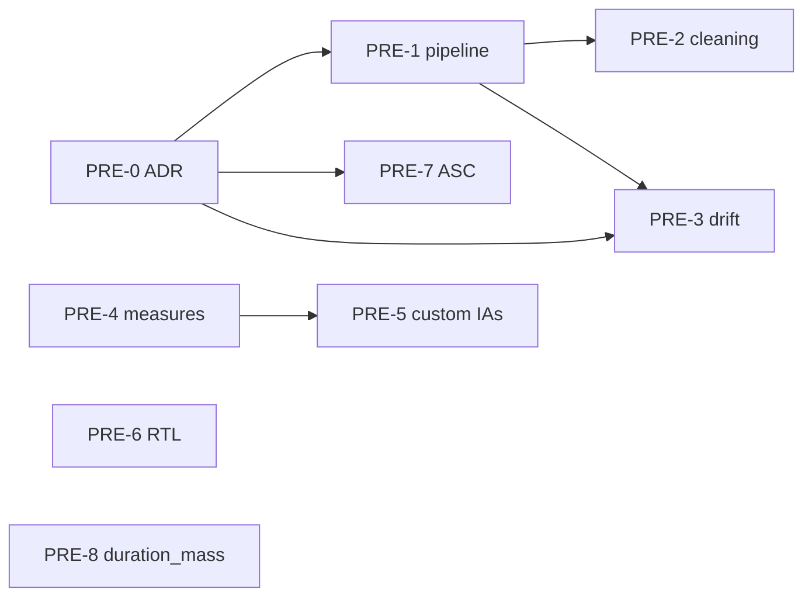

# Scanpath Studio — Improvements & Roadmap

Working tracker for planned features, improvements, and bug fixes. Each item has a
stable **ID** (e.g. `UX-1`) you can cite in chat ("let's do `CMP-3`"), a
**Status**, and a short description with the relevant code anchors.

## How to use this file

- **Status:** `Backlog` (captured, not scheduled) · `Planned` (next-ish, scoped)
  · `In progress` · `Blocked` · `Parked` (wanted, deliberately deferred — see
  below) · `Pending approval` (implemented, awaiting the user's final sign-off).
- **`Parked` vs. `Backlog`.** `Backlog` is the normal queue — unscheduled, but
  eligible. `Parked` means *we decided not to pursue this now*: captured so the
  idea isn't lost, explicitly out of scope until revisited, and not to be picked
  up as ordinary next work. Park with a date and a one-line reason; unparking is
  just a status change back to `Backlog`/`Planned`. ("Epic" is a scope label used
  in an item's title, not a status.)
- **Approval gate.** When an item's implementation is finished, mark it
  `Pending approval` — **never** jump straight to done. Only after the user gives
  the final confirmation is the item **cut from this file** and written up in
  [`IMPROVEMENTS_ARCHIVE.md`](IMPROVEMENTS_ARCHIVE.md), so this file stays scoped
  to open work. An item closed *without* being implemented is archived the same
  way, with the reason — this file holds only open work.
- **IDs are stable.** Don't renumber when an item is finished. New items get the
  next free number in their group; archived items keep their ID over there.
- **Composite asks are split** into sub-items so they can land independently.
- When implementing an item, ask for clarification as needed before starting.

### Currently in progress
- **PERF-1** — Plotly → matplotlib migration ([PR #83](https://github.com/lacclab/scanpath-studio/pull/83), `matplotlib-migration` branch).
- **DATA-1** — Broaden dataset support (ongoing epic).

### Awaiting your approval
Implemented, not yet signed off (→ archived on your confirmation):
**UX-19** (responsive breakpoints), **VIZ-18** (selectable palettes), **VIZ-11**
(animation slider + the frame-grid controls), **ENG-16** (README assets, now
rendered from the real pipeline) — all 2026-07-28.

**Docs, also 2026-07-28** — six new pages, all in the site nav:
**DATA-11** (bring your own data), **DATA-12** (privacy), **DATA-13** (the
security audit — its *fixes* are **DATA-16**), **DATA-14** (contributing a
dataset), **ENG-13** (corpus analysis), **ENG-18** (agent-facing docs + clearer
API errors).

**Tests, also 2026-07-28** — **ENG-1** (every `aggregation.py` helper + a figure
smoke test; found and fixed two real defects), **ENG-2** (the OneStop shard
fast-path), **ENG-3** (MultiplEYE side data), **ENG-4** (`AppTest` flows; found
**BUG-12**).

Older: **AN-28** (the one gap left from the *Analysis & corpus views* epic);
**PRE-3** (vertical drift correction — *you'll revisit*); **ENG-15** (standalone
desktop app — implemented 2026-07-16).

Signed off 2026-07-28 and archived: **UX-7**, **UX-9**, **UX-10**, **UX-11**,
**VIZ-15**, **EXP-1**, **EXP-2**, **AN-1 … AN-27**, **BUG-7**, **BUG-10**
(working as intended), **BUG-11**.

### Groups
[UX & Interaction](#ux--interaction) ·
[Compare mode](#compare-mode) ·
[Visualization & display](#visualization--display) ·
[Datasets & ingestion](#datasets--ingestion) ·
[Performance](#performance) ·
[Analysis & corpus views](#analysis--corpus-views) ·
[Preprocessing — eyekit parity](#preprocessing--eyekit-parity) ·
[Export](#export) ·
[Validation](#validation) ·
[Bugs](#bugs) ·
[Engineering](#engineering)

---

## UX & Interaction

_UX-1 … UX-6, UX-8, UX-9, UX-11, UX-12, UX-13, UX-16, UX-17, UX-18 are in
[`IMPROVEMENTS_ARCHIVE.md`](IMPROVEMENTS_ARCHIVE.md)._

**UX-14 · Tutorials on the documentation site** — `Status: Backlog`

**Primarily a `docs/` job, not an in-app one.** Write task-shaped tutorials on
<https://lacclab.github.io/scanpath-studio/> — *load your own data*, *compare two
readers*, *produce a figure for a paper*, *run it headless from a script* — each
walking a real task end to end with screenshots and copy-pasteable snippets,
rather than the feature-by-feature reference the site carries today. Extending the
in-app welcome tour is a secondary, optional follow-on; the docs are the
deliverable. Related: **UX-17** (the app has no link to the docs site at all —
tutorials nobody can find don't help), **UX-15** (FAQ), **DATA-11** (the
bring-your-own-dataset walkthrough is one of these tutorials), **ENG-12**.

**UX-15 · FAQ (in-app + docs site)** — `Status: Backlog`

Both surfaces: a short in-app FAQ (near the tour/help) and a fuller page on the
docs site. Content still to be decided — collect the recurring questions first
(column mapping, why measures differ from EyeLink's, what drift correction does,
where data goes / privacy → **DATA-12**).

**UX-19 · Layout breaks on smaller laptop screens** — `Status: Pending approval` *(implemented 2026-07-28)*

On ordinary laptop widths (not phones — think a 13" screen or a half-width
window) the app looks bad: controls, chips and the plot column crowd or overlap
rather than adapting. [`styles.py`](scanpath_studio/styles.py) has **no width
breakpoints at all** — the only `@media` rule is `prefers-color-scheme`
([`styles.py`](scanpath_studio/styles.py:121)) — so every layout decision is
fixed-width, which is the likely root cause. Establish the target range (say
≥1280 px down to ~1024 px), find what breaks first (chip strip **UX-11**, the
control rail, the plot's true-scale sizing at
[`plots.py`](scanpath_studio/plots.py:166), the header nav), and add real
breakpoints. AC: no overlap or clipping across the target range; the true-scale
plot keeps its scale guarantee (it may scroll, never distort).

**UX-20 · Disclose that the code was written with AI assistance** — `Status: Pending approval` *(implemented 2026-07-28)*

Say plainly, where a user will see it, that Scanpath Studio was built with
substantial AI assistance; that we made a real effort to validate behaviour but
bugs are possible; and that we want to hear about them.

**What the note should also say** — a bare "there may be bugs" is unfalsifiable
and gives the reader nothing to do with it. Three additions carry the weight:

1. **How the behaviour *was* validated**, concretely, so the claim is checkable
   rather than reassuring: a hand-traced synthetic trial with expected values for
   every measure ([`tests/synthetic_data.py`](tests/synthetic_data.py) — also
   loadable in-app as *Synthetic test trial*, so a user can eyeball it); the
   full pipeline exercised against the bundled sample; and — the strongest point
   — **pre-computed EyeLink `IA_*` measures take precedence over the ones this
   app derives**, so on a normal EyeLink export the numbers *are* the vendor's.
2. **What to do before publishing a number.** For results going into a paper,
   cross-check against your own pipeline or the source export. That is the honest
   ask for a research tool, and it's what a reviewer would ask anyway.
3. **Where to report** — a direct link to GitHub issues, with the one thing that
   makes a report actionable: the deep link / saved config (💾 Save & restore),
   which reproduces the exact view.

Worth *not* saying: anything that reads as a liability disclaimer. The MIT
licence already carries the no-warranty text; this note's job is to be useful.

**Where it goes** — the same three places the citation lives: the About popover
([`app.py`](scanpath_studio/app.py) `_render_about_sidebar`, in a collapsed
expander so it doesn't push the citation out of view), the README, and
`docs/index.md`. Related: **UX-16** (About layout), **DATA-12** (privacy — the
other "what you should know before trusting this" note), **UX-15** (FAQ).

**Implemented.** All three surfaces, plus
[`tests/test_disclosure.py`](tests/test_disclosure.py) — because a disclosure
whose "you can check this yourself" turns out to be wrong is worse than none. The
tests pin the note's own claims: that it appears on every surface with the
actionable half intact, that it carries no liability-disclaimer language, that
`?source=synthetic` really does load the hand-traced trial (drafting caught this
— the note first said "pick it in the data-source picker", but the synthetic
source is deliberately *not* offered fresh, so the deep link is the only route),
that EXPECTED covers every canonical measure, and that a pre-computed EyeLink
`IA_*` value survives both normalization and `compute_word_metrics` untouched —
which is what makes "the numbers are your eye-tracker's" true.

_Next item: `UX-21`._

---

## Compare mode

The "Compare with trial" flow (`single_compare_toggle`) and its per-scanpath
styling live in [`controls.py`](scanpath_studio/controls.py:622)
(`_COMPARE_SCANPATHS`, `_render_compare_fix_styles`,
`_render_compare_saccade_styles`, `_collect_compare_styles`); the overlay figure
is built in [`plots.py`](scanpath_studio/plots.py).

_CMP-1 … CMP-4 are in [`IMPROVEMENTS_ARCHIVE.md`](IMPROVEMENTS_ARCHIVE.md)._

**CMP-5 · Make the Comparisons subtab legible — what is being compared, and why** — `Status: Backlog`

*(Scope note: the main visualization's "Compare with trial" stays a **two**-scanpath
overlay — that's not what this item changes.)*

The **Comparisons** subtab (`render_multiple_comparison_tab`
[`tabs.py`](scanpath_studio/tabs.py:4373)) is hard to follow: it takes the
scanpath from the *main* trial picker, finds other scanpaths of the same text,
groups them by a user-chosen column, scores each against the selected one, and —
when there are more candidates than it can show — silently keeps the
best-ranked subset ([`tabs.py`](scanpath_studio/tabs.py:4257)). A user landing on
the tab can't tell which trials are on screen, why *those* ones, what they're
being compared **against**, or what was dropped.

Make each of those explicit: name the reference scanpath prominently (it comes
from a picker on a different part of the page — **ENG-8** removed the local one),
label every panel with the trial it is and the group it belongs to, state the
grouping column and the ranking rule in the tab itself, and say plainly when
candidates were truncated (*"showing the 6 most similar of 23"*). Related:
**CMP-6** (ordering), **UX-7** (empty/partial states should explain themselves).

**CMP-6 · Order candidate trials by similarity (and other orderings)** — `Status: Backlog`

Similarity scoring exists ([`similarity.py`](scanpath_studio/similarity.py),
`compute_similarity_table`) but only inside the Comparisons subtab, where it ranks
the table. Use it as an **ordering** wherever a trial is picked — first and
foremost the **compare-trial (B) selector** in the main visualization
([`tabs.py`](scanpath_studio/tabs.py:641)), so the candidates for B can be sorted
by similarity to A instead of in data order, making "now show me the most similar
reading / the most different one" a scroll rather than a search. Generalize to
other orderings while there (reading speed, regression rate, fixation count), and
keep it consistent with the general picker sorting in **UX-10**. Related:
**CMP-5**.

**CMP-7 · Two-scanpath heatmap (split word boxes)** — `Status: Backlog`

The word-level heatmap is single-scanpath only; in compare mode there's no
heatmap view. Support two scanpaths in one heatmap by **splitting each word box**
— e.g. left/top half tinted by reader A's measure, right/bottom half by reader B
— on a shared colour scale, so per-word differences are readable at a glance
without a separate difference plot. Renders through the existing
`layout.shapes` heatmap path in [`plots.py`](scanpath_studio/plots.py). Related:
**AN-19** (difference word profile), **AN-22** (stacked two-group heatmap).

**CMP-8 · Compare scanpaths across datasets** — `Status: Parked` *(2026-07-28 — not soon)*

Comparison assumes both scanpaths come from the same loaded dataset (and, for the
overlay, the same text). Allow picking scanpath A and B from **different**
datasets — the same text read under two corpora, or a reader from one study
against a reader from another. Hard part isn't the UI: it's reconciling
coordinate spaces, screen geometry and stimulus layout between corpora, plus
column sets that only partly overlap (see **DATA-2** — experimental-setup
parameters would be needed to put two corpora on a common scale). **Parked at the
user's request (2026-07-28)** — captured, not scoped. Depends on **CMP-5**.

_Next item: `CMP-9`._

---

## Visualization & display

_VIZ-1 … VIZ-10, VIZ-12, VIZ-13, VIZ-15 are in
[`IMPROVEMENTS_ARCHIVE.md`](IMPROVEMENTS_ARCHIVE.md)._

**VIZ-11 · Animate slider: uniform time grid + "elapsed / total seconds" readout** — `Status: Pending approval`

**Follow-up (2026-07-28), from your review.** The grid was decided *for* the user
in two module constants, and worse, the cap coarsened the requested step
**silently** — on the bundled demo the default 100 ms grid is quietly widened to
110 ms, which is exactly the kind of invisible decision that makes a setting feel
arbitrary. Both knobs are now visible in the Animate ⚙ Playback popover —
**Frame every (ms)** (smoothness) and **Max frames** (the ceiling that bounds the
GIF/MP4) — and the info box states what the choice actually produced:
*"361 frames · one every 110 ms of reading — coarsened from 100 ms to stay under
the 360-frame cap"*. New pure helper `plots.animation_timeline_summary` computes
that without building the figure. All four surfaces: the two `global_anim_*`
keys, `anim_grid_step_ms` / `anim_max_frames` in the deep link (clamped via
`_URL_BOUNDED`) and the saved config's new `animation` section,
`--anim-grid-step-ms` / `--anim-max-frames` on `render`, and — free, since the
allow-list is derived from the builder's signature — the same two names as
`animate_scanpath` overrides. Defaults unchanged, so nothing moves until someone
moves it.

**Implemented (2026-07-02).** Frames now sit on a uniform time grid
(`plots._anim_timeline` → `_ANIM_GRID_STEP_MS` / `_ANIM_MAX_FRAMES`, returning
`(frame_times, frame_duration_ms, reading_span_ms)`); the slider
(`_animation_time_slider(frame_times, total_ms)`) labels each step `elapsed /
total s` and dropped the `Elapsed:` prefix. Uniform per-frame duration keeps the
GIF/MP4 export bounded. Display-only (no deep-link/CLI/API surface). Tests in
[`tests/test_plots.py`](tests/test_plots.py) (`TestScanpathAnimation` /
`TestDualScanpathAnimation` / `TestAnimationPlaybackTiming`).

Improve the animation time slider so its readout and stepping are **time-based**
rather than fixation-onset-based, and the readout shows elapsed **out of total**
seconds — e.g. **"1.2 / 30.0s"** instead of the current bare **"Elapsed: X.Xs"**.

**Why not fixation index:** the obvious "Fixation N / TOTAL" readout breaks for a
**comparison** animation (two overlaid scanpaths). In Plotly the slider's stops
*are* the frames, and frames are currently emitted at every distinct fixation
*onset across all scanpaths* (`_anim_timeline`
[`plots.py`](scanpath_studio/plots.py:1745)), so with two readers the steps are
the *union* of both onset sets — no single fixation index is meaningful, and the
slider steps bunch wherever fixations cluster instead of scrubbing linearly.

**Plan — switch the frame grid from onsets to uniform time.** Generate one frame
every fixed interval (≈100 ms) instead of one per onset; the per-frame *content*
logic already works unchanged (`searchsorted(onsets, t)` shows every fixation
whose onset ≤ t — `make_scanpath_animation` [`plots.py`](scanpath_studio/plots.py:2283)).
This makes the slider a linear time scrubber, makes the readout naturally
time-based for **any** number of scanpaths (the two-scanpath problem disappears),
and simplifies playback (uniform per-frame duration — the variable-duration
bookkeeping in `_anim_timeline` mostly goes away). In `_animation_time_slider`
([`plots.py`](scanpath_studio/plots.py:1896)) drop the `prefix="Elapsed: "` and
set each step `label` to `f"{t / 1000:.1f} / {total / 1000:.1f}s"`.
- **Bound the frame count:** an adaptive grid `step = max(100ms, span / MAX_FRAMES)`
  (cap ~300–400 frames) so a long reading gets a coarser grid instead of thousands
  of frames — otherwise the GIF/MP4 export (`animation_export.export_animation`)
  balloons. Quantization is ≤ one grid-step (a 0.13 s onset shows at the 0.2 s
  frame); negligible at 100 ms.
- **Single-scanpath bonus:** when exactly one scanpath is animated the fixation
  index *is* unambiguous, so optionally append it there only —
  `Fixation 5 / 42 · 1.2 / 30.0s` — and omit it in comparison mode.

Display-only; no deep-link/CLI/API surface needed. Related: **VIZ-10**, **CMP-4**.

**VIZ-14 · Per-trial stimulus images from a folder + naming pattern** — `Status: Backlog`

Split out of VIZ-4 (2026-07-03). The `image_path` / `image_x` / `image_y` column
convention already lets *any* dataset declare embedded/absolute per-trial images,
and an uploaded image can be aligned via VIZ-4's **Align to text** controls. What's
still missing is the case the user raised — a dataset that stores images **on disk
keyed by a column value**: a UI to point at an **image folder** + a **filename
pattern / column** (e.g. `{text_id}.png`) so per-trial images resolve without
embedding them. Local-only (folders aren't reachable on the hosted demo); generalize
`data._resolve_sample_image_paths` from the bundled `sample_data` dir to a
user-supplied root. Keep it deferred until someone needs it on a real on-disk corpus.

**VIZ-16 · Show the word text in the fixation hover** — `Status: Backlog`

The fixation hover reads `Fixation # / Duration / Word #`
([`plots.py`](scanpath_studio/plots.py:1620)) — the word *number*, not the word.
Add the word text (the word-box hover already does this,
[`plots.py`](scanpath_studio/plots.py:906)) via `customdata`, for the single,
compare, and animation traces.

**VIZ-18 · Rethink the default palette (contrast, print, greyscale, colourblind)** — `Status: Pending approval` *(implemented 2026-07-28)*

Audit the [`constants.py`](scanpath_studio/constants.py) defaults against the ways
these figures actually get used: on-screen contrast, **printed** in a paper,
reproduced in **black & white**, and read by **colourblind** viewers. Offer
selectable palettes (colourblind-safe, print/greyscale-safe, high-contrast) rather
than only the current one, and prefer a default that survives greyscale
conversion. Interacts with **VIZ-15** (shape as a redundant channel) and
**VIZ-17**.

**VIZ-20 · Hand-authored scanpaths + an "Illustration" mode** — `Status: Backlog`

Two related asks for making *teaching* and *figure* material rather than showing
recorded data:

- **Author a scanpath by hand.** Place fixations (position + duration) and their
  saccades directly on a text to build a scanpath from scratch — the canonical
  "this is what a regression looks like" figure, with no participant data
  involved. Output should flow through the normal figure/export path, and be
  saveable/restorable like any other trial.
- **An "Illustration" preset.** A one-click schematic styling — snapped fixations
  (`fixation_snap_to_word`), arcing saccades (`saccade_render_mode="Arc"`, see
  **BUG-9** / **BUG-10**), clean uniform colours (**VIZ-17**), no raw noise — so
  *recorded* data can also be rendered as a diagram. The preset should compose
  with the existing controls rather than being a separate renderer.

Note: [`synthetic.py`](scanpath_studio/synthetic.py) already builds a fully
hand-specified trial (the "Synthetic test trial" data source) — the same
construction could back the authoring UI.

**VIZ-21 · Audit which control-rail options actually apply in Animate / Compare mode** — `Status: Backlog`

Many rail options silently do nothing (or misbehave) once **Animate** or
**Compare** is on. The gating is ad-hoc and partial: `controls.py` hides a handful
of controls behind `if not comparing:`
([`controls.py`](scanpath_studio/controls.py:1368)) — with a comment conceding
that colour-by-line "is honoured on the static plot, not the animation/compare"
([`controls.py`](scanpath_studio/controls.py:1367)) — while **Animate** gates
nothing at all, so its unsupported settings just have no effect with no
indication. Drift correction (**PRE-3**), snap-above-words, and by-line colouring
are known cases; there are likely more.

Do it in three steps: **(1) map** every `global_*` / `single_*` viz setting
against the three render paths (`make_scanpath_figure`,
`make_scanpath_animation`, the comparison builders) and record which are honoured;
**(2) support** what's reasonably supportable in the animation/compare builders;
**(3) disable** the rest explicitly — greyed out with a reason ("not available
while animating"), never silently ignored. A short table of the mapping in
`scanpath_studio/CLAUDE.md` would keep it honest as builders change. Related:
**CMP-5** (generalizing compare will re-open the same question).

_Next item: `VIZ-22`._

---

## Datasets & ingestion

**DATA-1 · Broaden dataset support (epic)** — `Status: In progress`

Ongoing work to load more corpora beyond the bundled sample / OneStop. Track
per-dataset adapters in [`datasets.py`](scanpath_studio/datasets.py) /
[`data.py`](scanpath_studio/data.py). Related: MultiplEYE support, EyeLink `.asc`
import (**PRE-7**), RTL/multilingual rendering (**PRE-6**), non-English validation
(**VAL-3**).

**DATA-2 · Integrate experimental-setup parameters into display/data settings** — `Status: Backlog`

Fold experimental-setup values (screen resolution, viewing distance, DPI, stimulus
font pt, etc.) into the display/data settings so true-to-scale rendering and the
px↔pt note (**VIZ-1**) can use them directly instead of being implicit.

**DATA-10 · MECO support** — `Status: Backlog`

Add a MECO adapter (the multilingual eye-tracking-while-reading corpus) alongside
OneStop / MultiplEYE / PoTeC in [`datasets.py`](scanpath_studio/datasets.py).
Feeds **DATA-1**, and exercises **PRE-6** (RTL / multilingual rendering) and
**VAL-3** (non-English validation).

**DATA-11 · Documented "bring your own dataset" pipeline** — `Status: Pending approval` *(implemented 2026-07-28)*

**Implemented.** [`docs/bring-your-own-data.md`](docs/bring-your-own-data.md)
— the minimum the app needs and what degrades without each field, how auto-detection
works and how to override it, saving and reusing a mapping, worked EyeLink-report
and plain-CSV examples, and a symptom→cause table for when it goes wrong. Linked
from the wizard's first screen and from `getting-started` / `data-format`.

An end-to-end path from a raw export to a loaded dataset: what the app minimally
needs (word boxes + fixations), how to map columns, how to save and reuse a
mapping, and worked examples for the common export shapes. Docs page + a clear
entry point from the wizard. Distinct from **DATA-14**, which is about getting a
dataset *bundled* with the app. Related: **PRE-7** (`.asc` import).

**DATA-12 · Privacy statement — "we don't use your data"** — `Status: Pending approval` *(implemented 2026-07-28)*

**Implemented.** [`docs/privacy.md`](docs/privacy.md), written from the code
rather than from intent: where an upload actually goes, the three things that
*do* touch the disk, what a share link and a saved config contain, Streamlit's
own telemetry, and a per-deployment section (local / desktop / hosted demo). In
the app, the wizard states where a file goes **before** the uploader and About
links the page. Two code changes came out of it: the CLI now injects
`--browser.gatherUsageStats=false` (Streamlit's default is opt-*in*, and
`.streamlit/config.toml` resolves against the launch directory, so a
pip-installed run had telemetry on), and the desktop bundle binds loopback.

Make it explicit, in the app and in the docs, that uploaded data isn't retained,
transmitted, or used for anything beyond the current session, and spell out what
that means per deployment: local install and the desktop bundle (**ENG-15**) never
leave the machine; the hosted Streamlit demo processes uploads in the session
only. Researchers with participant data need this stated plainly before they
upload, not inferred. Related: **DATA-13**, **UX-15**.

**DATA-13 · Data security** — `Status: Pending approval` *(implemented 2026-07-28)*

**Implemented.** [`docs/security.md`](docs/security.md) — an evidence-based
audit citing the `module.py:function` each claim was verified in: on-disk
residue, deep-link/saved-config leakage, ingest path handling, the desktop
bundle's bind address, and cross-session cache bleed. 11 findings (S1–S11),
severity-ranked, each with the exact fix; two accepted with reasons. It
deliberately changed no code so the fixes land as reviewable commits — tracked as
**DATA-16**. S1 (the bundle served every interface) is already fixed.

The engineering side of **DATA-12**: audit where uploaded data actually goes
(`st.cache_data` temp paths, the export zip staging, any on-disk dataset store the
wizard writes), how long it survives, and what a shared deep link / saved config
can leak. Document the findings and fix what needs fixing. Would become a
prerequisite if a hosted multi-user mode is ever built (**ENG-17**).

**DATA-14 · Document how to get a dataset bundled by default** — `Status: Pending approval` *(implemented 2026-07-28)*

**Implemented.** [`docs/contributing-a-dataset.md`](docs/contributing-a-dataset.md)
— the real adapter contract derived from OneStop / MultiplEYE / PoTeC: the
raw-frames entry point and its signature, canonical-column mapping and
optional-field registration, registry wiring, licence expectations, bundled vs.
download-on-demand and the size threshold that decides, expected tests, and PR
shape, with one existing adapter walked end to end. Linked from `CONTRIBUTING.md`
and the sidebar data-source picker.

Someone with a public corpus should be able to find out how to make it appear as
a built-in data source in a future release — what an adapter in
[`datasets.py`](scanpath_studio/datasets.py) has to provide (loader, licence,
download-on-demand vs. bundled, canonical-column mapping, sample size limits),
what tests are expected, and how to submit it. Write it up in `CONTRIBUTING.md` /
the docs site and link it from the wizard's data-source picker.

**DATA-15 · Real raw-gaze samples in the bundled demo** — `Status: Backlog`

The demo's `raw_gaze.{csv,parquet}` is **synthesized** from the fixation report
(`synthesize_raw_gaze` in
[`update_sample_data.py`](scanpath_studio/update_sample_data.py:322), seeded) — it
looks like real eye-tracker output but isn't, so the raw-gaze overlay demos a
plausible fiction. Either ship genuine OneStop raw samples for the bundled
trials, or label it unmistakably as synthetic everywhere it's shown (the overlay
control, the docs, the export).

**DATA-16 · Fix the security audit's findings** — `Status: Planned`

**DATA-13** produced [`docs/security.md`](docs/security.md) and deliberately
changed no code, so the fixes land as reviewable commits with their own tests.
Each finding names the file + function precisely enough to apply without
re-deriving it. Ranked by what an attacker or an accident can actually achieve:

| # | Sev | Finding | Fix lands in |
| --- | --- | --- | --- |
| ~~S1~~ | High | ~~The desktop bundle binds every interface~~ — **fixed**: `--server.address=127.0.0.1` | `desktop/launcher.py:main` |
| ~~S2~~ | High\* | ~~Path oracle + arbitrary-directory write~~ — **fixed**: `local_filesystem_enabled()` gates the box / picker / download, `SCANPATH_DATA_ROOT` is an allow-root | `app.py` |
| S3 | Med | A share link names a participant, in the URL | `url_state._render_share_body` |
| ~~S4~~ | Med | ~~Exported tables carry an absolute local path~~ — **fixed**: `strip_local_paths` at the `_write_table` chokepoint | `export.py` |
| ~~S5~~ | Med | ~~`frame_fingerprint` ignores the middle of a frame~~ — **fixed**: full hash to 200k rows, order-sensitive digest | `data.frame_fingerprint` |
| S6 | Low–Med | A zip upload is decompressed with no size cap | `data._read_zipped_table` |
| S7 | Low | Stimulus text is interpolated into raw HTML unescaped | `tabs` (stimulus panel) |
| S10 | Low | The debug log handler is added per session to the process-wide root logger | `debug_log` |
| S11 | Low | An unreachable Data Inspection download helper holds a latent leak | `tabs` |

\* hosted deployments only — the app has **no authentication on any deployment**,
so every access-control decision is made by whatever binds the port.

**Done 2026-07-28: S1, S2, S4, S5**, each with its own tests
([`tests/test_deployment_gate.py`](tests/test_deployment_gate.py),
[`tests/test_export.py`](tests/test_export.py)). S1 and S2 went first because
they are the only two a stranger on the network can reach at all.

**Next: S3, S6, S7, S10, S11.** S8 (MP4 temp file) and S9
(`..` in a *user-typed* export pattern) are accepted with reasons recorded on the
page — don't reopen them without reading those. Related: **DATA-12**, **ENG-15**
(desktop), **ENG-17** (a hosted mode would make S2 load-bearing).

_DATA-3 … DATA-9 (OneStop public source + the data-source UI overhaul) are in
[`IMPROVEMENTS_ARCHIVE.md`](IMPROVEMENTS_ARCHIVE.md). Next item: `DATA-17`._

---

## Performance

**PERF-1 · Replace Plotly with matplotlib (or lighter renderer) for speed** — `Status: In progress`

Interactivity isn't essential for the core spatial plot; a static renderer should
be much faster. Tracked in [PR #83](https://github.com/lacclab/scanpath-studio/pull/83)
(`matplotlib-migration` branch). Keep the spatial plot on the true-scale path.

**PERF-2 · Investigate (and warn about) slowdowns from keeping many fields** — `Status: Backlog`

Hypothesis: selecting many columns/measures/metadata fields slows the app.
**First verify** whether it's actually true (profile a wide vs narrow frame); if
so, add a note/warning. If not, close this item.

---

## Analysis & corpus views

_The epic is signed off: **AN-1 … AN-27** are in
[`IMPROVEMENTS_ARCHIVE.md`](IMPROVEMENTS_ARCHIVE.md). Only **AN-28** stays open —
it's the one thing the epic didn't deliver, and it's a plumbing gap rather than a
missing view._

**AN-28 · Persist the active filter & visualization controls into Corpus Analysis** — `Status: Pending approval`

The Aggregated Views subtab (`tabs.render_aggregated_views_tab`
[`tabs.py`](scanpath_studio/tabs.py:2528)) already receives
`words_filtered`/`fixations_filtered`, so the **trial filters** (participants, text,
metadata, favourites/tags via `controls.read_trial_filters`) **do** carry over
(matching the section goal above). But it does **not** receive `viz_settings`, so
its per-text heatmap (the `make_scanpath_figure` call around
[`tabs.py`](scanpath_studio/tabs.py:2647)) **hard-codes** the display options —
heatmap style/metric/colorscale, colorbar orientation/font, marker size, label &
text styling, fixation-flag highlights, stimulus image — instead of reading the
user's `global_*` choices, unlike `render_multiple_comparison_tab`, which threads
`viz_settings` through. Pass `viz_settings` from `render_corpus_analysis_tab` into
`render_aggregated_views_tab` and replace the hard-coded figure args with reads
from it; audit the trend / distribution figures for the same gap. Related:
**AN-23**, **AN-24**.

- **Colour control (added 2026-07-28).** Same gap, stated as a user-facing ask:
  the Corpus Analysis figures hard-code their colours / colourscales, so a user
  can't restyle them (for a paper, for print, or for a colourblind-safe scheme).
  Threading `viz_settings` through covers the heatmap; also expose a colour /
  colourscale choice for the *other* analysis figures (profiles, distributions,
  difference plots), which don't read the `global_*` viz keys at all. Related:
  **VIZ-18**.

---

## Preprocessing — eyekit parity

**Epic.** Scanpath Studio is strong at *visualization* and *corpus aggregation*
but does almost no *data preprocessing* — [eyekit](https://jwcarr.github.io/eyekit/)'s
home turf. These items close the gap.

**Build order:** `PRE-0` → `PRE-1` → (`PRE-2`, `PRE-3`); `PRE-4` → `PRE-5`;
`PRE-6`, `PRE-7`, `PRE-8` independent.

**Milestones:** M1 foundation (`PRE-0`, `PRE-1`) · M2 flagship (`PRE-2`, `PRE-3`)
· M3 analysis (`PRE-4`, `PRE-5`) · M4 reach (`PRE-6`, `PRE-7`, `PRE-8`).

**Cross-cutting acceptance criteria** (every item): new processing is optional &
off by default · visible in the true-scale plot where applicable · reflected in
measures + export · respects `global_*`/`single_*`/`filter_*` session-state
conventions · spatial plot stays on `tabs._render_true_scale_chart` · CHANGELOG
updated.

**PRE-0 · ADR: adopt eyekit as a dependency vs. reimplement** — `Status: Decided 2026-06-23 — reimplement natively` *(blocks PRE-3, PRE-5, PRE-7)*

**Decision: do NOT adopt eyekit; port the algorithms natively.** eyekit is
**GPL-3.0** (copyleft), incompatible with this MIT project distributed on PyPI —
taking it as a runtime dependency would impose GPL on the combined work. The
canonical algorithm code (`jwcarr/drift`, the Carr et al. 2021 companion repo) is
**CC BY 4.0**, so we port with attribution; only `scipy` (BSD-3) is added (the
optimizer + k-means a few algorithms need). Reading measures (**PRE-4**) likewise
stay native. This reverses the earlier "adopt eyekit" recommendation, on the
licence finding above. Full rationale + per-item design (this doc serves as the
ADR): [`plans/pre-3-vertical-drift-correction.md`](plans/pre-3-vertical-drift-correction.md). Deliverable: `scipy` in `pyproject.toml` when PRE-3 lands. **PRE-7**
(`import_asc`) must also be reimplemented or sourced from a non-GPL parser.

**PRE-1 · Preprocessing pipeline stage (foundation)** — `Status: Backlog` *(depends PRE-0)*

Optional stage between `data.normalize_fixations` and
`measures.enrich_fixations`/`compute_per_word_measures`. Fixations gain an
`excluded` flag (soft-exclude, not hard-drop) + a derived-column convention so
corrections keep the original. New **"Preprocessing"** panel, `global_preproc_*`
keys, off by default, with a recompute trigger. Fold preproc settings into the
cache key (don't break the OneStop `frame_fingerprint`/`st.cache_data` fast path).
AC: disabled = byte-identical output to today.

**PRE-2 · Fixation cleaning: discard short / long / out-of-bounds + purge** — `Status: Partly done (visualization-only)`

**Visualization-only version shipped** (per the user's 2026-06-23 reframing): under
the ⚙ Fixation style controls, **short / long / out-of-bounds** each get
Off / **Highlight** (chosen marker + colour) / **Discard** (hide from the plot
only), with editable short/long ms thresholds (defaults 80 / 800). Threaded as a
`fixation_flags` dict through `_collect_viz_settings` → `make_scanpath_figure`
(classify on `ordered`, drop Discards before the marker trace, overlay Highlights);
saccade lines still bridge across discarded fixations. Replaces the old
out-of-text marker toggle (`global_highlight_out_of_text` removed → `fixation_flags`).
Does **not** touch reading measures or exports.

Still **Backlog** (the eyekit preprocessing version): a real `excluded` soft-flag in
the pipeline (depends PRE-1), an "N excluded" count, and `purge` (hard-drop +
reindex) that propagates to measures + export.

**PRE-3 · Vertical drift correction (`snap_to_lines`) + before/after viz** — `Status: Pending approval` *(implemented 2026-06-28)*

> **Note (2026-07-03):** the user will **revisit this later** before signing off.

The headline gap (today only a 50px nearest-word fallback exists in
[`measures.py`](scanpath_studio/measures.py)). **This is the "support fixation
alignment algorithms" request.** Wrap eyekit `FixationSequence.snap_to_lines`
(Carr et al. 2022): `chain / cluster / merge / regress / segment / slice / split /
stretch / warp`. Adapter: word boxes → line y-centers (reuse
`measures.cluster_word_lines`); write corrected y to a derived column. Algorithm
picker + per-algorithm params in the Preprocessing panel. Before/after toggle on
the true-scale plot (ghost originals, arrows to corrected, optional color-by line).

▶ **Detailed plan:** [`plans/pre-3-vertical-drift-correction.md`](plans/pre-3-vertical-drift-correction.md) *(approved 2026-06-23; **implemented 2026-06-28**)*. Per the **PRE-0** decision (**port natively, not eyekit**): a new [`alignment.py`](scanpath_studio/alignment.py) (native CC BY 4.0 port, see [`NOTICE`](NOTICE)), a **📐 Line assignment** comparison-grid subtab, and an in-place main-plot correction (**Fixations ⚙️ → Drift correction** + optional connectors). The set is the Carr et al. (2021) **10** — `attach / chain / cluster / compare / merge / regress / segment / split / stretch / warp` — which adds `attach`/`compare` and **drops `slice`** (a post-2021 eyekit addition) versus the original list above. *Note:* not yet exposed on the CLI/headless-API surfaces (drift correction is a viz-time transform applied in `tabs.py`, not a `make_scanpath_figure` parameter); `alignment.correct` is importable for scripting.

**PRE-4 · Reading-measure parity** — `Status: Backlog`

Extend `measures.compute_per_word_measures`: `initial_landing_position` and
`initial_landing_distance`; `number_of_regressions_in` as an integer count (app
has only the boolean flag); `second_pass_duration`; `single_fixation_duration`
(FFD when exactly one first-pass fixation). Audit that the app's
`regression_path_duration` == eyekit `go_past_duration`. Surface in per-word
export, color-by options, corpus aggregation; keep IA_* pre-aggregated precedence.

**PRE-5 · Custom interest areas + IA-level reports** — `Status: Backlog` *(depends PRE-4)*

Today AOIs == precomputed per-word boxes only. Define IAs per text by word range,
regex over word text, or eyekit-style `[bracket]{id}` markup (union of member word
boxes). Render as distinct highlighted regions in
[`plots.py`](scanpath_studio/plots.py). IA-level measures (reuse PRE-4) →
`interest_area_report`-style table for Corpus Analysis + export. Persist
definitions per `text_id` via the Save & restore JSON.

**PRE-6 · RTL & multilingual text rendering** — `Status: Backlog`

Lab is Technion (Hebrew); MultiplEYE anticipates an RTL sample. Today the
true-scale renderer assumes LTR monospace. Add a `right_to_left` flag (per
dataset/trial, auto-detect from script) that flips word/line order + label
anchoring; Arabic shaping/bidi; a CJK-capable font option. Ensure reading-order
inference, line clustering, landing-position direction (**PRE-4**), and order
numbers respect direction. Keep stimulus-image background as fallback (**VIZ-4**).

**PRE-7 · EyeLink `.asc` import** — `Status: Backlog` *(depends PRE-0)*

App requires pre-extracted fixations today. Wrap `eyekit.io.import_asc` (EFIX
fixations; optional messages/variables) → normalized fixation schema; derive
participant/trial from filename (like the MultiplEYE path). New "Dataset format"
in the upload wizard; optional raw-sample surfacing; message-based trial
segmentation. Word boxes/AOIs still come from a separate stimulus file. Feeds
**DATA-1**.

**PRE-8 · `duration_mass` probabilistic heatmap** — `Status: Backlog`

Add eyekit `measure.duration_mass` as a 4th heatmap style (alongside
word/density/interpolated): spread each fixation's duration across nearby
characters via a Gaussian (sigma in chars) instead of hard word assignment. New
style + sigma param in the existing heatmap control; render through the existing
heatmap path in [`plots.py`](scanpath_studio/plots.py). Related to **VIZ-3**.

**PRE-9 · Expose drift correction on the deep-link / CLI / headless API surfaces** — `Status: Backlog`

PRE-3 shipped vertical drift correction as a viz-time transform applied in
[`tabs.py`](scanpath_studio/tabs.py) (the `global_align_algorithm` /
`global_align_connectors` viz keys → `alignment.correct`), so it's live in the
UI but **not yet on the other three surfaces** (see *AGENTS.md → Exposing a
feature on every surface*): (1) **deep link / Share** — add `align_algorithm` /
`align_connectors` to `url_state._URL_PRESETS` + `_apply_url_preset` (read) and
`_build_share_query` (write) so a shared link round-trips the applied algorithm;
(2) **CLI** — a `render` flag on [`cli.py`](scanpath_studio/cli.py) (e.g.
`--drift-correct <algo>` / `--drift-connectors`); (3) **headless API** — since
correction happens outside `make_scanpath_figure`, either add an
`align`/`drift_correct` parameter to `api.plot_scanpath` that calls
`alignment.correct` before building, or document `alignment.correct` as the
scripting entry point. (4) **💾 Save & restore** — `align_algorithm` /
`align_connectors` are collected in `controls._collect_viz_settings` but written
by neither `tabs._build_studio_config` nor read by `url_state._restore_plot_config`,
so a saved plot-config JSON doesn't round-trip the drift setting either (add an
`alignment` config section + reader). Keep all surfaces in sync. Follows **PRE-3**.

**PRE-10 · Line assignment subtab polish** — `Status: Backlog`

Follow-ups on the 📐 **Line assignment** comparison grid shipped with **PRE-3**:

- **Bigger, and consistent with the main plot.** The grid panels are too small to
  judge an algorithm; render them larger and match the main scanpath plot's
  styling and scale so the comparison reads like the plot above it.
- **Better diff visualization.** Make it obvious *which* fixations an algorithm
  moved and how far — e.g. only the moved fixations highlighted, with their
  displacement — instead of leaving the reader to spot the difference between two
  near-identical panels.
- **Citations.** Show the source for each algorithm (Carr et al. 2021 plus the
  original method papers) next to the picker, so a user can cite what they used.
- *(Parked)* A short recording/animation explaining how `merge` works — worth
  doing eventually, set aside for now.

---

## Export

Bulk + single-trial export lives in [`export.py`](scanpath_studio/export.py)
(wired into the Scanpath view's **Export** subtab).

_EXP-1, EXP-2 are in [`IMPROVEMENTS_ARCHIVE.md`](IMPROVEMENTS_ARCHIVE.md)._

_Next item: `EXP-3`._

---

## Validation

**VAL-1 · Validate against the EyeLink-rendered image** — `Status: Backlog`

Confirm the true-to-scale rendering matches what EyeLink produced for the same
trial (word boxes / fixation positions overlay correctly).

**VAL-2 · Validate OneStop text-spacing v1 (1px difference)** — `Status: Backlog`

Verify the 1-pixel text-spacing difference in OneStop spacing version 1 shows up
correctly in the layout.

**VAL-3 · Check additional datasets, especially non-English** — `Status: Backlog`

Smoke-test loading/rendering on non-English corpora. Surfaces RTL needs (**PRE-6**)
and feeds **DATA-1**.

---

## Bugs

_BUG-1, BUG-2, BUG-3, BUG-5, BUG-6, BUG-7, BUG-10, BUG-11 are in
[`IMPROVEMENTS_ARCHIVE.md`](IMPROVEMENTS_ARCHIVE.md)._

**BUG-4 · MultiplEYE: residual small text-vs-image mismatch** — `Status: Backlog`

Follow-up to **BUG-3** (now `Pending approval`). After the BUG-3 fixes (real
`FONT_SIZE`/`FONT` threaded through, line-pitch-based `scale_text_to_boxes`,
script-aware width cap) the MultiplEYE true-to-scale word text lines up *much*
better, but a **small** residual offset between the rendered text layer and the
stimulus image remains — the labels are close but not pixel-exact on top of the
image words. Likely the leftover slack noted in BUG-3's root cause (2): the
nominal-vs-inked glyph size + anchor difference between how PIL drew the image
glyphs (top-left in a glyph-tight cell) and how Plotly centers/rasterizes the
label in the box, and/or remaining font-metric differences between the CJK
fallback font and the exact stimulus font. Quantify the residual (by how much,
and whether it's a constant shift vs. per-line/per-word drift) before fixing.
Code anchors: `_word_label_font_px` / `scale_text_to_boxes` / `_line_pitch`
([`plots.py`](scanpath_studio/plots.py:339)), MultiplEYE font stamping
(`datasets._multipleye_font_config` / `_multipleye_font_css`), and the font snap
in `app.render_sidebar_canvas_controls`. Related: **BUG-3**, **VIZ-4**, **PRE-6**.

**BUG-8 · Bundled-demo fixation `word_id` is 1-based vs. words `IA_ID` 0-based** — `Status: Backlog`

The demo fixation report's word column runs `1..N` while `ia.csv`'s `IA_ID`
runs `0..N-1`, so each fixation's pre-assigned `word_id` points at the **next**
word. `measures.assign_fixations_to_words` keeps existing ids
(`overwrite=False`), so computed-from-raw measures on this data shape attach to
the wrong words — masked in normal use because the pre-computed IA measures
take precedence. Verify: first fixation of `l37_1129` /
`l37_1129_2_2_1_Adv_r0` sits at (374, 196) on the first word but carries
`word_id=1.0`; that word's `word_id=0`. Decide: regenerate the sample with
consistent ids ([`update_sample_data.py`](scanpath_studio/update_sample_data.py)),
and/or detect a 1-based offset during normalization. Related: **BUG-7** (same
discovery pass).

**BUG-9 · Arc saccades: direction arrowheads not aligned with the arc** — `Status: Planned`

With `saccade_render_mode="Arc"` (**VIZ-9**) the saccade is drawn as an upward
arch, but the arrowheads still come from the straight chord: `_saccade_arrow_markers`
([`plots.py`](scanpath_studio/plots.py:650)) places a marker at the segment
**midpoint** and rotates it along the straight `start → end` heading, so the
arrowhead floats off the curve and points the wrong way relative to it. Compute
the marker position on the arc and its angle from the arc's tangent at that point
(the arch geometry is already known — `arch_frac` / `_ARCH_FRAC`,
[`plots.py`](scanpath_studio/plots.py:1022)). Affects both the single-trial path
and the comparison path ([`plots.py`](scanpath_studio/plots.py:3164)).

**BUG-12 · Annotation filters don't reach the raw-gaze table** — `Status: Planned`

`data.filter_raw_gaze` narrows by participant + trial, but the annotation
filters (favorites / tags) are applied to the words + fixations frames only —
so a raw-gaze row for an unstarred trial survives ⭐ *Favorites only*. Visible
consequence on the bundled demo: with nothing starred, `words_filtered` and
`fixations_filtered` are both empty but `raw_gaze_filtered` isn't, so
[`app.py`](scanpath_studio/app.py:2343)'s all-three-empty guard doesn't fire and
the UX-7 guidance panel is never reached — the user gets a half-empty view with
generic per-subtab "no data" messages instead. Found while writing the ENG-4
AppTest flows (which work around it by using the raw-gaze-free synthetic
source — see the comment in
[`tests/test_apptest_flows.py`](tests/test_apptest_flows.py)). Fix by applying
the same trial-key filter to raw gaze. Related: **UX-7**.

_Next item: `BUG-13`._

---

## Engineering

Lower priority than features, but tracked.

### Tests

**ENG-1 · Tests for each `aggregation.py` helper + smoke test per new figure** — `Status: Pending approval` *(implemented 2026-07-28)*

**Implemented.** Every public helper in `aggregation.py` (36 names, checked by
an AST walk) is covered by a tiny hand-built tidy frame with hand-computed
expectations, in [`tests/test_aggregation.py`](tests/test_aggregation.py); the
figure builders get a structural smoke test each in
[`tests/test_analysis_figures.py`](tests/test_analysis_figures.py). The old
`tests/test_analysis_views.py` was **deleted** — 516 lines of
`assert len(fig.data) >= 1` / `not out.empty` over the same builders; its two
unique regression cases were re-homed first.

Writing it surfaced **two real defects**, both now fixed:
`add_normalized_column` filled an undefined z with `0.0`, conflating a
zero-variance group (where 0 *is* the group mean) with a genuinely missing
observation — so an unfixated word re-entered the distribution as an
exactly-average data point and normalizing changed the observation count; and
`word_rate_profile`'s `n` counted **rows**, so a reader who read a text twice
cleared a min-readers guard that `cohort_word_profile` correctly rejected — the
two guards disagreed on the same frame, and the rates were row-weighted.

Pure functions → feed a tiny tidy frame, assert grouped output.

**ENG-2 · Cover the OneStop per-pid shard fast-path** — `Status: Pending approval` *(implemented 2026-07-28)*

**Implemented.** [`tests/test_onestop_shard.py`](tests/test_onestop_shard.py) —
27 tests, two layers. A synthetic export tree in `tmp_path` (CSV.zip pair +
`by_pid/{ia,fixations}/<pid>.parquet`) always runs; an agreement check against
the real corpus is gated on `$ONESTOP_DATA_DIR` with an explicit skip reason.

The behaviour worth pinning is the **refusal**: when a participant is named and
their shard is missing, `load_onestop_server_bundle` must *not* fall back to the
15 GB read — the link is for one pid, so loading the whole cohort to discover it
has no data is pure waste. Testing that needs `st.stop()` to actually stop; in
pytest's bare mode it is a no-op, so the test swaps in a recorder whose `stop()`
raises. Without that the assertion passes straight through to the slow path and
still looks green.

Also covers `_onestop_shard_paths` (lowercase + strip), the full-export path,
`onestop_full_bundle_exists`, `onestop_data_provenance` (which bytes are on
screen), and `onestop_shard._shard_one` (per-pid write, skip-unless-rebuild,
named errors). Three mutations were run to confirm the tests discriminate —
dropping the pid lowercasing, removing the `st.stop()`, and un-lowercasing the
writer each fail the intended test. The path test exists *because* the
end-to-end one didn't catch the first: macOS is case-insensitive, so the
filesystem round-trip accepted the wrong case and only Linux CI would have
caught it.

**ENG-3 · Cover MultiplEYE side-data enrichment** — `Status: Pending approval` *(implemented 2026-07-28)*

**Implemented.** [`tests/test_multipleye_enrichment.py`](tests/test_multipleye_enrichment.py)
builds a synthetic MultiplEYE tree in `tmp_path` and covers each side-data kind
— comprehension questions, reader metadata, per-reader reading measures, stimulus
images — asserting merged *values* and join keys (no row multiplication), that a
missing file degrades to an absent column rather than a crash, and that malformed
side data can't corrupt the canonical columns.

Questions / reader meta / measures / images.

**ENG-4 · Extend `AppTest` coverage** — `Status: Pending approval` *(implemented 2026-07-28)*

**Implemented.** [`tests/test_apptest_flows.py`](tests/test_apptest_flows.py)
drives multi-step flows through `AppTest`: overriding a column mapping and
checking the re-derived data, narrowing the pool with the condition + annotation
filters (including the UX-7 empty state and the per-filter clear), and building
the bulk-export zip from the Export subtab. Render-level checks stay in
`test_apptest.py`. It also turned up **BUG-12** — annotation filters skip the
raw-gaze table, so on the bundled demo the all-three-empty guard never fires and
the guidance panel is unreachable there; the flow tests use the raw-gaze-free
synthetic source to work around it.

Column-mapping UI, trial filters, bulk-export zip.

### Code quality

_ENG-5 (decompose `app.py`) · ENG-7 (`watchdog`) · ENG-8 (Comparisons subtab) are
in [`IMPROVEMENTS_ARCHIVE.md`](IMPROVEMENTS_ARCHIVE.md)._

**ENG-6 · Centralize `st.session_state` keys** — `Status: Backlog`

*(Was `Skipped` 2026-06-23 — reopened 2026-07-28.)* **273 distinct literal key
strings across 445 occurrences** — 112 in `tabs.py`, 68 in `controls.py`, 42 in
`app.py` — grouped only by naming convention (`global_*` 61, `wizard_*` 22,
`tour_*` 21, `single_*` 12, `filter_*` 5). Replace the bare strings with typed
constants so a typo is an `AttributeError` at import instead of a widget that
silently reads its default forever.

**The reason it was skipped is real and doesn't go away**: a key is not a local
variable, it's a **wire-format contract**. `url_state._apply_url_preset` seeds
many of them *before* the widget exists, `_build_share_query` reads them back,
and the Save & restore JSON stores them — so a rename that looks local silently
breaks a saved config or a shared link, and nothing fails loudly.

**Suggested approach — do the contract, not the whole surface.** A big-bang typed
migration of all 273 buys little and risks exactly the keys that matter. Instead:

1. **Define constants only for the keys with an external contract** — the ones in
   `_SHARE_*` / `_URL_PRESETS` / the Save-&-restore reader. Those are the ones a
   rename can actually break, and there are far fewer of them than 273.
2. **Add a test that pins the wire format**: assert the URL keys and config keys
   against a frozen list, so any future rename fails a test instead of a user's
   old link. *This is the payoff, and it's worth having even if step 1 stops
   there.*
3. Migrate the rest opportunistically, per module, as each is touched — no flag
   day.

Related: **ENG-11** (the config already versions itself; this is the same
concern one layer down).

### UX / robustness

_ENG-9 (auto-detected columns) · ENG-10 (animation-export errors without Chrome) ·
ENG-11 (versioned Save & restore) · ENG-12 (rendering docs) · ENG-14 (author list)
are in [`IMPROVEMENTS_ARCHIVE.md`](IMPROVEMENTS_ARCHIVE.md)._

**ENG-13 · Document the new analysis sections once built** — `Status: Pending approval` *(implemented 2026-07-28)*

**Implemented.** [`docs/corpus-analysis.md`](docs/corpus-analysis.md), in the
site nav under *Using the app*: the three subtabs (Per text · Per reader ·
Groups), what research question each view answers, how to read it, the caveat
that matters for each, and the cross-cutting controls (measure picker,
aggregation & spread, raw vs. z-scored, the min-readers guard, tidy-table
download) plus how the active filter and viz settings carry in.

Add to `docs/` after AN-* land.

**ENG-16 · README: one single-scanpath GIF instead of two** — `Status: Pending approval` *(implemented 2026-07-28)*

**Implemented.** The README keeps the single-scanpath hero GIF and shows the
dual-reader demo as a still (`assets/demo_dual_scanpath.png`, 197 KB), captioned
with a link to the animated version, which now lives on the docs site
(`docs/index.md`, under *The app in one paragraph*). 1.2 MB less animation before
the install line.

**Both assets re-rendered from the real pipeline (2026-07-28, your note).** The
originals were hand-made and didn't correspond to any actual reading. New script
[`assets/render_dual_scanpath.py`](assets/render_dual_scanpath.py) builds them
from the bundled demo — two readers of `2_1_1_Ele`, 305 fixations — through
`plots.make_comparison_figure` and `make_scanpath_animation` +
`animation_export.export_animation`, i.e. exactly what the app draws. Committed
alongside its output, following the `project_map.dot` → `.png` precedent, so the
assets can be regenerated rather than rotting. Word boxes are off (212 AOI
outlines fight the scanpaths at README width) and both are palette-quantized:
the still 1.0 MB → 197 KB, the GIF 2.49 MB → 1.36 MB, visually unchanged.

The README embeds two animated GIFs — the hero
(`assets/scanpath_animation.gif`, a single scanpath) and
`assets/demo_dual_scanpath.gif` (two readers on a shared clock) — ~3 MB of
animation before a reader reaches the install line. Show **one** GIF, of a single
scanpath, and demote the dual-reader demo to a still (or move it to the docs
site). Related: **ENG-12**.

**ENG-18 · Agent-facing docs + an agent-friendly API** — `Status: Pending approval` *(implemented 2026-07-28)*

**Implemented.** [`docs/agents.md`](docs/agents.md) is the counterpart to
`AGENTS.md` for an agent asked to *use* Scanpath Studio headlessly: canonical
column names, the minimum input a figure needs, the full parameter set with
defaults, and runnable end-to-end snippets. On the API side, a caller passing a
table with the wrong column names now gets a message naming the canonical field
that couldn't be inferred and the candidates that were tried, instead of a
`KeyError` from deep inside normalization.

Two halves, both aimed at *users'* coding agents rather than contributors:

1. **Docs an agent can act on.** `AGENTS.md` / `CLAUDE.md` today describe how to
   *develop* Scanpath Studio. Add the counterpart for an agent asked to *use* it —
   the headless surface ([`api.py`](scanpath_studio/api.py) + the `render` CLI):
   canonical column names, the minimal input a figure needs, the parameter set and
   its defaults, and worked end-to-end snippets, in a file an agent will find and
   read.
2. **An agent-friendly API surface.** Audit `api.py` for the things that make
   scripted use awkward — errors that don't say which column was missing,
   parameters that only exist in the UI (drift correction, **PRE-9**), defaults
   that drift from the app's. Related: **ENG-12**, **DATA-11**.

### Distribution / packaging

**ENG-15 · Package the app as a standalone desktop application** — `Status: Pending approval`

**Implemented (2026-07-16).** Approach per the ADR
([`plans/eng-15-desktop-app.md`](plans/eng-15-desktop-app.md)): **PyInstaller
onedir + the system default browser** (stlite/WASM rejected — scipy/Parquet/
Kaleido; Electron/Tauri and briefcase/constructor rejected for v1). New
[`desktop/`](desktop/): `launcher.py` (free-port Streamlit server + branded
theme via `cli._theme_cli_flags` (BUG-6) + health-check browser open +
`--selfcheck`), `scanpath_studio.spec` (package **source** + `sample_data/`
collected — Streamlit re-execs `app.py` from disk — plus
streamlit/plotly/sortables/kaleido/imageio-ffmpeg data;
`--global.developmentMode=false` guards frozen Streamlit), `smoke_test.py`
(frozen selfcheck: sample → figure → HTML + full app-module import; then boot +
`/_stcore/health` poll + `GET /`), `make_icons.py` + committed `icons/`
(scanpath motif; .png/.ico/.icns). CI:
[`.github/workflows/desktop.yml`](.github/workflows/desktop.yml) — 3-OS matrix
on `v*` tags + manual dispatch, builds, smoke-tests, uploads artifacts, and
attaches archives to the GitHub release. **Verified locally on Linux**: 507 MB
onedir bundle, smoke test fully green. Known limits (documented): unsigned
builds (Gatekeeper/SmartScreen warn), PNG/GIF export still needs a system
Chrome (ENG-10), console window stays visible in v1 (native window = follow-up).

**ENG-17 · Hosted online mode: login + remote data backend (Snowflake?)** — `Status: Parked` *(2026-07-28 — may revisit)*

A deployed multi-user mode: authentication (`st.login` / OIDC), per-user datasets
that persist between sessions, and optionally a warehouse backend (Snowflake via
`st.connection`) instead of local files — so a lab could keep a shared corpus
online rather than everyone loading their own copy. The opposite trade-off from
**ENG-15** (the desktop bundle keeps everything local), and it would make
**DATA-13** (data security) a hard prerequisite. **Parked at the user's request
(2026-07-28)** — captured so the idea isn't lost, not scoped.

Ship Scanpath Studio as a double-clickable desktop app (Windows / macOS / Linux)
so non-technical researchers can use it without installing Python or running
`pip install` + a terminal command. Today the entry points are the PyPI package
(`scanpath-studio run` via [`cli.py`](scanpath_studio/cli.py)) and the hosted
Streamlit Community Cloud demo — both assume either a Python toolchain or
internet access; a desktop build also keeps private eye-tracking data fully
local. Candidate approaches to evaluate:

- **`streamlit-desktop-app` / PyInstaller** — bundle the Python runtime + app
  into a single executable that launches the Streamlit server and opens a
  native window (pywebview). Most direct; watch binary size (Plotly, pandas,
  scipy) and the `sample_data/` + font assets (`importlib.resources` paths must
  survive freezing).
- **Electron/Tauri wrapper** around a bundled server — more moving parts, but
  proven for Streamlit (e.g. stlite desktop). **stlite (Pyodide/WASM)** itself
  is likely out: scipy/Parquet/Chrome-based animation export may not run in WASM.
- **Conda constructor / briefcase** — installer-style distribution instead of a
  single binary.

Scope: pick an approach (small ADR), a build script + CI job per OS
(`.github/workflows/`), an app icon, and a smoke test that the frozen build
boots the bundled demo. Gotchas to verify under freezing: the theme lookup from
any launch dir (BUG-6), Chrome/kaleido discovery for PNG + animation export
(ENG-10), and `st.cache_data` temp paths. Related: **DATA-1** (private local
corpora are the main audience), **PERF-1**.

---

> When any view, measure, severity, or path here lands, update `AGENTS.md`,
> `scanpath_studio/CLAUDE.md`, `CHANGELOG.md`, and the `docs/` site in the same
> change (project convention: keep docs in sync with code).
