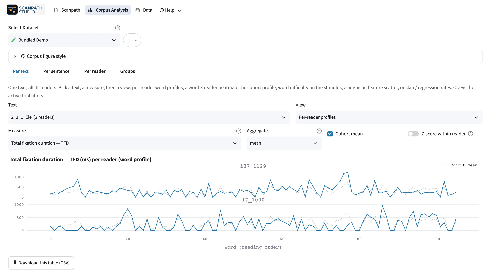

# Corpus workspace

**:material/bar_chart: Corpus Analysis** summarises many readings at once. It uses the same
dataset and trial filters as the Scanpath view. The line beside the dataset
picker counts what those filters keep (for example *12 of 24 trials · 1 of 2
readers*) and names each active filter. **Edit filters** opens the Scanpath
view's filter panel, and **Clear** resets every filter.

<figure class="sps-screenshot" markdown>

</figure>

## Reading measures come from your data

Corpus Analysis shows the reading measures your interest-area report provides
(first fixation duration, total fixation duration, regression path, and so on).
It does not compute them itself. An EyeLink report's `IA_*` columns are mapped
automatically; other names can be mapped under :material/database: **Data Management → Edit dataset**.
Without any, the page says so. The per-fixation measures are the fixation table's
own durations, and its saccade amplitudes, or, when it has none, the distance
between consecutive fixations.

## Three views

| View | Answers |
| --- | --- |
| **Per text** | How was this text read, word by word, across readers? |
| **Per reader** | How does this reader behave across trials? |
| **Groups** | How do conditions or populations differ? |

Choose a measure, how to aggregate it, and the spread to show. A line under the
measure says what it is, its unit, and what each plotted value is (one word,
one reader's mean, …), with a link to its definition; a line under the spread
says whether it shows how values vary (SD, IQR) or how precisely the centre is
known (SEM, bootstrap CI). Set a **minimum number of readers** per word so
sparse words don't look like stable estimates.

**Groups** defines a cohort by splitting on a field, or with its own filters.
Turn on **Compare** for a second cohort, with the two group means and their
difference — descriptive, with no significance test.
Fields from attached participant, trial or text tables appear here too.

## From summary to evidence

Every result table has **⬇ Download this table (CSV)**, with **⬇ Download the
recipe (JSON)** beside it: the dataset, trial filters, analysis choices and
counts that produced the table, without its rows or any figure settings. When
something looks odd, open the trials behind it in the Scanpath view.
