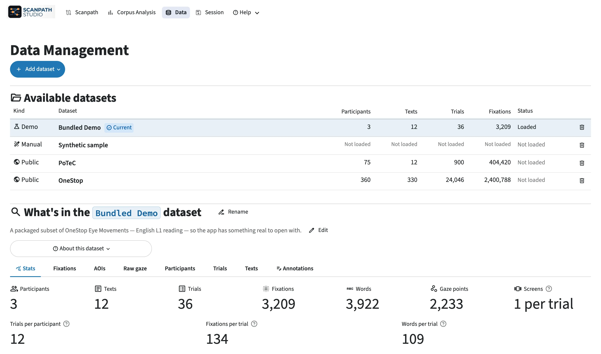

# Loading public and own data

## Choose a source

Open the dataset picker above the plot, or the :material/database: **Data Management** page.

- **Bundled Demo** — a small OneStop sample, for learning the app.
- **Synthetic sample** — a hand-made six-word trial.
- **Public corpus** — OneStop or PoTeC; the app downloads it when asked
  (only when it runs on your own computer — [OneStop](../onestop.md)).
- **+ → Import files** — your own tables.
- **+ → Create manually** — type a text and place fixations on it by hand:
  click to add, drag to move, or edit the table.

## What your data needs

| Table | Minimum |
| --- | --- |
| words / interest areas (AOIs) | trial ID, word ID, and the word box (the word text, to show it) |
| fixations | trial ID, duration, and x/y or a word ID |

Either table alone also works. Participant and text IDs, timestamps, raw gaze,
conditions and reading measures are optional and unlock more features.

Files can be CSV, TSV, TXT, Parquet, Feather, Excel, or a `.zip` of any of
these. A `.zip` holding both EyeLink reports (one folder per participant, say)
can go in both rows: each row reads only its own reports and says which it
left out. See [Data format](../data-format.md) for every field.

## Import files

The import screen has three parts:

1. **Name** — and an optional one-line description.
2. **Tables** — upload fixations, AOIs and, optionally, raw gaze. The app
   guesses which column is which; check its guesses. The trial count under each
   ID picker is a quick sanity check, and hovering the :material/visibility:
   icon beside a mapped field shows its first few values and how they are read,
   for example `0.12 → 120 ms` for a column in seconds. On a guess you have not
   confirmed yet, the same values are on the :material/auto_awesome: confirm
   button's tooltip. Reading measures from an EyeLink
   interest-area report (`IA_DWELL_TIME`, …) are picked up automatically, and
   are what Corpus Analysis shows. Optional tables, one row per reader, trial or
   text, add fields to filter and group by.
3. **Recording setup** — the screen the data was recorded on (below).

Then click **:material/check: Add dataset**. Anything the app cannot use is listed above the
button before you confirm.

To see what the two main tables look like, click **:material/download: Download example
tables** before uploading anything: a tiny AOI table and fixation table that map
without a single manual pick, with a README giving each column's unit and what
the IDs mean.

### Recording setup

Describe the screen the data was **recorded** on, not the one you are using
now. A wrong resolution rescales every figure, so nothing is preselected. For
each value, say how you know it: measured, estimated from your data, or a
default. That answer travels with the dataset, so others can tell measured
values from assumed ones.

## The Data Management page

:material/database: **Data Management** lists every dataset with its counts; click a row to open it.
**Edit dataset** opens under the list, below the open dataset's counts and
tables, and changes its name, description, column mapping, recording setup
and metadata tables, or adds a table it is missing (fixations, AOIs or raw
gaze); its mapped fields show the same value preview. On an
added dataset, changing an ID or coordinate column shows a few values as they
are now and as they will be after saving, and **:material/search: Count trials and check
joins** says whether readings would merge or the word boxes or a metadata table
would stop matching. Its
**:material/download: Save setup** writes the mapping in your files' own column names, so
whoever has the same files can restore it on the add screen; anything a
restore cannot redo by itself is listed beside the button. For the demo and
the public corpora, a recording setup you save is your own for that dataset
alone: the setup the corpus declares is kept, and **Reset to source setup**
goes back to it. Nothing applies until you click **Save changes**;
**Cancel** discards all of it. The page also holds each dataset's tables and its
annotations, and at the foot, what is saved on this computer.

Above the open dataset's tables, **Data checks** looks for values that loaded
as numbers but cannot be right: fixations lasting 0 ms or less or with an
infinite duration or onset, fixations or raw-gaze samples whose position is
missing or infinite, word boxes with no width or height or at infinity, and
per-screen screen sizes that are infinite or 0 or less. Each finding gives the rows and trials affected, the columns
they came from, a few example rows, and what the app does with them. Nothing
is removed: the rows stay in every table and export. `check_data_health` runs
the same checks from Python, and `scanpath-studio check` from the terminal.

Columns are named as they are in your files: in the tables, the plot
controls, the trial chips, filters and sort, Corpus Analysis, the figure's
hover and colour bar, and the setup screens, a column you uploaded as
`CURRENT_FIX_DURATION` keeps that name. A column marked *(computed)* is one
Scanpath Studio made, such as a reading measure your data did not bring.

<figure class="sps-screenshot" markdown>

</figure>
