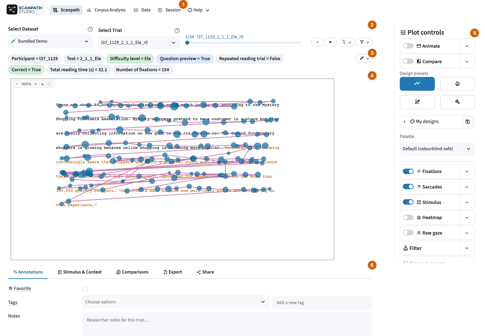

# Scanpath visualization

The Scanpath view shows one selected reading on the stimulus coordinate system.

<figure class="sps-screenshot" markdown>

</figure>

1. The views — 🗺️ Scanpath, 📊 Corpus Analysis, 🗂️ Data — and the 💾 Session
   and ❓ Help dialogs.
2. The dataset and trial pickers, the ⇅ sort and the filter funnel.
3. The trial's summary chips.
4. The figure.
5. The 🎛️ Plot controls.
6. The subtabs: 📝 Annotations, 📄 Stimulus & Context, 🔬 Comparisons,
   📤 Export and 🔗 Share.

## Choose a trial

Use the trial picker on the control line above the plot. The filter funnel
beside it holds every way to narrow the pool — pickers for text and participant
at the top (*All texts* / *All participants* until you choose), then the
condition and annotation filters — and the ⇅ popover orders the list, which helps
surface long, short, early, or late trials. The chip strip under the picker
shows the active trial's summary fields.

When a trial contains ordered screens, a second navigator appears below the
trial picker. The plot always shows one screen in its own recorded canvas; use
the previous/next buttons or screen menu to move between them. Figure links and
saved configurations retain the active screen, and **Annotations** lets you
choose parent-trial or current-screen scope.

## Control the layers

The **🎛️ Plot controls** rail beside the plot starts with the **🎬 Animate** and
**⚖️ Compare** rows, four **Design presets** (👁️ Scanpath, 🔥 Heatmap,
✏️ Illustration, 🛠️ Custom) and a **Palette**. Scanpath, Heatmap and
Illustration reset to the app defaults before applying their view; **Custom**
restores your last hand-made settings. Seven sections follow:

| Section | Layers | Use it for |
| --- | --- | --- |
| 👁️ Fixations | Fixations | location, order, duration and colour field |
| ↗️ Saccades | Saccades | movement direction, reading type, regressions and return sweeps |
| 📄 Stimulus | Text, Bounding boxes, Stimulus image | verify stimulus geometry and fixation-to-word alignment; compare against the original display; text font, text colour and plot background |
| 🔥 Heatmap | Heatmap | spatial concentration by fixation count or duration |
| 🔵 Raw gaze | Raw gaze | millisecond-level gaze samples |
| 🧹 Filter | — | thin what is drawn inside this one reading (fixations and saccades together) |
| 📐 Figure & canvas | — | monitor framing, colour bars, axes, title and labels |

Each section is one line: its switch and a **▾** with the rest of its settings.
Switching a layer off keeps its settings.

**Stimulus → Text** keeps typography beside the layer it controls. Text can
scale from word boxes, or use one fixed size entered in pixels or points; point
sizes use the dataset DPI. The text font, text colour and **Plot background**
live there too, so they are only on screen while the Text layer is on (your
choices are kept while it is off). **📐 Figure & canvas** contains **🖥️ Screen &
framing**, **📊 Axes & grid**, and **🏷️ Title & labels**.

**Colour ranges** — the fixation colour range (👁️ Fixations **▾**, once
fixations are coloured by a column) and the heatmap's (🔥 Heatmap **▾**) start
on **Auto range**: each trial is scaled to its own values, and a comparison
shares one scale across both readings. Drag the range, type a bound, or untick
*Auto range* to pin one. A pinned range stays as you step through trials, which
is what makes them comparable, and travels on a Share link, until you tick
*Auto range* again. Choosing another *Color fixations by* column puts the
fixation range back to auto.

### Show screen coordinates

Open **📐 Figure & canvas → 📊 Axes & grid** and turn on **Coordinate grid** to
read the stimulus in monitor pixels. Automatic spacing chooses a readable
1/2/5×10ⁿ interval for the current range; turn it off to enter an exact major
interval. Ticks stay anchored to screen-coordinate zero even when the visible
range is cropped or negative.
The grid is off by default and does not shrink or rescale the spatial data area.

## Filter fixations and saccades

One **🧹 Filter** section thins the whole figure, in two blocks. Not to be
confused with the filter funnel on the control line above the plot, which narrows the
*trial pool* — which readings you can pick; this one thins the reading you are
looking at.

**👁️ Fixations** contains duration thresholds, out-of-bounds handling, and the
fixation-index range. **Highlight** keeps flagged fixations in view, marked; **Discard** removes them from
the rendered scanpath.

**↗️ Saccades** picks which reading classes are drawn at all — forward,
skip, refixation, return sweep, regression. Hidden classes lose their line
*and* their direction arrow, which is how you get a regressions-only figure.
Clearing the list means no filter. A • on the section title shows that
something is hidden.

These are visualization choices, not edits to the source data or reading-measure
computation.

## Replay and compare

- **Animate** replays the selected trial. The **▾** beside it controls playback
  speed, autoplay, and smoothness.
- **Compare** adds a second reading to the selected one — overlaid on the same
  stimulus by default, or side by side / top & bottom from the **▾** beside it.
- **Comparisons** shows trials whose chosen field matches the selected trial.
  Choosing text id finds other readings of the text; choosing participant id
  finds that reader's other trials.

### Comparing across datasets

**Compare with** (the first control on scanpath B's line, under the main dataset
picker) chooses which dataset scanpath B comes from. It defaults to *This
dataset*; pick another and the candidate list, the filter funnel at the end of
B's line, and the trial's screen geometry all come from that dataset instead.

B's line has its own filter funnel: it starts from the whole dataset, and your
main funnel never narrows B.

Uploads, the bundled demo and the synthetic trial are always available. A public
corpus loads only if its files are already set up; otherwise it shows *(needs
setup)* — open it once as the main dataset.

Three things behave differently across datasets:

| | Why |
| --- | --- |
| **Overlay needs one shared screen** | Overlay pools both readings into one set of pixel coordinates, so it needs matching canvases — see below. Otherwise Side by side is used, and your Overlay choice is remembered for same-dataset pairs. |
| **Each panel is drawn to its own screen** | In a split layout a caption under the figure names both monitors. Box and text sizes are true-to-scale *within* a panel and **not** comparable across panels. |
| **Only shared metrics can colour it** | A measure one corpus ships and the other doesn't would colour one panel and blank the other, so it falls back with a note. |

Across datasets 👤 (same reader) never appears; 📄 still marks a matching text
id.

#### When can two datasets be overlaid?

Only when the two canvas sizes match; otherwise Side by side is used. If either
dataset did not record its screen (most public corpora), the overlay is drawn
with a warning, because the app cannot confirm the displays matched. Nothing is
rescaled to make an overlay possible.

An animated comparison follows the same rule — a co-animation replays both
readings on one clock, which is an overlay, so it needs the same shared screen.

#### Whose text does an overlay show?

**Stimulus from** (in the **▾** beside Compare, overlay only) picks which reading
supplies the word boxes and text: **Both**, **A**, or **B**. Two datasets' word
boxes line up only when the text, font and wrapping are identical, so across
corpora *Both* often draws two offset sets of rectangles under the two traces.
Pick one side to read the overlay as a comparison of the *fixation traces*
against a single stimulus. It defaults to *Both*.

**⚖️ Download this comparison as a bundle** (Export → *Current figure*) writes the
figure plus both scanpaths' tables and a manifest naming each side's dataset,
trial and recording setup. The image alone can't be reproduced; the bundle can.

A Share link carries the comparison and each scanpath's styling; a comparison
with an uploaded dataset can't be rebuilt from a link, and the Share panel says
so.

Compare mode is also available headlessly — see
[`compare_scanpaths`](../api.md#scanpath_studio.api.compare_scanpaths) and
`render --compare-with` in the [CLI reference](../cli.md#compare-two-scanpaths).

Use [Outputs and sharing](outputs-sharing.md) when the view is ready.
