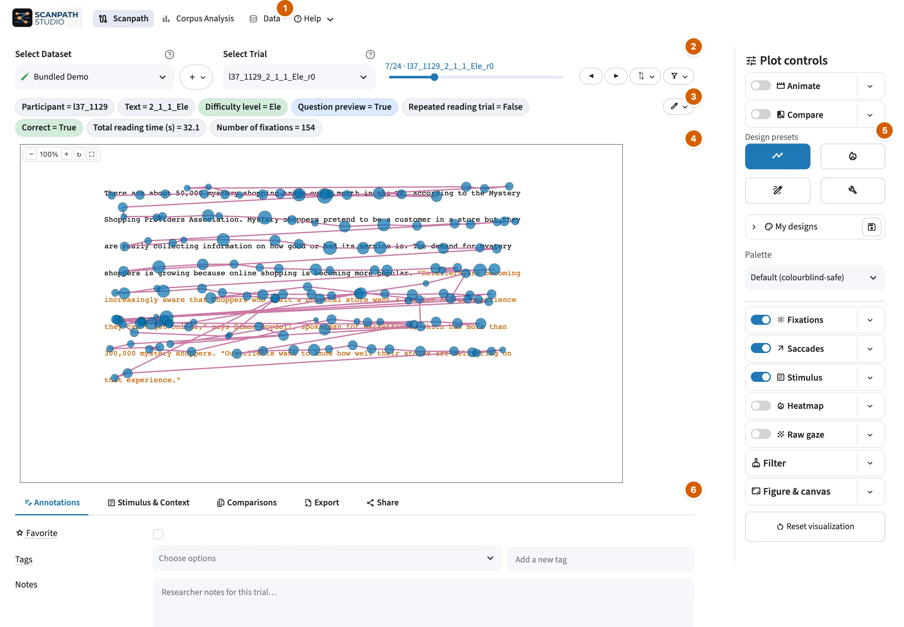

# Scanpath visualization

The Scanpath view draws one reading on the screen it was recorded on.

<figure class="sps-screenshot" markdown>

</figure>

1. Views and :material/help: Help.
2. Dataset and trial pickers, sort (⇅) and filter funnel.
3. The trial's summary.
4. The figure.
5. Plot controls.
6. Annotations, Stimulus & context, Comparisons, Export and Share.

## Choose a trial

Pick a trial above the plot. The **filter funnel** beside it narrows the list
by text, participant, condition or annotation, and **⇅** sorts it. A trial with
several screens gets a second navigator to move between them.

## Control the layers

The **:material/tune: Plot controls** rail starts with **:material/movie: Animate**, **:material/compare: Compare**, four
design presets and a palette. Below them, each section is one line: a switch,
and a **▾** with its settings.

| Section | What it controls |
| --- | --- |
| :material/blur_on: Fixations | markers: size, color, order |
| :material/arrow_outward: Saccades | lines and arrows, colored by direction or reading type |
| :material/article: Stimulus | text, span highlight, stimulus image, font and background |
| :material/crop_square: Word boxes | each word's interest area: outline color and opacity; fill color and opacity |
| :material/local_fire_department: Heatmap | where fixations concentrate, by count or duration |
| :material/grain: Raw gaze | the gaze samples as recorded |
| :material/filter_list: Filters & highlights | which fixations and saccades are drawn |
| :material/aspect_ratio: Figure & canvas | screen framing, axes and grid, title and labels, hover fields, legends |

Color ranges start on **Auto**, scaled to each trial. Pin a range to keep it
fixed as you step through trials and filters, so they stay comparable; its
number boxes take any endpoint, beyond the data shown too. The word-box
heatmap's range is in dwell time per word (ms), the summed duration of the
fixations in each box, or in fixations per word; on Auto it runs from 0 to the
trial's highest. **Interpolated** blurs the fixations with a Gaussian (its
**Blur** row: Auto, or a σ in px) and scales to each figure's own peak, so its
range is grayed. The range still applies to Word boxes, and in Compare, which
always draws word boxes.

Marker size shows fixation duration on a **fixed scale**: 50–600 ms span the
smallest to the largest marker in every trial, both sides of a comparison, the
replay and every export, so one duration is always one size. Shorter fixations
take the smallest marker and longer ones the largest. Under
**:material/blur_on: Fixations ▾**, **Scale** picks the curve: **√ duration** (the
default) grows marker area with duration, **Linear** grows the diameter with it,
**Log** compresses long fixations. **Durations** sets the two bounds, and
**Size key** draws reference circles labeled in ms in the figure's corner
(in Compare, only while both scanpaths use the same marker size range).
**Relative to this figure** stretches each figure from its own shortest to
longest fixation instead, so its sizes compare only within that figure. Share
links, settings files, saved designs and restored sessions from before the fixed
scale reopen on the relative one, as they were drawn.

## Filters & highlights

**:material/filter_list: Filters & highlights** thins the trial on screen (the funnel above the plot chooses
*which* trials you can pick). For fixations, **Highlight** or **Discard**
short, long, out-of-bounds or blink fixations, or show only an index range.
*Out of bounds* means outside every word box, not off the screen; *blink* needs
a blink column in your fixations (`is_blink`, `blink`, `blink_before`,
`blink_after`), and without one nothing is flagged.
For saccades, choose which reading types are drawn: hide everything but
regressions, for example. Filtering changes only the figure, never your data.

## Place the legends

**:material/aspect_ratio: Figure & canvas → :material/legend_toggle: Legends** is a
table with a row for each legend the current figure draws: **Compare (A/B)**
while comparing, **Saccade types** when saccades are coloured by type,
**Fixation colours** for a categorical **Color by**, a Highlight filter or raw
gaze, and the duration **Size key** on a fixed marker scale. A legend the
figure does not draw has no row. Its columns:

- **Show**: draw the legend at all. This is the only place to turn a legend on
  or off.
- **Position**: one of eight spots (**Top left**, **Top center**, **Top
  right**, **Left**, **Right**, **Bottom left**, **Bottom center**, **Bottom
  right**), each **outside** or **inside** the plot. **Left** and **Right** run
  down that side. An outside spot makes the figure larger instead of shrinking
  the plot, so the text stays true to scale. Legends sharing a spot stack, the
  size key included.
- **Arrangement**: **Stacked** (one item under the other) or **Side by side**.
  On **Auto**, a legend at the middle of the top or bottom edge is a row and
  every other one a stack.
- **Text size**: in px; empty uses the figure's own.

On **Auto** a legend stays where it is drawn by default. The size key's circles
keep the true marker sizes wherever it goes; its **Text size** sets the labels.
Compare's A/B label patterns stay under **Compare ▾**. Share links, settings
files, saved designs, `render --legend` / `--no-color-legend` and the API's
`legend_layout` / `show_color_legend` all carry these.

## Replay and compare

- **Animate** replays the trial; its **▾** sets the speed.
- **Compare** adds a second reading, overlaid or side by side. **Compare
  with** can take it from another dataset.
- **Comparisons** lists other trials that match this one on a field you
  choose: other readings of the same text, or the same participant's other trials.

Side by side, each panel shows its own reading's stimulus image, or none when
that reading has no image. An uploaded image stands for the first reading's
page, so the second shows it only when it reads the same text on the same
screen.

Two readings can be overlaid only when they were shown on the same screen size,
within one dataset too; otherwise they are drawn side by side, each on its own screen. Nothing is rescaled to force an
overlay.

Compare is also available from Python
([`compare_scanpaths`](../api.md#scanpath_studio.api.compare_scanpaths)) and the
[CLI](../cli.md#compare-two-scanpaths).
