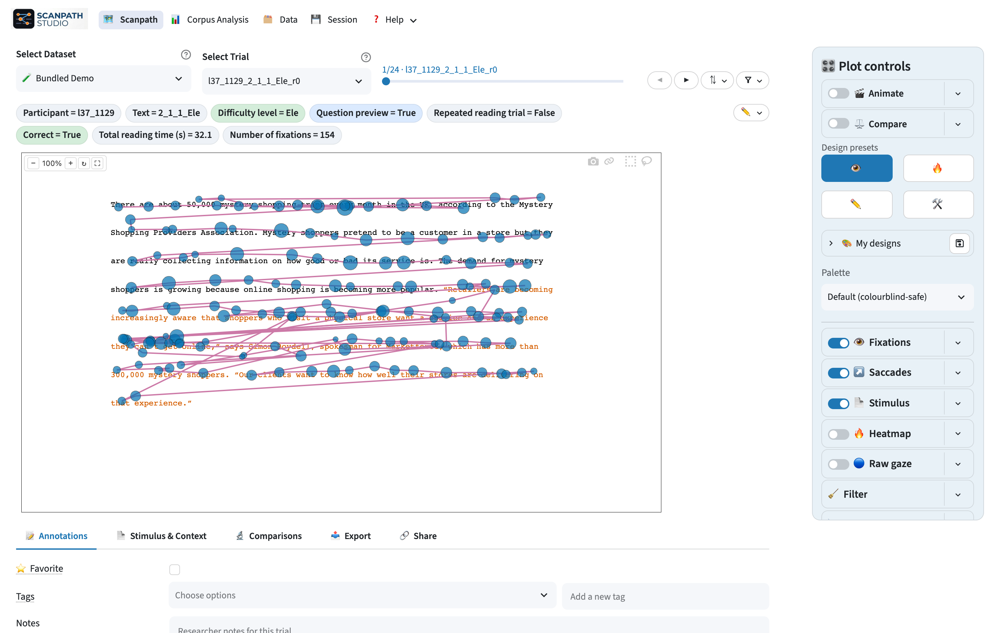

---
hide:
  - navigation
  - toc
---

# Scanpath Studio

Inspect, compare, analyse, and export eye-tracking-while-reading scanpaths.

[:material-play-circle: Try the demo](https://scanpath-studio.streamlit.app){ .md-button .md-button--primary }
[:material-rocket-launch: Get started](getting-started.md){ .md-button }
[:material-school: Tutorials](tutorials/index.md){ .md-button }

{ .sps-shot }

## Start with your task

- :material-clipboard-pulse:{ .lg .middle } **[Check data collection](tutorials/data-collection.md)**

    Review a pilot or session for calibration, setup, and recording problems.

- :material-filter:{ .lg .middle } **[Filter data](tutorials/data-filtering.md)**

    Find unsuitable trials, annotate decisions, and keep the analysis pool.

- :material-file-export:{ .lg .middle } **[Export figures](tutorials/exporting-figures.md)**

    Produce one publication figure or export a consistent batch.

- :material-chart-box:{ .lg .middle } **[Analyse a corpus](tutorials/corpus-analysis.md)**

    Compare texts, readers, conditions, or groups and download the result.

## What the app includes

- **Scanpath visualization:** true-position text, fixations, saccades, heatmaps,
  replay, comparison, and vertical-drift correction.
- **Flexible loading:** public corpora or your own word, fixation, and raw-gaze
  tables with automatic or manual column mapping.
- **Corpus analysis:** per-text, per-reader, and group summaries using standard
  reading measures.
- **Reproducible output:** static and animated figures, bulk exports, share
  links, and restorable configurations.

See the [feature guides](guides/index.md) for the controls, or
[Automation & reference](automation.md) for Python, CLI, and file formats.

!!! note "AI-assisted software"
    Scanpath Studio was built with AI assistance. Cross-check results before
    publishing; verify the ground-truth trial with `?source=synthetic`. If
    something looks wrong, [report it](https://github.com/lacclab/scanpath-studio/issues)
    with your **Save & restore** JSON.

Citation metadata is available in
[`CITATION.cff`](https://github.com/lacclab/scanpath-studio/blob/main/CITATION.cff).
