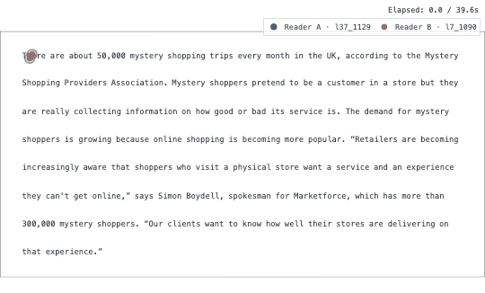

# Tutorial 2 — Compare two readers

**Goal:** put two readings of the *same* paragraph next to each other — as
overlaid scanpaths, as a co-animated replay, and as a table of per-word
differences you can actually report.

**You need:** nothing but the bundled demo. Every command below was run against
it; substitute your own ids and they work unchanged.

---

## 1. Pick the first reading

Open the app (**Scanpath Visualization** view) and choose a trial in the main
trial picker. Anything with fixations will do — the demo's
`l37_1129_2_1_1_Ele_r0` is the one used throughout this tutorial.

---

## 2. Turn on Compare

In the right-hand control rail, flip **Compare** on. Two things appear:

- **Compare with trial (B)** — a selector above the plot, mirroring the main
  picker: a dropdown, a scrubbing slider showing `3/12 · <trial id>`, and
  ◀ ▶ step buttons. Candidates are marked **📄** (same text as your trial) and
  **👤** (same participant), so "another reader of this paragraph" is one
  glance away. Pick a 📄 candidate.
- **⚙️ Compare options** — a popover with the layout and the legend.

In **⚙️ Compare options**:

| Control | What it does |
| --- | --- |
| **View** → *Overlay* | Both scanpaths on one true-to-scale canvas. The default, and the one to use when you care about *where* they differ. |
| **View** → *Side by side* | Two panels, left and right. |
| **View** → *Stacked* | Two panels, one above the other — good for a page-shaped stimulus. |
| **Show A/B legend** | Adds a legend naming the two scanpaths. Off by default; the colours already tell A from B. |

!!! tip "Style A and B independently"
    The per-scanpath comparison styling (colours for A and B) lives in the
    visualization controls once Compare is on — the swatches shown there match
    the figure exactly, so what you pick is what exports.

---

## 3. Watch them read at the same time

Turn on **Animate** with Compare still on and the two readings co-animate on
**one shared real-time clock** — so a reader who took twice as long visibly
takes twice as long. The layout is forced to overlay while animating (there is
one clock, so there is one canvas).

{ .sps-shot }

Playback speed lives in the **⚙️ Playback** popover next to the Animate toggle
(default ×4 — real time ÷ 4), along with the **Frame grid** controls
(**Frame every (ms)**, **Max frames**). Coarsen the grid before exporting a
long trial; play / pause / restart sit below the plot.

---

## 4. Share the exact view

The **🔗 Share** subtab builds a deep link that reopens the app on this trial
with these settings — layers, colours, animation speed, the lot. Paste it into
an issue or a lab channel and the other person sees precisely what you saw.

Two caveats the panel tells you about itself:

- A **built-in data source** (the demo, the synthetic trial, a public corpus)
  is rebuilt from the link. **Uploaded tables can't be** — the recipient needs
  the same data loaded, and only the view settings travel.
- 💾 **Save & restore** does the same job as a JSON file, and is the thing to
  attach to a bug report.

---

## 5. Rank many readings, not just two

Compare is pairwise. When the question is *which of these readings is closest
to mine*, use the 🔬 **Comparisons** subtab instead: it takes the trial selected
in the main picker, finds the other scanpaths of the **same text**, groups them
by a column you choose (reading regime, repeated-reading index, model
generation, …) and scores each against your reading. It renders no picker of
its own — the main trial selection *is* the selection.

For questions about a reader rather than a trial — *is this reader slower than
the cohort?* — the **📊 Corpus Analysis** view's **Per reader** subtab has
*Distribution vs cohort* and *Reading summary*, and **Groups** compares two
cohorts with effect sizes. See [Corpus analysis](../corpus-analysis.md).

!!! warning "The trial filter defines the cohort"
    "Cohort" always means *the other trials left by the trial filter*. Narrow
    the filter and you change the comparison, not just the target.

---

## 6. The same comparison as numbers

The visual comparison is for looking; this is for reporting. The script below
finds a text two readers share, renders both scanpaths, and builds a per-word
difference table:

```python
import scanpath_studio as sps

words, fixations = sps.load_sample_data()
combos = sps.list_trials(words, fixations)

# Trials that actually have fixations, tagged with the text they read.
texts = fixations[["participant_id", "trial_id", "text_id"]].drop_duplicates()
pool = combos.merge(texts, on=["participant_id", "trial_id"])

text_id = pool["text_id"].value_counts().idxmax()     # a text several readers share
pair = pool[pool["text_id"] == text_id].head(2)
print(pair.to_string(index=False))

# One figure per reader, same canvas → directly comparable.
for row in pair.itertuples(index=False):
    fig = sps.plot_scanpath(
        words, fixations, row.participant_id, row.trial_id,
        canvas_size=(2560, 1440), show_heatmap=False,
    )
    sps.save_figure(fig, f"compare_{row.participant_id}.html")

# Per-word dwell time, one column per reader.
measures = sps.compute_word_metrics(words, fixations)
pair_measures = measures[measures["trial_id"].isin(pair["trial_id"])]

wide = pair_measures.pivot_table(
    index=["word_id", "text"],
    columns="participant_id",
    values="total_fixation_duration_ms",
).dropna()
a, b = wide.columns[:2]
wide["diff_ms"] = wide[a] - wide[b]

biggest = wide.reindex(wide["diff_ms"].abs().sort_values(ascending=False).index)
print(biggest.head(5).to_string())
```

On the bundled demo that picks `2_1_1_Ele` (read by `l37_1129` and `l7_1090`)
and prints:

```text
participant_id  l37_1129  l7_1090  diff_ms
word_id text
76      can't     1168.0      0.0   1168.0
77      get       1224.0    205.0   1019.0
7       every      882.0      0.0    882.0
75      they       780.0      0.0    780.0
86      has        240.0    944.0   -704.0
```

A `0.0` is a **skipped word**, not a missing value — worth stating explicitly
in a caption, because it drags a mean down without being a short fixation.

### Reader-level summary

```python
summary = pair_measures.groupby("participant_id").agg(
    mean_tfd_ms=("total_fixation_duration_ms", "mean"),
    skip_rate=("skip_flag", "mean"),
    regression_rate=("regression_in_flag", "mean"),
)
print(summary.round(3).to_string())
```

```text
                mean_tfd_ms  skip_rate  regression_rate
participant_id
l37_1129            302.415      0.236            0.142
l7_1090             231.217      0.585            0.283
```

Two readers, one paragraph: one reads nearly every word, the other skips more
than half of them. That is the comparison the overlaid scanpath *shows* — this
is the version you can put in a table.

!!! warning "Two readers are two readers"
    Nothing here is a test. `n = 2` on one paragraph, with skips folded into
    the mean as zeros. Use it to find the trials worth looking at, then fit the
    model you actually want on the exported table.

---

## 7. Render both from the command line

Same figure, no Python:

```bash
scanpath-studio render --sample -p l37_1129 -t l37_1129_2_1_1_Ele_r0 \
    --no-heatmap -o reader_a.html
scanpath-studio render --sample -p l7_1090  -t l7_1090_2_1_1_Ele_r0 \
    --no-heatmap -o reader_b.html
```

The `render` command draws **one** trial per invocation — the overlaid
two-scanpath comparison is a UI feature (and a deep link), not a CLI flag. For
a scripted overlay, export each layer separately and compose them; see
[Produce a figure for a paper](figure-for-a-paper.md#5-separable-layers).

---

## Next

- Make one of these publication-ready →
  **[Produce a figure for a paper](figure-for-a-paper.md)**
- Do it for every trial in the corpus →
  **[Run it headless from a script](run-it-headless.md)**
- Cohort-level questions → **[Corpus analysis](../corpus-analysis.md)**
